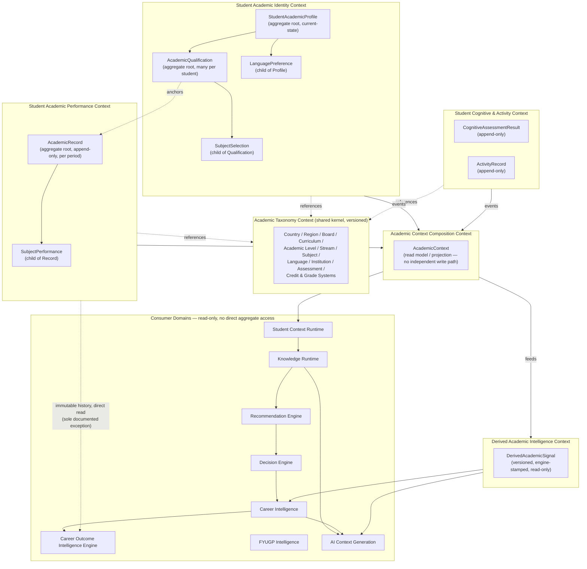

# WP-ARCH-01B — Enterprise Architecture Design
## Canonical Student Academic Domain

**Role:** Chief Enterprise Architect deliverable.
**Inputs treated as authoritative evidence (not re-investigated here):** `WP_ARCH01A_REPOSITORY_EVIDENCE_REPORT.md`, `WP_ARCH01A2_BUSINESS_SEMANTICS_REPORT.md`.
**Constraint compliance:** this document contains no SQL, no DDL, no migrations, no repository/service/API code, no indexes, no RLS, no permissions. Every table, RPC, and file name from the prior reports appears here only as *evidence for* a decision, never as a design constraint.

---

## PART 1 — Enterprise Domain Vision

### 1.1 Why the current architecture evolved this way

WP-ARCH-01A.2 established, with direct evidence, that HireRise's student-academic data did not fragment by accident — it fragmented because each fragment solved a real, narrow problem at the moment it was built, without a canonical model to extend:

- **Family A** (`student_academic_records`/`subjects`, `student_education_profiles`) was built for one job: get a Class 8–12 Indian student through a linear onboarding wizard, with partial-save support. It optimizes for *step completion*, not for lifetime academic history.
- **Family B** (`edu_students`, `edu_academic_records`, `edu_extracurricular`, `edu_cognitive_results`, `edu_stream_scores`) was built earlier, for a simpler "one current snapshot per student" model, and evolved engines (ROI, career simulation, stream intelligence) on top of it because it was the only thing available at the time.
- **Family C** (`student_academic_profiles`/`student_subject_selections`/`student_language_preferences`, RPC-driven) was a genuine attempt at the *right* idea — a taxonomy-driven, multi-country, multi-board, code-referenced model — built directly against Supabase from the frontend, evidently to move fast. It is architecturally the closest of the three to what an enterprise domain needs, but it was never given a backend owner, so it never got the chance to become canonical.
- **Family D** (the five unconfirmed tables in `recommendation-engine.js`) shows what happens without a canonical domain to anchor against: a fourth ad-hoc data shape was invented under deadline pressure, apparently without ever being migrated, because there was no single place to ask "does this concept already exist?"

None of these were built badly in isolation. They fragmented because **there was never a canonical domain for any of them to extend instead of duplicate.** That is the core problem this WP exists to solve — not "which table wins," but "what should the domain have been from the start."

### 1.2 Why a canonical domain is required now

Ten downstream systems are named as consumers of this domain: Student Context Runtime, Knowledge Runtime, Recommendation Engine, Decision Engine, Career Intelligence, Career Outcome Intelligence Engine, FYUGP Intelligence, Academic Recommendation Engine, AI Context Generation, and future capabilities. WP-ARCH-01A.2 (§7.1) already found the one runtime that tries to compose academic truth today — `StudentService` — explicitly marking most academic fields as `available: false` because it cannot confidently pick a source. **A composition layer cannot out-design its inputs.** Every one of the ten downstream systems will inherit this same ambiguity until the domain underneath has exactly one canonical answer per concept.

### 1.3 Design philosophy

1. **One concept, one owner, one lifecycle.** Every business concept identified in WP-ARCH-01A.2 gets exactly one canonical aggregate. Where two historical tables represented genuinely different concepts wearing the same name (e.g. subject *performance* vs subject *selection* — §2.7 of WP-ARCH-01A.2), the domain keeps them distinct, deliberately, as two entities — not because the old code did, but because the business reality does.
2. **Reference data is not student data.** Taxonomy (boards, curricula, subjects, languages, institutions) is a separate, versioned, shared-kernel concern. Student aggregates reference it by stable business key, never own or duplicate it.
3. **History is a first-class citizen, not a side effect of upsert.** WP-ARCH-01A.2 found that every existing table either upserts-in-place or replaces-all-in-place — none preserve prior states. A domain meant to power explainable AI recommendations for ten years cannot afford to have overwritten its own evidence.
4. **Downstream systems consume projections, never write-side aggregates.** The fragmentation risk is highest exactly where WP-ARCH-01A.2 found it already happening: ad-hoc, independent reads of raw tables by `recommendation-engine.js`, bypassing every layer meant to compose truth. The canonical domain closes that door structurally, not by convention.
5. **AI-native from the start.** "Explainability" and "auditability" are not bolted on. Every derived or AI-facing artifact carries a reference back to the exact taxonomy version and academic-context version that produced it — generalizing the `taxonomy_hash_at_save` pattern WP-ARCH-01A.2 found already emerging organically in Family C (§2.6–2.8).
6. **Multi-country, multi-board, multi-language is the default case, not an extension.** The current India-only, enum-based Family A model (`academic_year_enum`, fixed `ACADEMIC_SUBJECTS` list) is the one piece of prior design this document deliberately does not carry forward as-is, precisely because WP-ARCH-01A.2 found the taxonomy-driven Family C model already solving this correctly, just without an owner.

### 1.4 Architectural goals

- A single canonical **Student Academic Identity** any runtime can query with confidence.
- A single canonical, **immutable academic history** that supports trend, velocity, and explainability use cases the current schema was explicitly commented as anticipating but never fed (WP-ARCH-01A.2 §2.2).
- A **taxonomy layer** that lets HireRise onboard a new country or board without a schema change, only a taxonomy publish.
- A clean **read/write separation** so AI and recommendation systems never depend on write-side implementation detail.
- Zero ownership ambiguity: every one of the six ambiguities WP-ARCH-01A.2 §11 raised is explicitly resolved in Part 4.

### 1.5 Enterprise principles applied

Domain-Driven Design (bounded contexts, aggregates, ubiquitous language), single source of truth per concept, event-based integration for cross-context consumption, CQRS-style separation between the operational write model and the composed read model consumed by AI/runtime systems, and taxonomy-as-shared-kernel. These are elaborated with justification, not just named, in Parts 2–4.

---

## PART 2 — Canonical Bounded Contexts

Six bounded contexts fully cover the domain. Each is scoped to exactly the responsibility WP-ARCH-01A.2 found genuinely distinct — no more, no fewer.

### 2.1 Academic Taxonomy Context

- **Purpose:** the single source of truth for every reference concept a student's academic identity or history can point to.
- **Responsibilities:** define and version Countries, Regions, Boards, Curricula, Programs, Qualification Types, Academic Levels, Streams, Subjects, Languages, Institutions, Assessment Systems, Credit Systems, Grade Systems, and the mappings between them (e.g. which boards operate in which regions — WP-ARCH-01A.2 §2.6 already found a `board_region_map` seed referenced in evidence).
- **Owned entities:** every taxonomy concept listed above, plus a **Taxonomy Version** entity that stamps every published change with an immutable version identifier.
- **Consumed entities:** none — this is a pure shared-kernel/reference context with no dependency on any other bounded context.
- **Published events:** `TaxonomyVersionPublished` (whenever any reference set changes), `TaxonomyEntryDeprecated` (a code is retired but never deleted, per the "never remove enum values" contract WP-ARCH-01A found encoded in Family A's migration comments — generalized here into policy).
- **Consumed events:** none.
- **Integration points:** every other bounded context in this domain, plus any consumer domain that needs to render taxonomy (e.g. an onboarding UI's country/board selectors).
- **Ownership justification:** taxonomy changes on its own cadence (new academic years, new boards, new countries) independent of any individual student's data. Coupling it to student aggregates — as Family C's denormalized `board_code`/`region_code` columns did as a shortcut — creates exactly the "backfill from countries_master" reconciliation work WP-ARCH-01A.2 found evidence of (§2.6). A dedicated context removes the need for that reconciliation entirely: taxonomy is never denormalized onto a student aggregate, only referenced by version-stamped code.

### 2.2 Student Academic Identity Context

- **Purpose:** own the canonical answer to "who is this student, academically, right now."
- **Responsibilities:** maintain the student's current academic identity — country, region, board, institution, current academic level, current stream, language mediums — and the student's **Qualification** history (every credential the student is pursuing or has completed over their lifetime, see Part 3).
- **Owned entities:** `StudentAcademicProfile` (aggregate root), `AcademicQualification` (aggregate root, child-of-lifecycle to the profile but independently addressable — see Part 3 rationale), `SubjectSelection`, `LanguagePreference`.
- **Consumed entities:** Academic Taxonomy Context (by reference only — country/board/stream/subject/language codes).
- **Published events:** `AcademicProfileEstablished`, `AcademicProfileUpdated`, `QualificationStarted`, `QualificationCompleted`, `SubjectSelectionChanged`, `LanguagePreferenceChanged`.
- **Consumed events:** `TaxonomyVersionPublished` (to know when a referenced code has been deprecated and needs a migration prompt to the student, not a silent break).
- **Integration points:** Student Onboarding (writes into this context during onboarding), Student Academic Performance Context (references the active `AcademicQualification` when recording performance), Academic Context Composition Context (reads this context's published state).
- **Ownership justification:** WP-ARCH-01A.2 found three separate tables (`student_education_profiles`, `student_academic_profiles`, `edu_students`' education fields) each claiming partial ownership of "who is this student academically," with no reconciliation between them (§0 Finding #1–2, §6). Consolidating identity into one context with one aggregate root removes the terminology ambiguity at its source rather than requiring every consumer to guess which of three tables to trust.

### 2.3 Student Academic Performance Context

- **Purpose:** own the canonical, immutable record of what a student has actually achieved, academically, over time.
- **Responsibilities:** record per-qualification, per-period academic performance (subject-level marks, grades, computed percentages) as an append-only history.
- **Owned entities:** `AcademicRecord` (aggregate root, one per qualification-period), `SubjectPerformance` (child entity of `AcademicRecord`).
- **Consumed entities:** Academic Taxonomy Context (subject/grade-system codes); Student Academic Identity Context (references the `AcademicQualification` an `AcademicRecord` belongs to, and the `SubjectSelection` a `SubjectPerformance` fulfills).
- **Published events:** `AcademicRecordCommitted`, `AcademicRecordAmended` (an explicit, auditable correction — never a silent overwrite; see Part 7).
- **Consumed events:** `QualificationStarted`/`QualificationCompleted` (to know the valid period boundaries a record can be committed against).
- **Integration points:** Derived Academic Intelligence Context (reads committed records to compute trend/velocity — the exact use case WP-ARCH-01A.2 found the current schema's indexes anticipating but never being fed, §2.2); Academic Context Composition Context.
- **Ownership justification:** WP-ARCH-01A.2 (§0 Finding #5, §3) found this to be the single sharpest lifecycle divide in the whole domain — year-keyed upsert vs. atomic replace-all are not two implementations of one rule, they are two different answers to "does history matter." This context resolves that by design: performance is never replaced, only appended and, if wrong, explicitly amended with both versions retained.

### 2.4 Student Cognitive & Activity Context

- **Purpose:** own assessment-derived cognitive results and extracurricular/activity history — adjacent to academic performance but not the same concept.
- **Responsibilities:** record cognitive assessment attempts and their scores; record extracurricular activities and achievement levels.
- **Owned entities:** `CognitiveAssessmentResult` (aggregate root, one per assessment attempt — historical, not upserted, correcting the current single-row-per-student model WP-ARCH-01A.2 found at §2.12), `ActivityRecord` (aggregate root, one per activity, append-only, correcting the replace-all model found at §2.11).
- **Consumed entities:** Academic Taxonomy Context (activity-level/category codes, where applicable).
- **Published events:** `CognitiveAssessmentCompleted`, `ActivityRecorded`.
- **Consumed events:** none required.
- **Integration points:** Academic Context Composition Context; Derived Academic Intelligence Context (stream scoring consumes cognitive results, per WP-ARCH-01A.2 §2.13's evidence that `edu_stream_scores` is fed by assessment-derived signals).
- **Ownership justification:** kept as a distinct context, not folded into Performance, because WP-ARCH-01A.2 found no evidence these were ever treated as the same concept in the existing codebase — they have different producers (an assessment flow vs. an onboarding save flow) and different consumers (stream scoring vs. subject-level analytics). Forcing them into one aggregate would create exactly the kind of accidental coupling this document's philosophy (§1.3.1) rejects.

### 2.5 Academic Context Composition Context (Student Context Runtime — Academic Slice)

- **Purpose:** compose the write-side truth from the four contexts above into one **read-only, versioned, cache-friendly Academic Context projection** — the one and only thing every downstream AI/runtime system is allowed to depend on.
- **Responsibilities:** project current identity + active qualification + performance history summary + cognitive/activity summary into a single `AcademicContext` read model; stamp every projection with the taxonomy version and the latest event version of each source context it composed from.
- **Owned entities:** `AcademicContext` (a read model / projection, explicitly **not** a DDD aggregate with its own invariants — it owns no write-side truth of its own, matching the "compose, don't own" principle WP-ARCH-01A.2 §7.1 found `StudentService` already documenting as intent).
- **Consumed entities:** everything published by 2.2, 2.3, 2.4 (by event, not by direct table read).
- **Published events:** `AcademicContextRefreshed`.
- **Consumed events:** every event listed in 2.2–2.4.
- **Integration points:** this is the sole integration surface offered to Knowledge Runtime, Recommendation Engine, Decision Engine, Career Intelligence, Career Outcome Intelligence Engine, FYUGP Intelligence, and AI Context Generation. None of them integrate with 2.2/2.3/2.4 directly.
- **Ownership justification:** WP-ARCH-01A.2 (§7.3) found a second, fully independent path (`recommendation-engine.js`) that bypassed composition entirely and read raw, partially-unconfirmed tables directly, then fed them straight into an LLM prompt. That is the single most important architectural risk this WP-ARCH-01B must close. Making the composition context the *only* legal read surface — enforced by bounded-context integration policy, not by convention — removes the possibility of a third or fourth ad-hoc path ever recurring.

### 2.6 Derived Academic Intelligence Context

- **Purpose:** own computed, model-derived academic signals — stream affinity, academic trend/velocity, ROI indicators — that are outputs, never inputs, of the domain.
- **Responsibilities:** compute and version derived scores from the Academic Context projection (2.5) and Cognitive & Activity data (2.4); never accept direct user input.
- **Owned entities:** `DerivedAcademicSignal` (a family of versioned, engine-stamped outputs — the canonical replacement for `edu_stream_scores`, generalized beyond one hardcoded stream taxonomy).
- **Consumed entities:** Academic Context (2.5), Cognitive & Activity events (2.4).
- **Published events:** `DerivedSignalComputed` (always carries `engine_version` and the `AcademicContext` version it was computed from — resolving the gap WP-ARCH-01A.2 §2.13 found: no evidence of where/how `edu_stream_scores` was actually populated).
- **Consumed events:** `AcademicContextRefreshed`, `CognitiveAssessmentCompleted`.
- **Integration points:** Recommendation Engine, Decision Engine, Career Intelligence — all as read-only consumers.
- **Ownership justification:** keeping derived intelligence structurally separate from the operational contexts (2.2–2.4) guarantees no derived/AI-generated value can ever be mistaken for or silently merged with user-entered truth — a distinction WP-ARCH-01A.2 found the current schema *attempting* (the unused `percentage_source`/`is_predicted` fields, §2.2) but not architecturally enforcing.

---

## PART 3 — Canonical Aggregate Design

### 3.1 `StudentAcademicProfile` (aggregate root — Student Academic Identity Context)

- **Purpose:** represents the student's current academic identity as a single, always-valid snapshot.
- **Responsibilities:** hold current country/region/board/institution/academic-level/stream references; hold current language mediums (via child `LanguagePreference` entities); be the entry point for starting a new `AcademicQualification`.
- **Lifecycle:** established once at onboarding start; updated in place thereafter (this is the one entity in the domain that is intentionally **current-state-only**, not historical — a student's "who they are today" does not need a full history the way "what they achieved" does).
- **Children:** `LanguagePreference[]` (one aggregate-internal child list — replaces `student_language_preferences`, keeping the medium-of-instruction vs. additional-language distinction WP-ARCH-01A.2 §2.8 found was already meaningfully captured in the RPC parameter design).
- **Value objects:** `TaxonomyReference` (country code, region code, board code, stream code — immutable, always resolved against a specific `TaxonomyVersion`, never copied/denormalized as mutable data).
- **Reference entities:** Academic Taxonomy Context entries (referenced, not owned).
- **Business invariants:** exactly one `StudentAcademicProfile` per student, always (resolves the "one profile per student" ambiguity WP-ARCH-01A.2 §10 Finding #3 flagged as unconfirmed at the DB-constraint level — this document makes it an explicit, enforced aggregate invariant, not an assumption); a profile cannot reference a board that is not valid for its region, per the taxonomy's region-board mapping.
- **Transaction boundary:** the profile and its `LanguagePreference` children are written atomically together; a language-preference change never partially applies.
- **Size justification:** kept small and identity-only, specifically *not* including qualification or performance data, because WP-ARCH-01A.2 found `edu_students` collapsing identity + onboarding-step + skills into one row (§2.9) — an aggregate that grows to hold everything becomes a concurrency bottleneck and a change-coupling hazard. A student's board changing does not need to touch their subject marks.

### 3.2 `AcademicQualification` (aggregate root — Student Academic Identity Context)

- **Purpose:** represents one specific credential the student is pursuing or has completed — e.g. "Class 10, CBSE, 2024–25" or, in the future, "B.Tech Computer Science, University X, 2027–2031."
- **Responsibilities:** own the board/curriculum/stream/institution/period that applies to *this specific credential*, own the `SubjectSelection` list for it, and be the anchor every `AcademicRecord` in Part 3.3 attaches to.
- **Lifecycle:** created when a student begins a new stage of education; marked completed when finished; a student accumulates **many** `AcademicQualification` instances over a lifetime (this is the single largest structural change from every historical table found, all of which assumed one current qualification per student).
- **Children:** `SubjectSelection[]` (which subjects were chosen for this qualification — enrollment/intent only, no performance data, correcting the conflation WP-ARCH-01A.2 §2.7 flagged between selection and performance).
- **Value objects:** `QualificationPeriod` (start/target/end), `TaxonomyReference` (as in 3.1, but qualification-scoped so it can legitimately differ from the profile's current reference — this is exactly the "board may differ from `student_education_profiles.board_type` if the student transferred" scenario the original Family A migration comment anticipated, WP-ARCH-01A.2 §2.1).
- **Business invariants:** one board and one curriculum per qualification (directly resolves the brief's named invariant, and the gap WP-ARCH-01A.2 §4 found — "repository evidence is insufficient to determine" — because no qualification entity existed to hold it); subjects in `SubjectSelection` must belong to the qualification's stream per taxonomy rules.
- **Transaction boundary:** a qualification and its subject selections are written together; changing subject selection never touches other qualifications.
- **Size justification:** deliberately excludes performance data — a qualification can be referenced by years of `AcademicRecord` history without the qualification aggregate itself growing, keeping it cheap to load whenever only identity/selection context is needed (the common case for onboarding and profile display).

### 3.3 `AcademicRecord` (aggregate root — Student Academic Performance Context)

- **Purpose:** represents one committed period (typically a year, but taxonomy-defined so it can represent a term/semester for institutions that use those) of academic performance within a specific `AcademicQualification`.
- **Responsibilities:** own the period's completion state (draft/committed — preserving the `is_partial` concept WP-ARCH-01A.2 confirmed is a real, load-bearing business rule at §9 Rule 4/5) and the `SubjectPerformance` children for that period.
- **Lifecycle:** created in draft state as a student begins entering a period's results; transitions to committed; once committed, is **never overwritten** — a correction creates a new version with an explicit supersession link (see Part 7). This directly replaces both the per-year-upsert model and the replace-all model WP-ARCH-01A.2 found competing in Family A and Family B (§3).
- **Children:** `SubjectPerformance[]`.
- **Value objects:** `PerformancePeriod` (references the parent qualification's `QualificationPeriod`).
- **Business invariants:** many `AcademicRecord`s per `AcademicQualification` (one per period — resolves "many academic records per student" precisely, scoped correctly to qualification rather than loosely to student); a record cannot be committed with zero `SubjectPerformance` children.
- **Transaction boundary:** a record and all of its subject performances for that period commit atomically — this preserves the useful part of the historical "replace-all" pattern (a period's results are logically one unit) while fixing its destructive part (never overwriting prior committed periods).
- **Size justification:** scoped to one period, not the student's whole history, so that reading "this year's results" never requires loading the student's entire academic lifetime — an important cost control for a domain meant to be queried by ten downstream AI systems.

### 3.4 `SubjectPerformance` (child entity of `AcademicRecord`)

- **Purpose:** the atomic unit of academic performance — one subject's result within one committed period.
- **Responsibilities:** hold marks/grade/percentage and their derivation source explicitly (formalizing the `percentage_source` distinction WP-ARCH-01A.2 §2.2 found computed transiently but never persisted).
- **Lifecycle:** immutable once its parent `AcademicRecord` is committed.
- **Value objects:** `Score` (marks, max marks, percentage — always co-located and validated together, so "marks cannot exceed max marks" — WP-ARCH-01A.2 §9 Rule 2 — is a value-object-level invariant, not just an application-layer check bolted on afterward).
- **Business invariants:** references exactly one `SubjectSelection` from the parent qualification (a performance entry cannot exist for a subject the student never selected — a new invariant this design adds, since WP-ARCH-01A.2 found no evidence the old schema enforced any relationship between selection and performance at all, because they lived in entirely separate, unrelated table families).

### 3.5 `CognitiveAssessmentResult` and `ActivityRecord` (aggregate roots — Student Cognitive & Activity Context)

- **Purpose/lifecycle:** each assessment attempt and each activity is its own immutable, timestamped root — never upserted, never replaced, directly resolving the two lifecycle gaps WP-ARCH-01A.2 flagged at §2.11/§2.12/§2.13 (no history preserved, unclear population source).
- **Children/value objects:** `CognitiveAssessmentResult` holds a `ScoreSet` value object (the five named scores) plus the raw response payload as an immutable value object, not a mutable JSONB blob updated in place.
- **Business invariants:** a student may have many results/activities over time; the most recent is the "current" one only by recency ordering, never by overwrite.

### 3.6 `AcademicContext` (read model — Academic Context Composition Context)

- Explicitly **not** a DDD aggregate in the write-model sense — no invariants are enforced against it directly; it is a versioned, rebuildable projection. Included here because WP-ARCH-01A.2 (§0 Finding #6, §7.1) found the current closest equivalent (`StudentService`'s composed context object) treated by consumers almost as if it were an aggregate. Making its non-aggregate, purely-derived nature explicit prevents any future consumer from writing back into it — a discipline the current `StudentService` already states as intent (read-only, "does not own CRUD," per its own header) but that this design now makes structurally true across the whole domain, not just true by convention in one file.

### 3.7 `DerivedAcademicSignal` (aggregate root — Derived Academic Intelligence Context)

- **Purpose/lifecycle:** one versioned, engine-stamped record per computation run, never overwritten — generalizes and fixes the single-row, engine-version-carrying-but-never-actually-written `edu_stream_scores` shape found at WP-ARCH-01A.2 §2.13.
- **Business invariants:** always references the `AcademicContext` version and `TaxonomyVersion` it was computed from — the explainability/auditability requirement made structural.

---

## PART 4 — Canonical Entity Ownership

| Business concept | Canonical owner | Consumers | Sync model | Read model | Write model |
|---|---|---|---|---|---|
| Student academic identity (country/region/board/level/stream) | `StudentAcademicProfile` — Identity Context | Composition Context, Onboarding | Event (`AcademicProfileUpdated`) | Projected into `AcademicContext` | Direct command to Identity Context only |
| Qualification / credential pursuit | `AcademicQualification` — Identity Context | Performance Context (by reference), Composition Context | Event (`QualificationStarted/Completed`) | Projected into `AcademicContext` | Direct command to Identity Context only |
| Subject selection / enrollment | `SubjectSelection` (child of Qualification) — Identity Context | Performance Context (referenced by `SubjectPerformance`) | Event | Projected | Direct command to Identity Context only |
| Language preference | `LanguagePreference` (child of Profile) — Identity Context | Composition Context | Event | Projected | Direct command to Identity Context only |
| Academic performance (marks/grades) | `AcademicRecord`/`SubjectPerformance` — Performance Context | Derived Intelligence, Composition Context | Event (`AcademicRecordCommitted`) | Projected + full history queryable | Direct command to Performance Context only; append/amend, never delete |
| Cognitive assessment results | `CognitiveAssessmentResult` — Cognitive & Activity Context | Derived Intelligence, Composition Context | Event | Projected | Direct command only |
| Extracurricular activity | `ActivityRecord` — Cognitive & Activity Context | Composition Context | Event | Projected | Direct command only |
| Taxonomy (board/curriculum/subject/language/etc.) | Academic Taxonomy Context | Every other context (by reference) | Event (`TaxonomyVersionPublished`) | Versioned reference catalogue | Taxonomy governance process only |
| Derived academic signals (stream affinity, trend, ROI) | `DerivedAcademicSignal` — Derived Intelligence Context | Recommendation, Decision, Career Intelligence | Event | Read-only, versioned | Derived Intelligence Context only, computed not entered |
| Composed academic context | `AcademicContext` — Composition Context | All ten downstream runtimes/engines | Event-driven projection rebuild | The read model itself | No independent write path — rebuilt only |
| Career interests/goals | **Out of this domain's scope** — remains owned by the career/professional-identity domain, referenced not duplicated | Composition Context (reads by reference for AI context assembly only, mirroring the read-only reuse pattern WP-ARCH-01A.2 §7.1 found `StudentService` already using for `student_career_profiles`) | Event, cross-domain | N/A here | N/A here |

### 4.1 Explicit resolution of every ambiguity raised in WP-ARCH-01A.2 §11

1. **"Which of `student_education_profiles`, `student_academic_profiles`, `student_academics_profiles` is the durable identity record?"** — None of the three, individually. `StudentAcademicProfile` (3.1) is the single canonical identity aggregate; the education-level/board/school-type fields Family A captured and the country/region/stream/target-year fields Family C captured are unified into one entity, taxonomy-referenced rather than enum-hardcoded. `student_academics_profiles` (the unconfirmed typo variant) is not carried forward at all — see item 4.
2. **"Are subject performance and subject selection meant to remain separate?"** — **Yes, permanently, by design.** `SubjectSelection` (enrollment/intent, owned by `AcademicQualification`) and `SubjectPerformance` (result, owned by `AcademicRecord`) are two different entities in two different contexts, linked by explicit reference (3.4). This is not a compromise between the two historical shapes — WP-ARCH-01A.2 §2.7 established they were already different concepts; this design simply gives each its own home instead of one masquerading as the other.
3. **"Replace-all vs. historical-upsert — which lifecycle wins?"** — **Neither, as previously implemented.** `AcademicRecord` is append-only-per-period with explicit amendment/supersession (Part 7) — it keeps replace-all's useful property (a period's results commit as one atomic unit) while discarding its destructive property (no history preserved) and discarding upsert's ambiguity (silent overwrite of the same key).
4. **"Is the six-table read in `recommendation-engine.js` a real, unmigrated data model or dead code?"** — **This design does not resurrect it.** `student_interests_profiles`, `student_learning_styles`, `student_exposure_profiles`, `student_financial_profiles` describe *non-academic* student context (interests, learning style, financial constraints) that WP-ARCH-01A.2 could not confirm ever had a schema. They are explicitly **out of scope for the Student Academic Domain** by definition — if HireRise needs them, they belong to a separate, equally-canonical "Student Preference Context" designed with the same rigor, not folded into academics because a recommendation prompt once needed them in the same function call. `student_academics_profiles` (item 1's typo variant) is likewise not resurrected — its one call site's JSON-blob shape is superseded entirely by `SubjectPerformance`.
5. **"Should `StudentService`'s partial composition eventually pull from the taxonomy-RPC family, `student_academic_*`, `edu_*`, or a reconciliation?"** — **A reconciliation, but not the three legacy families reconciled with each other** — the Academic Context Composition Context (2.5) reads only from the three canonical operational contexts (2.2–2.4) defined in this document. No downstream system ever needs to know that `edu_*` or Family C existed.
6. **"What is the intended ownership model for the taxonomy-RPC family, given it has no backend module?"** — **Resolved structurally.** No bounded context in this design permits direct frontend-to-database access for writes. Every write to `StudentAcademicProfile`/`AcademicQualification`/`SubjectSelection`/`LanguagePreference` goes through the Student Academic Identity Context's command surface — never a direct RPC call from a frontend module with no corresponding backend owner. This closes the exact gap WP-ARCH-01A.2 §8 found: "no entity in this catalogue has this structurally different ownership shape" is now true by design, not by accident.

---

## PART 5 — Academic Context Lifecycle

Walking the exact chain given in the brief, mapped onto the aggregates defined in Part 3.

**1. Student starts onboarding.**
A `StudentAcademicProfile` does not yet exist. The onboarding flow (external to this domain, a consumer of its command surface) begins collecting identity data.

**2. Academic Profile.**
`StudentAcademicProfile` is established (`AcademicProfileEstablished`) with country/region/board/institution references resolved against the current `TaxonomyVersion`, plus initial `LanguagePreference`s. This is a single atomic write; the profile is immediately valid and queryable, even before any qualification exists.

**3. Qualifications.**
The profile initiates its first `AcademicQualification` (`QualificationStarted`) — e.g. "Class 10, current board." Over the student's lifetime, additional qualifications are started as they progress (Class 12, later an undergraduate program) — each a new aggregate instance, never a mutation of the first.

**4. Academic Records.**
Within the active qualification, an `AcademicRecord` is opened in draft state for the current period. This is where the "is this a draft or committed" distinction (WP-ARCH-01A.2 §9 Rule 4) lives — a record can be saved incrementally.

**5. Subject Selection.**
Independently of (and typically preceding) performance entry, `SubjectSelection`s are attached to the `AcademicQualification` — the student declares which subjects apply to this qualification, before any marks exist for them. `SubjectSelectionChanged` events fire as this changes.

**6. Academic Performance.**
As results become available, `SubjectPerformance` entries are added to the open `AcademicRecord`, each referencing a `SubjectSelection` from step 5 (Part 3.4's invariant). When complete, the record is committed (`AcademicRecordCommitted`) — an immutable event from this point forward.

**7. Academic Context.**
The Academic Context Composition Context listens for every event from steps 2–6 (plus Cognitive & Activity events) and rebuilds the `AcademicContext` read model. This is a pure projection — no business decision is made here, only composition, matching the "compose, don't own" principle already present as intent in `StudentService` (WP-ARCH-01A.2 §7.1).

**8. Student Context Runtime.**
Consumes the published `AcademicContext` (and equivalent contexts from other domains — career, professional, personalization) to build the full cross-domain student runtime view. The Academic Context Composition Context described in this document *is* the academic slice of this runtime — not a separate system feeding into it.

**9. Knowledge Runtime.**
Consumes the full Student Context Runtime output (academic + other domains) as one of its knowledge sources, read-only, matching the existing, evidence-confirmed pattern (WP-ARCH-01A.2 §7.1/§7.2) where `RecommendationService` depends only on `StudentService`, never on raw tables.

**10. Recommendation Engine.**
Consumes Knowledge Runtime's composed knowledge, never the Academic Context directly and never any Student Academic Domain aggregate directly — enforcing the resolution to ambiguity #4/#5 above.

**11. Decision Engine.**
Consumes Recommendation Engine output plus its own composed knowledge, under the same no-direct-domain-access rule.

**12. Career Intelligence.**
Consumes Decision Engine and Knowledge Runtime outputs; may separately consume `DerivedAcademicSignal`s (stream affinity, trend) directly from the Derived Academic Intelligence Context, since those are explicitly published, versioned, read-only outputs designed for exactly this kind of cross-domain consumption (2.6).

**13. Career Outcome Intelligence Engine.**
Consumes Career Intelligence output and, longitudinally, the immutable `AcademicRecord` history directly (read-only) where outcome analysis genuinely needs multi-year trend data no single projection snapshot could carry — this is the one place in the chain where reaching past the `AcademicContext` projection to raw historical events is architecturally legitimate, precisely because `AcademicRecord`'s immutability (Part 3.3) makes it safe to depend on directly for time-series analysis without risking the "read raw, possibly-stale, possibly-incomplete state" problem `recommendation-engine.js` demonstrated.

**14. AI Context Generation.**
Assembles the final LLM-facing context bundle from Knowledge Runtime, Career Intelligence, and Derived Academic Intelligence outputs — never from any Student Academic Domain write-side aggregate. Every fact included carries its source `AcademicContext` version and `TaxonomyVersion` for explainability, replacing the ungrounded direct-table-read pattern found in the current `recommendation-engine.js` (WP-ARCH-01A.2 §7.3) with a fully traceable one.

---

## PART 6 — Taxonomy Architecture

Architecture, not schema. The taxonomy layer is designed as a **versioned, hierarchical, code-referenced reference system**, independent of any student data store.

- **Layering:** Countries sit at the top; Regions belong to a Country; Boards/Education Systems operate within one or more Regions (many-to-many, per the `board_region_map` evidence WP-ARCH-01A.2 found already anticipated); Curricula and Qualification Types belong to a Board; Academic Levels (the "class"/"grade"/"year" concept) belong to a Curriculum; Streams belong to an Academic Level within a Curriculum; Subjects belong to a Stream (and may be shared across multiple streams); Languages are a cross-cutting reference set (mediums of instruction vs. studied languages, a distinction already meaningfully present in Family C's RPC design); Institutions are a separate reference set that a `AcademicQualification` may optionally point to (not required — supports students who haven't yet chosen a specific institution); Assessment Systems, Credit Systems, and Grade Systems are each independently versioned reference sets that a Board or Curriculum declares it uses, rather than being hardcoded per-subject (fixing the current enum-based `academic_grade_enum` design, which WP-ARCH-01A.2 found hardcoded to one grading scale globally).
- **Reference, never duplication:** every student-domain entity that needs a taxonomy fact stores a **code + the `TaxonomyVersion` it was resolved against**, never a denormalized copy of the taxonomy fact itself. This directly replaces the "denormed business key... backfilled from X" pattern WP-ARCH-01A.2 found Family C already doing ad hoc (§2.6) with a first-class architectural rule, removing the need for any future backfill migration.
- **Versioning:** every publish to the taxonomy produces a new `TaxonomyVersion`. Prior versions are never deleted — a student's historical `AcademicRecord` from three years ago remains resolvable against the taxonomy version active at the time it was committed, which is essential for both auditability and for not silently reinterpreting old grades under a new grading scale.
- **Extensibility:** onboarding a new country requires only: publish new Country/Region/Board/Curriculum/Stream/Subject/Language entries and a new `TaxonomyVersion` — zero changes to any of the aggregates in Parts 2–3, because none of them hardcode taxonomy values (unlike the current `ACADEMIC_SUBJECTS`/`ACADEMIC_YEARS` enums WP-ARCH-01A found duplicated across backend constants, SQL enums, and frontend types with only a documented, unverified "sync contract" holding them together, per WP-ARCH-01A.2 §6).
- **Institutions as an optional, separate reference set:** deliberately decoupled from Boards, since a student may know their board before they've chosen (or need to declare) a specific institution — this was a gap WP-ARCH-01A.2 found no entity covering at all (§6).

---

## PART 7 — Historical Strategy

| Data category | Belongs to | Why |
|---|---|---|
| **Operational data** (current identity, current active qualification, current subject selections) | `StudentAcademicProfile`, `AcademicQualification` — current-state-only aggregates | These answer "who/what is true right now" and are read on every onboarding/profile screen; keeping them current-state-only (Part 3.1) keeps them cheap and simple, matching WP-ARCH-01A.2's finding that this is the one place where the historical implementations were architecturally reasonable, just spread across too many owners. |
| **Historical data** (committed academic performance, cognitive results, activities) | `AcademicRecord`/`SubjectPerformance`, `CognitiveAssessmentResult`, `ActivityRecord` — append-only aggregates | These answer "what happened," and WP-ARCH-01A.2 found every existing implementation destroys this the moment it's re-saved (§3). An AI system asked "has this student's performance trended up or down" cannot be built on data with no trend to read. |
| **Snapshots** | Each committed `AcademicRecord` **is** a snapshot — a period's full subject set, frozen at commit time | Rather than a separate "snapshot" mechanism, snapshotting is achieved by the natural aggregate boundary: a period never partially mutates once committed. |
| **Versioning / amendment** | `AcademicRecordAmended` events, always referencing the record they supersede | Corrections happen (a student mis-entered a mark) — the domain must support this without ever deleting the original, so both a wrong-at-the-time value and its correction remain auditable. |
| **Replay** | Reconstructable by replaying the full event stream of Identity + Performance + Cognitive/Activity contexts through the Composition Context | Because the read model (`AcademicContext`) is explicitly non-authoritative and rebuildable (Part 3.6), any bug in a past composition can be fixed by replaying history against corrected composition logic — impossible under the current model, where the "composed" state (as far as it exists at all, in `StudentService`) is computed fresh each call from mutable source tables with no event history to replay.
| **Audit** | Every command in every context is expected to produce an event carrying actor, timestamp, and taxonomy version — the event log itself is the audit trail, not a bolted-on separate audit table. |
| **Derived intelligence** | `DerivedAcademicSignal` — Derived Academic Intelligence Context | Never stored as if it were user-entered truth; always versioned by `engine_version` + source `AcademicContext` version, so a later re-scoring never silently overwrites what an earlier recommendation was actually based on. |
| **AI context** | Regenerated on demand by AI Context Generation from the current `AcademicContext` + `DerivedAcademicSignal`s; never itself persisted as a system of record | An AI context bundle is a view, not a fact — persisting it as truth risks it drifting from the domain it was supposed to represent. |
| **Recommendation history / decision history** | Owned by the Recommendation and Decision domains respectively (outside this WP's scope), but required to reference the exact `AcademicContext` version and `TaxonomyVersion` used | This is what makes "why did the system recommend X" answerable months later, directly resolving the "Explainability/Auditability" principle named in the brief's architecture principles. |
| **Academic evolution (trend over a student's lifetime)** | Computed by Derived Academic Intelligence Context by reading the full `AcademicRecord` history directly (the one legitimate direct-history-read case, per Part 5 step 13) | Trend is inherently a multi-record computation; forcing it through a single-snapshot projection would lose the very history it needs. |

---

## PART 8 — Cross-Domain Integration

For every named consumer, the integration surface and ownership boundary:

- **Student Onboarding** — a *producer* into this domain, not a consumer. It issues commands to the Student Academic Identity Context (establish profile, start qualification, select subjects) and to the Performance Context (commit records). It owns no academic data itself; the domain boundary is: onboarding is a UI/workflow orchestrator, this domain is the system of record.
- **Student Context Runtime** — consumes the `AcademicContext` read model (Part 2.5) as one of several domain slices it composes (alongside career, professional, personalization). Boundary: read-only, event-driven, never queries write-side aggregates.
- **Knowledge Runtime** — consumes Student Context Runtime's composed output, one layer further removed than direct `AcademicContext` access (matching the existing, evidence-confirmed layering in `StudentService`/`KnowledgeService`, WP-ARCH-01A.2 §7.1). Boundary: read-only.
- **Recommendation Engine** — consumes Knowledge Runtime only, per the existing, evidence-confirmed pattern of `RecommendationService` depending exclusively on `StudentService` (WP-ARCH-01A.2 §7.2) — this design keeps that boundary and closes the second, non-compliant path (`recommendation-engine.js`, §7.3) that violated it.
- **Decision Engine** — consumes Recommendation Engine and Knowledge Runtime outputs. Boundary: read-only, no direct domain access, same rule.
- **Career Intelligence** — consumes Decision Engine output plus `DerivedAcademicSignal`s directly (Part 5 step 12) for stream/affinity data specifically, since that is a purpose-built, already-versioned publication surface. Boundary: read-only.
- **Career Outcome Intelligence Engine** — consumes Career Intelligence output plus direct, read-only access to immutable `AcademicRecord` history for longitudinal analysis (Part 5 step 13, Part 7's "academic evolution" row) — the one deliberate, narrowly-scoped exception to "always go through the projection," justified specifically by immutability making direct historical reads safe.
- **FYUGP Intelligence** — consumes the `AcademicContext` projection for qualification/stream/level data relevant to undergraduate-program matching; WP-ARCH-01A.2 (§7.5) found no confirmed direct evidence of this runtime's current data dependencies, so this integration is specified prospectively, following the same read-only-projection rule as every other consumer, with no exception carried over from unconfirmed legacy behavior.
- **Academic Recommendation Engine** — if distinct from the general Recommendation Engine, follows the identical boundary: Knowledge Runtime only, never direct domain access.
- **AI Context Generation** — consumes Knowledge Runtime, Career Intelligence, and Derived Academic Intelligence outputs, assembling the final AI-facing bundle with full version provenance (Part 5 step 14). Boundary: read-only, and this is the integration point explicitly designed to prevent recurrence of the ungrounded direct-table-read pattern found in the current `recommendation-engine.js`.
- **Education Intelligence** (the current module name, per WP-ARCH-01A/§4) — under this architecture, its responsibilities are fully absorbed: its identity/onboarding responsibilities move into Student Academic Identity Context, its performance/activity/cognitive responsibilities move into Performance and Cognitive & Activity Contexts, and its scoring-engine responsibilities move into Derived Academic Intelligence Context. It does not persist as a standalone bounded context in the target architecture — its current "sole sanctioned entry point" role (WP-ARCH-01A §4) is superseded by the Academic Context Composition Context performing that role domain-wide, not module-wide.

---

## PART 9 — Canonical Domain Diagram

**Reading the diagram:** solid arrows are write-side event flow or read-side dependency; dashed arrows are reference-only relationships (no ownership transfer). Every consumer domain arrow terminates at the Composition or Derived Intelligence contexts — never at Identity, Performance, or Cognitive & Activity directly — except the one explicitly justified exception noted on the diagram (Career Outcome Intelligence Engine reading immutable performance history for longitudinal analysis, Part 5 step 13).

---

## PART 10 — Architectural Decision Records

### ADR-01: Unify all "who is this student academically" tables into one `StudentAcademicProfile` aggregate
- **Decision:** Replace `student_education_profiles`, `student_academic_profiles`, and `edu_students`' education fields with a single canonical identity aggregate.
- **Alternatives considered:** (a) keep two profiles — one India-specific, one international — and reconcile at read time; (b) let `student_academic_profiles` (Family C) simply "win" since it is the richest schema.
- **Repository evidence:** WP-ARCH-01A.2 §0 Findings #1–2 and §6 established these are three separately-evolving tables with no reconciliation, and that the richest one (Family C) is currently unreachable from any live UI.
- **Business justification:** every downstream AI system needs one unambiguous identity source; reconciling three at read time (option a) simply moves the ambiguity into every consumer instead of solving it once.
- **Long-term impact:** enables genuine multi-country/board support without a second parallel schema ever being justified again.
- **Trade-offs:** a one-time, carefully-sequenced consolidation of existing data is required (out of scope for this WP — an implementation concern for a later work package).
- **Future extensibility:** new countries/boards are a taxonomy publish, not a schema or aggregate change.

### ADR-02: Introduce `AcademicQualification` as a first-class, multi-instance aggregate
- **Decision:** Model "qualification" explicitly, supporting many per student over a lifetime, rather than assuming one current qualification.
- **Alternatives considered:** keep qualification implicit in the profile (as every historical table did).
- **Repository evidence:** WP-ARCH-01A.2 §4 explicitly found "repository evidence is insufficient to determine" the "one curriculum per qualification" invariant, because no such entity existed to hold it — this is a genuine gap, not a preserved historical decision.
- **Business justification:** HireRise's stated 10-year horizon includes moving beyond school-only onboarding (the brief's own lifecycle chain references FYUGP — undergraduate programs); a student's academic identity across a lifetime is fundamentally multi-qualification.
- **Long-term impact:** the single largest structural improvement in this design over every historical schema found.
- **Trade-offs:** more entities to reason about than the current single-profile model; justified by the alternative being a second redesign in a few years when undergraduate onboarding is added.
- **Future extensibility:** directly supports school → undergraduate → postgraduate progression without new aggregate types.

### ADR-03: Separate `SubjectSelection` (enrollment) from `SubjectPerformance` (result), permanently
- **Decision:** two distinct entities, in two distinct contexts, linked by explicit reference.
- **Alternatives considered:** merge into one "subject" entity with nullable performance fields, matching how `student_academic_subjects` already partially works (performance fields nullable for partial saves).
- **Repository evidence:** WP-ARCH-01A.2 §2.7 found these were already, independently, structurally different in the existing (if unwired) Family C schema — selection has zero performance fields.
- **Business justification:** a student selects subjects before results exist; conflating them forces every consumer to distinguish "no result yet" from "no result ever" using nullability alone, which is fragile.
- **Long-term impact:** cleaner semantics for every downstream consumer asking "what is this student studying" vs. "how are they doing."
- **Trade-offs:** two writes instead of one during onboarding; acceptable given the clarity gained.

### ADR-04: Academic performance history is append-only with explicit amendment, never upsert or replace-all
- **Decision:** `AcademicRecord`/`SubjectPerformance` are immutable once committed; corrections are new, explicitly-linked events.
- **Alternatives considered:** keep per-year upsert (Family A's model); keep replace-all-per-student (Family B's model).
- **Repository evidence:** WP-ARCH-01A.2 §3/§0 Finding #5 found both models destroy history, just differently — one silently overwrites a key, the other atomically discards an entire set.
- **Business justification:** the brief's own architecture principles name "Auditability" and "Versioning" explicitly; the ten-year horizon includes trend/velocity-based recommendation and outcome-intelligence use cases the current schema's own comments anticipate ("future velocity analysis") but never enable.
- **Long-term impact:** every downstream engine gains access to genuine longitudinal data for the first time.
- **Trade-offs:** more storage over time than an upsert model; explicitly acceptable given the domain's stated 10-year horizon and AI-native goals.

### ADR-05: Taxonomy is a separate, versioned bounded context — never denormalized onto student aggregates
- **Decision:** all taxonomy references are code + `TaxonomyVersion`, never copied values.
- **Alternatives considered:** denormalize taxonomy codes onto student rows for query performance, as Family C's evolution migration already did ad hoc (`country_code`, `board_code` columns added directly to the profile table).
- **Repository evidence:** WP-ARCH-01A.2 §2.6 found this denormalization already required a documented backfill process ("backfilled from `countries_master.country_code`") — i.e., the ad hoc version of this pattern already needed exactly the reconciliation work a proper reference-context design avoids entirely.
- **Business justification:** multi-country/board/language is a named architecture principle; a shared, versioned taxonomy is the only way to add a country without touching every student aggregate's schema.
- **Long-term impact:** taxonomy governance becomes a content operation, not an engineering one.
- **Trade-offs:** requires a join (by reference) at read time rather than a denormalized column; acceptable, and mitigated by the Composition Context (Part 2.5) resolving references once per projection, not per consumer query.

### ADR-06: No downstream runtime or engine accesses Student Academic Domain write-side aggregates directly
- **Decision:** every one of the ten named downstream systems integrates only through the Academic Context Composition Context (or, narrowly, Derived Academic Intelligence Context / immutable Performance history where explicitly justified).
- **Alternatives considered:** allow direct repository access per consumer, as the current codebase does in at least one confirmed case.
- **Repository evidence:** WP-ARCH-01A.2 §7.3 found `recommendation-engine.js` bypassing every composition layer entirely, independently querying six raw tables (one confirmed, five unconfirmed) and feeding them straight into an LLM prompt with no version provenance.
- **Business justification:** this is the single clearest, most concrete architectural risk the evidence surfaced; closing it structurally (not by code review convention) is the highest-leverage decision in this document.
- **Long-term impact:** guarantees no future consumer can silently reintroduce a fourth ungoverned data path.
- **Trade-offs:** slightly more integration ceremony for new consumers (must go through the projection); justified given the alternative already demonstrably happened once.

### ADR-07: Cognitive assessment and extracurricular activity remain a distinct bounded context from academic performance
- **Decision:** `CognitiveAssessmentResult` and `ActivityRecord` are not merged into `AcademicRecord`.
- **Alternatives considered:** unify all "things a student did" into one performance-history concept.
- **Repository evidence:** WP-ARCH-01A.2 found these already had different producers (assessment flow vs. onboarding save flow) and different consumers (stream scoring vs. subject analytics), with no code anywhere treating them as one concept.
- **Business justification:** preserving genuinely distinct producer/consumer relationships avoids accidental coupling — a change to how cognitive assessments are scored should never require touching academic record logic.
- **Long-term impact:** each context can evolve its own cadence (e.g. new assessment types) independently.
- **Trade-offs:** the Composition Context must merge two additional event streams; acceptable, it already merges three.

### ADR-08: Derived/AI-generated signals are structurally, not just conventionally, separated from user-entered data
- **Decision:** `DerivedAcademicSignal` lives in its own context, always versioned by `engine_version` and source-context version, never merged into or mistaken for operational data.
- **Alternatives considered:** store derived scores as additional columns/fields on the operational aggregates, as `edu_stream_scores` effectively did (a table that is 100% derived fields but sits alongside operational tables with no structural marker distinguishing it).
- **Repository evidence:** WP-ARCH-01A.2 §2.13 found no evidence of where/how these scores actually get populated, and §7.4 found derived engines already sit on top of, not inside, the operational repository.
- **Business justification:** "Explainability" as a named architecture principle requires being able to say, unambiguously, "this value was computed, here's by what and from what" — impossible if derived and entered data share a schema with no structural distinction.
- **Long-term impact:** new scoring engines can be added or retired without any operational-context change.
- **Trade-offs:** none material; this mirrors how Derived Intelligence already behaves today, just formalized.

### ADR-09: Exclude the five unconfirmed `recommendation-engine.js` table concepts (interests/learning-style/exposure/financial) from this domain
- **Decision:** these are not modeled as part of the Student Academic Domain, canonically or otherwise.
- **Alternatives considered:** absorb them as additional child entities of `StudentAcademicProfile`, since they were queried alongside academic data in the one place they appear.
- **Repository evidence:** WP-ARCH-01A.2 §2.4/§10 Finding #1 found no migration, no repository file, and no shape documentation for any of the five beyond one call site — and, on inspection, they are not academic concepts at all (financial profile, learning style, exposure are preference/context data, not academic identity or performance).
- **Business justification:** folding non-academic concepts into the academic domain because one legacy function happened to query them together would reintroduce exactly the kind of accidental-scope-creep aggregate this document's philosophy rejects (§1.3.1).
- **Long-term impact:** keeps this domain's boundary clean; a future, equally-rigorous WP can design a "Student Preference & Context Domain" for these concepts on their own terms.
- **Trade-offs:** the specific prompt-generation use case `recommendation-engine.js` served will need those five concepts sourced from wherever that future domain lands — an integration concern for that domain's design, not a reason to misplace the concepts here.

### ADR-10: `AcademicContext` is a rebuildable projection, never itself a source of truth
- **Decision:** the read model composed for downstream consumption carries no independent write path and can always be regenerated from the underlying event history.
- **Alternatives considered:** treat the composed context as authoritative and allow consumers or admin tools to edit it directly for convenience.
- **Repository evidence:** WP-ARCH-01A.2 §7.1 found `StudentService`'s header already states this intent ("does not own CRUD") for the current, much narrower composition — this ADR generalizes an already-validated design instinct into an enforced, domain-wide rule.
- **Business justification:** CQRS-style separation ensures bugs in composition logic are always fixable by replay, never require manual data surgery on a read model that has quietly become load-bearing.
- **Long-term impact:** the domain can evolve its projection logic freely without any migration risk to the underlying truth.
- **Trade-offs:** requires the underlying contexts to be genuinely event-sourced (or event-published) for replay to be real, not just theoretical — a requirement carried through from ADR-04's append-only decision, not a new cost.
