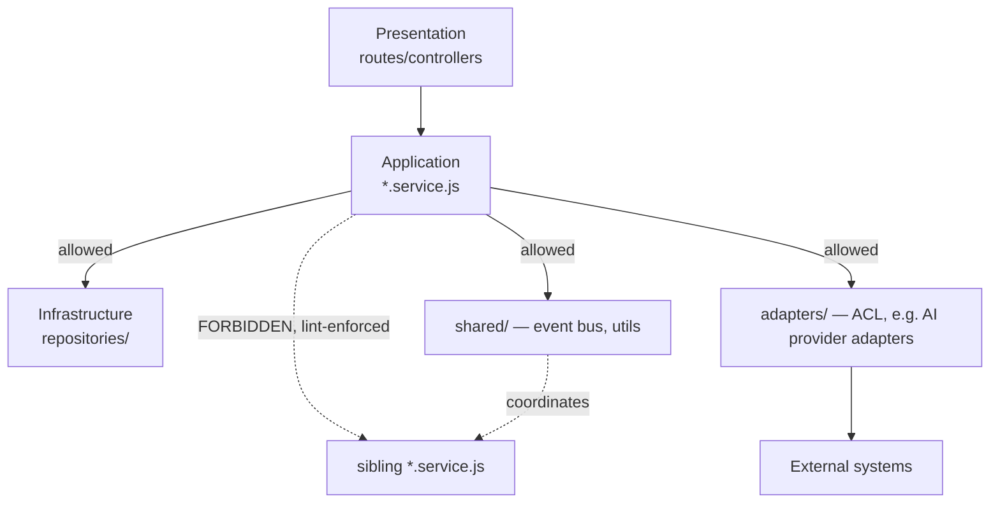

# EEP-01 — Phase I
## Enterprise Engineering Standards & Development Architecture
### HireRise Career Intelligence Platform

**Role:** Chief Software Architect / Enterprise Architect / Principal/Staff Engineer / Platform Engineer / DevSecOps Architect / QA Architect / AI Engineering Architect / Technical Governance Architect / Secure SDLC Specialist / DevEx Architect — combined deliverable.

**Inputs treated as authoritative, not redesigned:** EEP-01 Phases A–H. Phase I owns *how code gets written, reviewed, and kept consistent* — Phase A owns what the data means, Phase F owns AI governance, Phase G owns runtime, Phase H owns organizational process. This document is the one place in the series that should read most like something an engineer opens while actually writing code.

**Convention (inherited from Phases D–H):** 🔧 **CURRENT STATE** / 🎯 **TARGET STATE**, every target-state item mapped to a Part 0 trigger.

**Headline finding, stated up front because it changes how to read this whole document:** the codebase already has a **custom ESLint plugin enforcing architectural boundaries** (`local/no-service-importing-service`, `local/no-engine-importing-engine`), a dependency-cruiser config, circular-dependency detection via `madge`, contract tests (`test:contract`), migration-drift checking, and Gitleaks wired into both CI and an `npm run` script. That is a materially more rigorous engineering-standards foundation than most companies at any size have, let alone a small team. This document's job is mostly to **document what's already enforced, close specific gaps that inspection surfaced, and defer everything else to its trigger** — not to invent standards from nothing.

---

# PART 0 — Engineering Reality Check

| Capability | Current-state ceiling | Trigger to adopt target state |
|---|---|---|
| Dedicated Architecture Team | The custom lint rules + this EEP series *are* the architecture function today, encoded as automation and documentation rather than headcount | Enough engineers proposing conflicting designs that automated rules + docs can't resolve disagreement alone |
| Staff Engineer Layer | Whoever wrote the lint governance rules and this series is already doing staff-level work informally | Team size where technical direction needs a named, dedicated role rather than falling to whoever's available |
| QA Team | Jest unit/integration/contract tests, engineer-owned | Test volume/complexity where a dedicated QA function adds more than it costs in coordination overhead |
| Developer Experience Team | `npm run lint/test/depcruise/madge` scripts are DevEx tooling already, just not a team | Enough engineers that onboarding friction or tooling gaps are measurably slowing delivery |
| Internal Engineering Portal | A well-maintained repo README + this EEP series | Enough services/teams that "read the docs folder" stops scaling |
| Monorepo vs Multi-repo | **Already a monorepo** (`core/`, `front/` in one repo) — this is working and shouldn't be split preemptively | A genuine independent-deploy-cadence need per team, not monorepo's inherent unfashionability |
| Automated Architecture Validation | **Already partially real** — the custom ESLint rules are exactly this, just narrow in scope (2 rules) | Broaden the rule set as new boundary violations are found in review, not as a separate future initiative |
| AI Pair Programming Standards | Informal | Measurable AI-assisted-code volume high enough that inconsistent practices across engineers create real risk (Part 14) |
| Internal SDKs | The provider-abstraction layer (Phase E/F) is an internal SDK in function if not in name | Multiple teams/services needing the same abstraction packaged and versioned independently |
| Engineering Enablement Team | N/A | Same trigger as DevEx Team above |

---

# PART 1 — Engineering Philosophy

## 1.1 Culture, as evidenced by the code, not aspiration

The existing lint rule's own comment is worth quoting for what it reveals about the team's actual engineering values: *"Direct service-to-service imports create hidden coupling... Services coordinate via the event bus or through a dedicated coordinator; they do not call each other directly."* That's a genuinely sound architectural principle, already enforced, already documented in the rule's own message text. This document's philosophy section doesn't need to invent a culture — it needs to name the one already operating and make sure new code and new engineers inherit it.

## 1.2 Simplicity over complexity, and where the codebase already shows the tension

The `.eslintrc.cjs` file itself contains a telling comment: several rules (`no-unused-vars`, `no-undef`, etc.) are set to `warn` rather than `error` under a `// Temporary Noise Reduction During Adoption Phase` heading. That's an honest snapshot of a codebase mid-tightening — not a problem to hide, but a concrete Part 17 (Technical Debt) item: **these should have a tracked plan to become `error`, not stay `warn` indefinitely by default.**

## 1.3 Relationship to Phase A/D/F/H

Phase A's domain boundaries are what the service-import lint rule actually protects at the code level; Phase D's event-bus pattern is the rule's own prescribed alternative to direct service coupling; Phase F's provider abstraction is this document's model example of the anti-corruption-layer pattern (Part 4); Phase H's PR governance gate is enforced, in part, by this phase's review checklist (Part 10).

---

# PART 2 — Repository Architecture

## 2.1 🔧 CURRENT STATE — real structure, with a real gap to name

`core/src` today has, among others: `modules/`, `services/`, `engines/`, `intelligence/`, `controllers/`, `repositories/`, `api/`, `jobs/`, `workers/`, `adapters/`, `core/`, `lib/`, `utils/`, `sync/`, `data-import/`. **This is worth naming honestly:** several of these top-level directories describe overlapping concerns — `services/`, `engines/`, and `intelligence/` all sound like they could hold the same *kind* of code (business logic), and it's not obvious from the directory names alone which one a new capability belongs in without already knowing the codebase's history. `modules/` (domain-oriented, per Phase A's bounded contexts) coexisting with flat top-level `services/`/`controllers/`/`repositories/` (layer-oriented) suggests the codebase is mid-migration from a layered structure toward a modular/domain structure — which is a completely normal, healthy evolution, but it should be named as a known-in-progress state (Part 17) rather than presented as if it were the final intended shape.

**Current-state action, cheap and high-value:** a one-page `ARCHITECTURE.md` at `core/src/` root stating explicitly: "new domain logic goes in `modules/<domain>/`; the flat `services/`/`engines`/`intelligence/` directories are legacy locations being migrated, do not add new code there without a specific reason." This single sentence, written once, prevents new code from perpetuating the ambiguity for future contributors and costs nothing beyond writing it.

## 2.2 Module boundary standard (formalizing what the lint rule already enforces)

```
src/modules/<domain>/
├── <domain>.routes.js       # presentation layer
├── controllers/             # presentation layer
├── <domain>.service.js      # application layer — may import repositories/, shared/, NOT sibling *.service.js
├── repositories/            # infrastructure layer — data access only
├── agents/                  # if the domain has AI agents (Phase F pattern)
└── __tests__/                # co-located tests
```

This mirrors the actual `career-copilot` module's real shape (`agents/`, `coordinator/`, `retrieval/`, `routes/`) — the standard being written here is a description of the best-structured existing module, not an invented ideal.

## 2.3 🎯 TARGET STATE

Formal internal SDKs (Part 0) once the provider-abstraction and shared-utility patterns need independent versioning across genuinely separate deployables; a fully-migrated `modules/`-only structure with the legacy flat directories retired, tracked as a Part 17 debt item with an actual completion criterion (zero remaining imports from the legacy paths, checkable via `depcruise`).

---

# PART 3 — Coding Standards

## 3.1 🔧 CURRENT STATE — document the conventions the code already follows

| Element | Observed convention | Example |
|---|---|---|
| Service files | `<name>.service.js` | `aiExtractor.service.js` |
| Controllers | `<name>.controller.js` | `resume.controller.js` |
| Routes | `<name>.routes.js` | `webhooks.routes.js` |
| Repositories | `<name>.repository.js` | `adminCmsRoles.repository.js` |
| Workers | `<name>.worker.js` | `sla-evaluation.worker.js` |
| Tests | co-located `__tests__/` directories | `student-onboarding/__tests__` |
| Agents | `<name>Agent.js`, extending `BaseAgent` | `careerAdvisorAgent.js` |

**Current-state action:** write these down as an explicit table (this one is a starting point) in the repo, since a convention that exists only as a pattern engineers infer from reading other files eventually drifts — the fastest engineer to violate it won't have done so maliciously, just without a written reference.

**Error handling / logging:** `logger` (via `utils/logger`) appears used consistently across the files inspected in this review series (`BaseAgent`, `careerAgentCoordinator.js`, `sla-evaluation.worker.js` all import it) — worth confirming this is the *only* logging path (no stray `console.log` in newer code) via a lint rule addition (Part 2.2's spirit, extended).

## 3.2 🎯 TARGET STATE

A published style guide document (not just a table in an EEP phase) linked from `CONTRIBUTING.md` (not currently found in the repo — worth adding regardless of target-state timing, since a `CONTRIBUTING.md` costs an afternoon and directly helps the next engineer or contractor who joins), plus lint rules that mechanically enforce naming conventions beyond the two existing architectural rules.

---

# PART 4 — Architectural Boundaries

## 4.1 🔧 CURRENT STATE — already enforced, document it as policy not just as code



The two existing lint rules (`no-service-importing-service`, `no-engine-importing-engine`) are Clean/Hexagonal Architecture's dependency-inversion principle, enforced mechanically rather than by convention alone — genuinely rare and worth protecting. **Current-state completion, not redesign:** the pattern should extend to `*.repository.js` (repositories likely shouldn't import sibling repositories either, for the same reason) and to `*.controller.js` (controllers shouldn't import sibling controllers) if either currently lacks the equivalent rule — a natural, low-effort generalization of a pattern that's already proven to work, checkable in ~30 minutes by searching for existing violations before writing the new rule.

## 4.2 Anti-corruption layer standard

Phase E/F already identified the AI-provider adapter layer as a real ACL. Formalized as a standard here: **any integration with an external system (a new AI provider, a future partner API, Phase E Part 7) must land behind an adapter in `adapters/` that translates the external shape into an internal one before it touches a `*.service.js` file** — not a new pattern, a naming of the one the codebase already uses well in one place, generalized as the required approach everywhere.

## 4.3 🎯 TARGET STATE

Automated architecture validation (Part 0) as a broader rule set, checked in CI as a required gate (dependency-cruiser is already present — the target state is making its ruleset comprehensive and its check a hard CI failure, not just a locally-run script) once the ruleset is mature enough that false positives aren't a bigger cost than the violations it catches.

---

# PART 5 — API Engineering Standards

Restates Phase E Part 3/12 at the code level: 🔧 **current state** — REST is the standard, versioning/pagination/error-response conventions should be written down explicitly if not already (a quick grep across `routes/*.js` for response-shape consistency is worth doing once, since inconsistent error-response shapes across routes is one of the most common silent API-quality problems); 🎯 **target state** — OpenAPI generation from code (Phase E Part 12.1's contract) as a CI artifact, not hand-written documentation that drifts.

---

# PART 6 — Data Engineering Standards

## 6.1 🔧 CURRENT STATE — a real, fixable naming inconsistency

Migration filenames mix two conventions: sequential (`000_initial_schema.sql`, `001_semantic_ai_upgrade.sql` ... `006_multi_agent_system.sql`) and Supabase-CLI-generated timestamps (`20260320000001_supabase_bootstrap_fix.sql`, `20260410162714_remote_schema.sql`). This isn't cosmetic — it makes migration *ordering* harder to reason about at a glance, and the existing `drift:check` script (`scripts/check-migration-drift.js`) is exactly the kind of tooling that becomes more valuable, not less, once naming is consistent. **Current-state action:** standardize on the Supabase-CLI timestamp format going forward (it's what the tooling generates natively) and leave the early sequential ones as a documented historical exception rather than renaming history — renaming past migrations is riskier than the inconsistency itself.

## 6.2 Standards, restated from what's evidently already practiced

Repository pattern (`*.repository.js`, Part 3.1), RLS (Phase B, already required), pgvector for embeddings (Phase F §6.1) — this document doesn't re-derive these, it points to where they're already defined and adds the coding-level naming convention (Part 6.1) that was the one concrete gap found.

## 6.3 🎯 TARGET STATE

Automated schema-drift alerting wired to CI (extending the existing `drift:check` script from a manually-run tool to a CI gate) once migration frequency is high enough that manual runs get skipped.

---

# PART 7 — AI Engineering Standards

Restates Phase F Parts 4–8 as *developer-facing rules* rather than architecture: 🔧 **current state** — new AI capability must go through `aiProviderManager`'s abstraction (never a direct provider SDK call from a new service, per Phase F ADR-F3's spirit), new prompts go in the prompts directory with a version per Phase F Part 5.1, and — restating Phase F's single biggest flagged gap — **any new AI capability should come with at least a handful of golden-output test cases (Phase F Part 12.1) as a condition of merge, not as a someday-nice-to-have.** This is the one AI engineering standard worth treating as a hard rule rather than a guideline, precisely because Phase F identified evaluation as the platform's largest existing gap.

🎯 **Target state:** the full evaluation platform (Phase F Part 12.2) as CI infrastructure rather than a per-feature ad hoc check.

---

# PART 8 — Testing Standards

## 8.1 🔧 CURRENT STATE — already has contract tests, a real strength

`npm run test:contract` running Jest against `tests/contract/` is a genuinely mature practice to already have — contract testing is usually a "target state" recommendation in a document like this, and here it's real. Current-state completion: coverage is uneven (`__tests__` directories exist in `student-onboarding`, `knowledge-runtime`, `source-intelligence`, `services`, `repositories` — not confirmed present in every module) — worth an honest audit (which modules genuinely lack tests) rather than a blanket "increase coverage" mandate, since some untested modules may be low-risk and some may be exactly the high-stakes AI capabilities Part 7 flags as needing golden-output tests most.

## 8.2 Test types and where they belong

| Type | Tooling | Standard |
|---|---|---|
| Unit | Jest, co-located `__tests__/` | Required for new `*.service.js`/`*.repository.js` logic |
| Contract | Jest, `tests/contract/` | Required for any new external-facing API endpoint |
| AI evaluation | Golden-output sets (Phase F §12.1) | Required for any new AI capability (Part 7) |
| Integration | Jest, likely alongside unit tests currently | Required for new worker/event-consumer logic (Phase D pattern) |
| Security | Gitleaks (already CI), dependency scan (Phase G gap) | Existing + the Phase G-flagged addition |
| Performance | Not confirmed present | 🎯 — add once a specific endpoint's latency (Phase G Part 16 SLA) is at risk, not speculatively across the board |
| End-to-end | Not confirmed present | 🎯 — justified once the frontend/backend integration surface is large enough that unit+contract tests leave real gaps |

## 8.3 🎯 TARGET STATE

Formal coverage thresholds enforced in CI (a number, not a feeling), performance/E2E suites once Part 8.2's triggers fire, and chaos/failure-injection testing tied to Phase G Part 11's reliability engineering once there's enough redundancy for it to be informative.

---

# PART 9 — Secure Software Development Lifecycle (SSDLC)

🔧 **Current state — already substantially real:** Gitleaks in CI and as an `npm run security:scan` script, the governance/quality-gate CI jobs (Phase G Part 10.1). Gaps flagged consistently across this series and restated here as the SSDLC-specific action items: dependency/vulnerability scanning (Phase G Part 8) and SBOM generation (Phase G Part 8) are the two concrete additions this document, like Phase G, recommends adding to CI now — they're cheap, well-supported by existing tooling (`npm audit`, `syft`), and directly close a gap the brief itself asks about. Threat modeling: informal today (appropriate at this scale) — a lightweight threat-model note (STRIDE-style, one paragraph per category) for any new capability that touches payments, auth, or PII (Phase B's classification) is a reasonable current-state bar, not a full formal threat-modeling program.

🎯 **Target state:** static/dynamic analysis (SAST/DAST) as CI gates, formal security review sign-off for high-risk changes (tied to Phase H's change-classification tiers), and vulnerability management SLAs (time-to-patch by severity) once patch volume justifies a tracked process over ad hoc response.

---

# PART 10 — Code Review Standards

## 10.1 🔧 CURRENT STATE — extend the existing PR template rather than replace it

The PR template already covers change type, boundary/infra flagging, and query/cache ownership (Phase D/G/H all referenced this). Current-state addition: a short, explicit review checklist as a comment template or docs page, covering what a reviewer should check beyond what CI already automates — architecture fit (does this respect Part 4's boundaries — CI catches the two lint rules, but not judgment calls the rules don't cover), test presence (Part 8, especially Part 7's AI-capability rule), and documentation (does this change require a Part 11 doc update). **Merge strategy and branch protection:** confirm these are actually configured in GitHub settings to match what the PR template implies — a PR template requiring architecture review only has teeth if branch protection actually blocks merge without it, which is a five-minute settings check worth doing rather than assuming.

## 10.2 🎯 TARGET STATE

Formal reviewer rotation/ownership (CODEOWNERS file — not found in the current repository, and worth adding now regardless of target-state timing, since it costs nothing and immediately clarifies who should review what) and AI-assisted review (an automated first-pass bot flagging obvious issues before a human reviewer, Part 14) once review volume makes a first-pass filter worth the setup cost.

---

# PART 11 — Documentation Standards

## 11.1 🔧 CURRENT STATE — a real gap surfaced during this review

The service-import lint rule's own error message cites **"Doc 08 — Dependency Rules"** as the reference for its policy — but no document matching that reference was found in the repository during this review (the only "08"-numbered documents found belong to an unrelated integration work-package series). **This is worth fixing directly: either "Doc 08" exists somewhere not included in what was reviewed, or the lint rule references documentation that was never written or was lost.** Either way, the fix is the same and cheap: write the actual "Dependency Rules" doc the lint error message promises, so an engineer hitting that lint error has somewhere real to go — a broken documentation reference in an error message a developer will actually see is a small thing that costs real trust when it 404s.

This EEP-01 series itself is the architecture-documentation layer (Phase H Part 13 already established this) — Part 11's job is the code-adjacent layer: ADRs (this series' own format, reusable for smaller engineering-level decisions too), runbooks (Phase G/H), and the specific fix above.

## 11.2 🎯 TARGET STATE

A documentation-freshness check (flagging docs referenced by code comments that no longer resolve — exactly the class of problem "Doc 08" represents) as an automated CI check once the number of such references is large enough that manual auditing (like this review just did, once) doesn't scale.

---

# PART 12 — Observability Standards

Restates Phase G Part 9 at the code level: 🔧 **current state** — `health.routes.js` and `admin/systemHealth.routes.js` already exist; `health:smoke` and `ready:smoke` npm scripts already exist, which is a genuinely good practice (smoke-testable health/readiness as a first-class, easily-runnable check). Current-state completion: confirm correlation IDs are propagated through a request's full lifecycle (API → worker → AI call) — valuable for debugging and cheap to add via middleware if not already present, and directly supports Phase F Part 13's per-call cost/latency tracking by giving those numbers something to key on.

🎯 **Target state:** full OpenTelemetry wiring (Phase G Part 9.2), unchanged from that phase's description.

---

# PART 13 — Dependency Governance

🔧 **Current state:** `depcruise` and `madge --circular` are already real, run-able tools (`npm run depcruise`, `npm run madge`) — current-state completion is running them in CI as a gate (they appear to be local/manual scripts today) rather than leaving them as commands an engineer has to remember to run. License compliance and third-party risk review: not confirmed present — a lightweight practice (checking a new dependency's license before adding it, a one-line habit) is a reasonable current-state bar; a formal license-scanning tool is 🎯, justified once dependency count or a specific enterprise-customer requirement (Phase E Part 20) demands it.

🎯 **Target state:** automated license scanning, a formal internal-library versioning policy once Part 0's Internal SDK trigger fires, and a scheduled (not ad hoc) dependency-upgrade cadence.

---

# PART 14 — AI-Assisted Development

🔧 **Current state:** no evidence of formal standards for AI-assisted coding (e.g. Claude Code, Copilot) in the repository, and none should be over-engineered at this scale — the practical current-state standard is: **AI-generated code is reviewed exactly as rigorously as human-written code** (Part 10's checklist applies regardless of authorship), and AI-generated code touching the boundaries Part 4 protects is subject to the same lint rules automatically, which is precisely the value of those rules being mechanical rather than a matter of reviewer vigilance. Given this entire EEP-01 series has itself been produced through AI-assisted work, it's worth naming the standard this series has tried to hold itself to as the actual current-state practice worth writing down: **AI output should be checked against the real codebase before being presented as fact, not accepted on the strength of how plausible it sounds** — the same standard applied to every phase of this document.

🎯 **Target state:** formal AI pair-programming guidelines (Part 0 trigger — meaningful AI-assisted-code volume), automated AI-generated-test review, and responsible-use guidelines specific to a team using AI tools at scale rather than individually.

---

# PART 15 — Engineering Reference Architectures

Each of the ten requested references is a pointer to the real, existing example in the codebase that already best demonstrates the pattern, rather than an invented one:

| Reference | Real example |
|---|---|
| REST endpoint | `webhooks.routes.js` (Phase E, Part 11's cited good security pattern) |
| Worker | `sla-evaluation.worker.js` extending `BaseWorker` |
| Repository | Any `*.repository.js` under `modules/*/repositories/` |
| Event publisher | Phase D Part 4.1's outbox pattern, applied in any `*.service.js` writing a domain event |
| Event consumer | Phase D Part 5.1's inbox pattern, applied in `notification-worker` |
| AI service | `aiExtractor.service.js` via `aiProviderManager` |
| RAG pipeline | `ragRetriever.js` (Phase F §6.1) |
| Database migration | Any `supabase/migrations/*.sql`, following Part 6.1's naming standard going forward |
| Testing structure | `student-onboarding/__tests__/` as the most complete example found |
| CI pipeline | `.github/workflows/deploy.yml`'s Quality Gate job |

**This table's method is itself the recommended practice:** when a new engineer asks "how do I structure a new worker," the answer should be "look at `sla-evaluation.worker.js`," not a fresh example invented for a document — real code drifts less than documentation does, precisely because it's the thing actually running.

---

# PART 16 — Engineering Maturity Model

| Level | Name | Requires | HireRise's position |
|---|---|---|---|
| 1 | Individual Contributor Practices | Ad hoc conventions, no enforcement | Exceeded |
| 2 | Team Standards | Written conventions, code review, basic CI | Exceeded |
| 3 | Platform Engineering | Automated architecture validation, contract testing, mature CI/CD | **Largely reached** — the custom lint rules, dependency-cruiser, contract tests, and multi-job CI pipeline are genuinely Level 3 practices |
| 4 | Enterprise Engineering | Dedicated architecture/QA/DevEx functions, formal SDKs, comprehensive automated validation | Partially reached in **tooling**, not reached in **organization** (consistent with Phase H's finding — tooling maturity outruns headcount-dependent maturity) |
| 5 | Engineering Excellence | Self-service platform, continuous architecture validation, engineering analytics, communities of practice | Not reached |

**Restating Phase H's pattern once more, because it's now confirmed at the code level too:** HireRise's engineering *tooling* sits closer to Level 3–4 than its *organizational* structure does. This document's near-term recommendations (Doc 08, CODEOWNERS, `ARCHITECTURE.md`, extending the lint rule pattern) close documentation and consistency gaps within Level 3, not organizational gaps that require Level 4's headcount.

---

# PART 17 — Technical Debt Management

## 17.1 🔧 CURRENT STATE — specific, named debt found during this review, not a generic mandate

| Item | Type | Evidence | Priority |
|---|---|---|---|
| Lint rules on `warn` during "Adoption Phase" | Code debt | `.eslintrc.cjs` comment | Medium — should have a tracked completion date, not stay indefinite |
| Overlapping `services/`/`engines/`/`intelligence/`/`modules/` directories | Architecture debt | Directory listing (Part 2.1) | Medium — write the one-sentence `ARCHITECTURE.md` note now; full migration is longer-term |
| Missing "Doc 08 — Dependency Rules" | Documentation debt | Referenced in lint error message, not found (Part 11.1) | **High** — cheap to fix, actively misleads a developer who hits the lint error |
| Inconsistent migration naming | Data/code debt | `supabase/migrations` listing (Part 6.1) | Low — cosmetic going forward, don't rename history |
| Uneven test coverage across modules | Code debt | `__tests__` presence audit (Part 8.1) | Medium — audit before mandating |
| No AI evaluation harness | AI debt | Phase F Part 12 (already the series' top flagged gap) | **High**, restated from Phase F |
| No CODEOWNERS | Process/code debt | Not found in repo (Part 10.2) | Low effort, worth doing regardless of priority ranking |

## 17.2 🎯 TARGET STATE

A formal debt register (this table, extended and kept current) with each item scored and revisited on the cadence Phase H Part 7 already establishes for problem management — Part 17 doesn't need a separate system, it feeds the one Phase H already defined.

---

# PART 18 — Architecture Decision Records

### ADR-I1: Document existing enforcement mechanisms before adding new ones

- **Context:** the codebase already has real architectural enforcement (lint rules, dependency-cruiser) that isn't matched by equivalent documentation (the missing "Doc 08" is the clearest example).
- **Problem:** enforcement without documentation means a developer hits a rule's consequence (a failed lint check) without access to its reasoning, which erodes trust in the rule and invites workarounds.
- **Options:** (a) prioritize writing new rules/tooling; (b) prioritize documenting what already exists and fixing broken references first.
- **Decision:** (b).
- **Consequences:** slower rollout of Part 4.1's rule extensions; higher trust in the rules that already exist.
- **Trigger to adopt:** immediate — this is a documentation task, not a scale-gated migration.

### ADR-I2: Extend the existing lint governance pattern to repositories and controllers before building a broader architecture-validation platform

- **Context:** Part 4.1 identifies a natural generalization of the two existing rules.
- **Problem:** the brief's "Automated Architecture Validation" (Part 0) could be read as justifying a new platform/tool; the cheaper, evidence-based path is extending what already works.
- **Options:** (a) adopt a general-purpose architecture-validation product; (b) extend the existing custom ESLint plugin incrementally, since it already fits the codebase's actual conventions exactly.
- **Decision:** (b), until a concrete limitation of the ESLint-based approach appears (e.g. a boundary rule that ESLint's AST access genuinely can't express).
- **Consequences:** lower tooling overhead; the existing plugin's `docs` folder (implied by its own doc references) becomes the de facto architecture-rules reference — which is exactly why ADR-I1 needs to happen first.
- **Trigger to adopt a dedicated platform:** a rule need ESLint can't express, or Part 0's broader Automated Architecture Validation trigger.

### ADR-I3: AI-generated code is not a separate review category

- **Context:** Part 14 needs a policy on how AI-assisted code is treated in review.
- **Problem:** creating a separate, lighter review path for AI-generated code would undermine the very boundaries (Part 4) mechanical enforcement exists to protect, since AI-generated code is exactly as capable of violating them as human-written code, and confident-sounding without necessarily being correct.
- **Options:** (a) a lighter/faster review path for AI-assisted PRs; (b) identical review standard regardless of authorship.
- **Decision:** (b).
- **Consequences:** no review-speed shortcut from AI-assisted development, which is the correct tradeoff — the goal of AI assistance is faster *writing*, not lower *scrutiny*.
- **Trigger to revisit:** if and only if Part 7's AI evaluation platform (once built) extends to code-generation-quality scoring with a track record good enough to justify a differentiated process — not before.

---

# PART 19 — Future Engineering Evolution

Roadmap only, 🎯 by definition, mapped to Part 0 triggers — consistent with every prior phase.

- **Developer Portal / Engineering Analytics:** Part 0's Internal Engineering Portal trigger — a well-maintained docs folder and this EEP series serve the purpose today.
- **Engineering Enablement / DevEx Team:** Part 0's headcount-and-friction trigger.
- **Platform SDKs:** Part 0's Internal SDK trigger, building on the already-real provider-abstraction pattern.
- **AI Pair Programming (formalized):** Part 14's usage-volume trigger.
- **Self-Service Engineering / Internal Developer Platform:** depends on Phase G's Kubernetes/Platform-Engineering trigger firing first — an IDP without an underlying platform to self-serve onto is a website with no backend.
- **Continuous Architecture Validation:** ADR-I2's natural extension, generalized once the rule set is broad enough to warrant calling it a "platform" rather than "the lint config."
- **Communities of Practice:** meaningful once there's more than one team's worth of engineers to convene — premature to name as a workstream before then.

---

# PART 20 — Enterprise Engineering Roadmap

| Phase | Objectives | Prerequisites | Dependencies | Success criteria | Adoption trigger |
|---|---|---|---|---|---|
| **1 — Engineering Foundations** | Write "Doc 08" (ADR-I1); add `CODEOWNERS` and `CONTRIBUTING.md`; write the `ARCHITECTURE.md` directory note (Part 2.1); fix the tracked-completion-date gap for `warn`-level lint rules | None — all buildable immediately | Nothing beyond current tooling | All four artifacts exist and are linked from the repo README | None — baseline, same framing as every prior phase's Phase 1 |
| **2 — Standardized Development** | Extend lint governance rules to repositories/controllers (ADR-I2); wire `depcruise`/`madge` into CI as gates; add dependency/SBOM scanning (Phase G's flagged gap, closed here at the CI level) | Phase 1 complete | Phase G's CI pipeline | New boundary-violating PRs fail CI automatically, not just at review time | Evidence of a boundary violation reaching review that the current two rules didn't catch |
| **3 — Engineering Excellence** | Formal coverage thresholds; AI evaluation harness as a merge gate for new AI capabilities (Phase F ADR-F1, enforced here); performance/E2E suites per Part 8.2's triggers | Phase 2 complete | Phase F's eval platform | A new AI capability cannot merge without golden-output tests, demonstrated at least once | Test-coverage or AI-quality incident that a lighter bar didn't catch |
| **4 — Platform Engineering** | Internal SDKs; formal architecture-validation platform if ESLint's limits are actually hit; DevEx/Enablement function | Phase 3 complete; Part 0's headcount/complexity triggers | Phase G's Platform Engineering trigger | Multiple teams versioning shared internal packages independently without coordination overhead | Team/service count trigger |
| **5 — Enterprise Engineering Organization** | Dedicated Architecture/QA/DevEx teams; formal Communities of Practice; engineering analytics | Phase 4 complete | Phase H's Level 4 organizational maturity | A new engineer's onboarding, review, and first merge all happen through named, staffed functions rather than whoever's available | Sustained headcount growth |

---

## Closing note on scope discipline (restated across all nine phases, most concrete here)

This is the phase where inspecting the actual code paid off the most directly — the standards worth writing down turned out to already be running, in a custom ESLint plugin most companies this size don't have. The genuinely actionable list from this document is short and cheap: write the doc a lint error already promises exists, add a `CODEOWNERS` file, write one sentence clarifying which directory new code belongs in, and extend two working lint rules to two more file types. None of that requires a bigger team or a longer roadmap — it requires finishing what's already been started, which has been this entire EEP-01 series' most consistent recommendation from Phase D onward.
