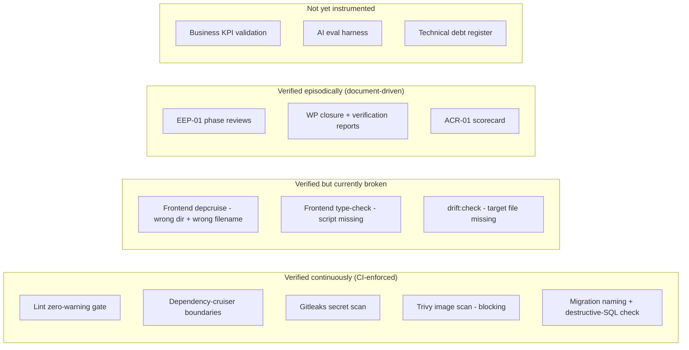
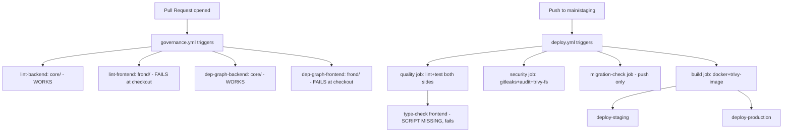
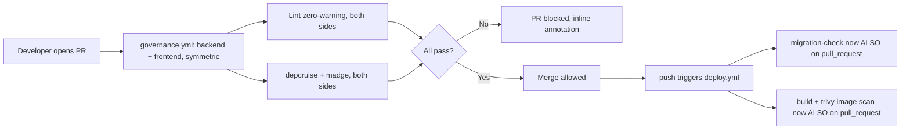
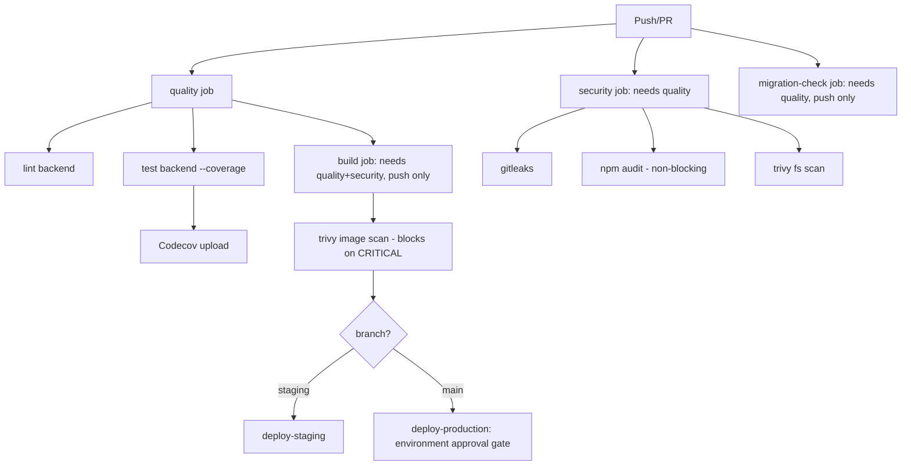
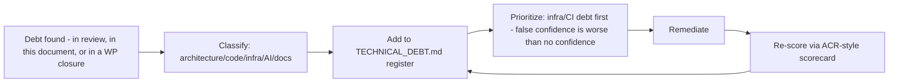
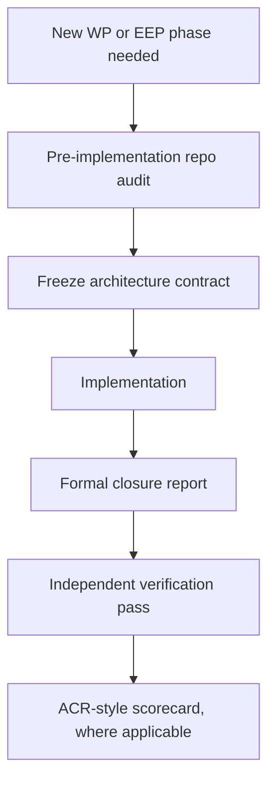
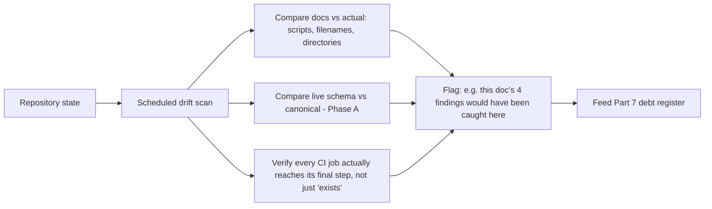

# EEP-01 — Phase J
## Enterprise Quality, Architecture Conformance & Continuous Improvement Architecture
### HireRise Career Intelligence Platform

**Role:** Chief Enterprise Architect / Principal Software Architect / Enterprise Quality Architect / Architecture Governance Lead / Platform Engineering Architect / DevSecOps Architect / Quality Engineering Architect / AI Quality Architect / Site Reliability Engineer / Enterprise Governance Architect / Continuous Improvement Consultant — combined deliverable.

**Inputs treated as authoritative, not redesigned:** EEP-01 Phases A–I. Phase J does not own *what* is built (A), *how it's secured* (B), *how it communicates* (C/D/E), *how AI behaves* (F), *where it runs* (G), *how the organization operates it* (H), or *how code is written* (I). Phase J owns the one question none of those phases answer: **how does HireRise know, continuously and with evidence rather than belief, that all of the above remain true as the system changes?** This is the feedback-loop phase — it closes the circle back onto Phases A–I rather than opening new architectural ground.

**Convention (inherited from Phases D–I):** 🔧 **CURRENT STATE** / 🎯 **TARGET STATE**, every target-state item mapped to a Part 0 migration trigger.

**Headline finding, stated up front because it changes how to read this whole document:** the repository already contains real, working pieces of a quality and conformance system — a custom ESLint plugin enforcing four architectural layer-boundary rules (`no-service-importing-service`, `no-engine-importing-engine`, plus dependency-cruiser rules for repositories, engines, and controllers), a CI pipeline (`deploy.yml`) with a genuine migration-safety fitness function (timestamp-naming enforcement, destructive-SQL detection), Gitleaks secret scanning wired into two separate workflow files, Trivy container scanning that blocks on CRITICAL CVEs, and — most notably — a **precedent engineering scorecard** (`documents/ACR-01/ARCHITECTURE_GOVERNANCE_SCORECARD.md`) that already scores a work package across eight weighted quality dimensions against direct repository evidence. That scorecard is a better starting template for Part 9 than anything this document could invent from scratch.

At the same time, direct inspection surfaced that **the quality machinery itself has quietly drifted out of sync with the repository it's meant to govern** — the exact failure mode Phase J exists to catch. Four concrete, verifiable instances, each cited with file evidence in the relevant Part below and collected in the Part 15 drift register:

1. `.github/workflows/governance.yml` sets `working-directory: frond` for both frontend jobs (`lint-frontend`, `dep-graph-frontend`) — the actual directory is `front/`. Both jobs fail at checkout on every PR, silently, because `governance.yml` triggers on `pull_request` and a red frontend-governance check is easy to read as "frontend lint failed" rather than "the workflow file itself is broken."
2. That same job also expects `.dependency-cruiser.cjs` inside `front/`; the file that actually exists is `front/dependency-cruiser-frontend.cjs` — a different filename, in addition to the directory-name defect above. `front/package.json` has no `dependency-cruiser` or `madge` devDependency at all, so even a fixed path would resolve via ad hoc `npx` fetches rather than a pinned, reproducible version.
3. `.github/workflows/deploy.yml`'s `quality` job runs `npm run type-check` in `front/` — `front/package.json` defines `dev`, `build`, `lint`, `preview`, and no `type-check` script. This step fails on every push/PR to `main`/`staging`.
4. `core/package.json` defines `"drift:check": "node scripts/check-migration-drift.js"`. No file at that path, or any file resembling it, exists anywhere in the repository. This is a phantom capability of exactly the kind Phases prior to this one flagged when found (WP-IMP-04A's ValidationService) — declared in the tooling surface, absent in the tree.

None of these are exotic gaps; each is a one-line or one-file fix. But their combined presence is the finding that matters most for a Quality & Conformance phase: **the mechanisms meant to catch drift have themselves drifted, undetected, because nothing was watching the watchers.** Part 6 and Part 15 make "verify the verifiers" itself a first-class, continuously-checked property — the alternative is a governance layer that looks rigorous in the repo and quietly does nothing in CI.

---

# PART 0 — Quality Reality Check

Migration triggers for capabilities Phase J could plausibly recommend, scored against what already exists.

| Capability | Current-state ceiling | Trigger to adopt target state |
|---|---|---|
| Architecture Review Board | This EEP series itself *is* the review function — episodic, document-driven, engineer-authored | Enough concurrent architectural proposals (2+ conflicting designs open at once) that a document series can't arbitrate fast enough |
| Continuous Architecture Validation | Real but broken in two of four checked places (governance.yml `frond` typo, missing frontend depcruise config) — see headline finding | Once the four Part-15 defects are fixed: promote from "exists but silently failing" to "verified passing on every PR," then extend rule coverage |
| Architecture Fitness Functions | Six dependency-cruiser rules (backend) + 2 ESLint layer rules + migration-naming/destructive-SQL checks in `deploy.yml` — a real, non-trivial starting set | New fitness functions added reactively, one per boundary violation actually caught in review (Phase I's own stated practice), not speculatively |
| Enterprise Quality Office | N/A — no headcount, no need for one yet | Team size where "whoever wrote the lint rules" stops being a sufficient answer to "who owns quality standards" |
| Engineering Scorecards | One exists: `ARCHITECTURE_GOVERNANCE_SCORECARD.md`, WP-scoped (Knowledge Runtime ACR-01), 8 dimensions, evidence-weighted | Recurring cadence — score every closed WP, not just one, so trend data (Part 9.3) becomes possible |
| AI Quality Platform | Phase F/XAI governance docs + `phase4b-governance-hardening.test.js` cover AI governance at the code/test level; no dedicated eval harness | Enough distinct AI-touching surfaces (agents, providers, prompts) that manual review of each PR's AI-relevant diff stops scaling |
| Technical Debt Program | Named informally across WP closure reports (e.g., Phase I's `warn`-not-`error` ESLint note); no single register | First time two engineers independently rediscover the same known-but-undocumented debt item — the cost of not having a register becomes visible |
| Continuous Compliance | Gitleaks (2 workflows), npm audit (non-blocking), Trivy (blocking on image CRITICAL) already run automatically | External compliance requirement (SOC 2, data-residency audit) that needs *evidence of continuous* control operation, not just current-state control existence |
| Enterprise Quality Dashboard | N/A — signals exist (Codecov upload, CI job statuses, the ACR scorecard) but nothing aggregates them | Enough separate signal sources that "check four different places" becomes a real daily cost, not a hypothetical one |
| Architecture Analytics Platform | N/A | Fitness-function and scorecard history (Part 16) accumulates enough data points (12+ months, several WPs) that trend analysis adds more value than the platform costs to build |

---

# PART 1 — Enterprise Quality Vision

## 1.1 Philosophy: quality as a property that must be re-verified, not a property that was once achieved

Phases A–I each made a claim about how the system *should* be structured. Phase J's premise is that every one of those claims decays by default, not by exception — schemas drift from their documented shape (Phase A), security controls get bypassed under deadline pressure (Phase B), event contracts grow undocumented fields (Phase C), and so on — unless something keeps re-checking the claim against the running system. This is the **Continuous Architecture** position (Erder & Pureur; also the basis of Ford, Parsons & Kua's *Evolutionary Architecture* fitness-function model): architecture is not a diagram approved once, it's a set of testable invariants re-evaluated on every change.

The repository evidence in this document's headline finding is itself the strongest argument for this philosophy: the four broken quality gates were not written wrong on day one — dependency-cruiser configs, `type-check` scripts, and drift-check scripts are exactly the kind of thing that's correct when written and silently stops being correct as a repo reorganizes around them (a directory rename, a package.json edit that drops a script, a config file renamed for a good local reason). Phase J's job is to make that decay visible immediately, not months later when someone happens to run the command by hand.

## 1.2 Continuous Improvement, not continuous punishment

None of Parts 2–17 are designed to be graded pass/fail against an external ideal. The ACR-01 scorecard's own scoring rationale — *"the foundation itself is well-built, but is not yet safe to build directly on without the three named conditions"* — models the right posture: quantify current state honestly, name specific blocking conditions, and don't conflate "imperfect" with "bad." Phase J's quality gates (Part 5) and scorecards (Part 9) inherit that posture rather than introducing a stricter, more punitive one.

## 1.3 Relationship to Phase B, G, H, I

- **Phase B (Security):** Phase J's continuous-compliance layer (Part 10) is how Phase B's controls are *proven* to keep operating, not just documented as existing. Gitleaks and Trivy, already in CI, are Phase B controls that Phase J's fitness-function framing (Part 4) formalizes as continuously-measured, not one-time.
- **Phase G (Platform/Runtime):** Phase G defined where things run; Phase J's operational-quality dimension (Part 2) and drift management (Part 15) cover infrastructure/configuration drift on top of that runtime.
- **Phase H (Operations/Governance):** Phase H owns the organizational process (who approves what); Phase J's quality gates (Part 5) are the automated, mechanical enforcement of a subset of that process — the parts that don't need a human in the loop.
- **Phase I (Engineering Standards):** Phase I named the lint rules and dependency-cruiser config as they exist; Phase J's Part 3/4/6 pick those exact same artifacts back up and ask "are they actually running, and are they actually catching things" — the verification layer on top of Phase I's standards layer.

---

# PART 2 — Enterprise Quality Model

## 2.1 🔧 CURRENT STATE — canonical quality dimensions, evidence-mapped

| Dimension | What exists today | Evidence |
|---|---|---|
| Architecture Quality | 6 dependency-cruiser rules + 2 custom ESLint layer rules | `core/.dependency-cruiser.cjs`, `core/src/eslint-plugin-local/` |
| Engineering Quality | Jest unit/integration/contract tests, `npm run lint`, zero-warning CI gate | `core/package.json` scripts, `.github/workflows/governance.yml` |
| Security Quality | Gitleaks (2 workflows), Trivy filesystem + image scan, npm audit | `deploy.yml`, `core/.github/workflows/secret-scan.yml` |
| Platform Quality | Health/ready smoke tests, migration safety checks, rolling deploy with health-check rollback | `deploy.yml` `migration-check`/`deploy-production` jobs, `scripts/health-smoke.js`, `scripts/ready-smoke.js` |
| AI Quality | Governance test suite for Phase 4B, response-contract governance tests for knowledge runtime | `core/__tests__/ai/phase4b/phase4b-governance-hardening.test.js`, `responseContractGovernance.test.js` |
| Data Quality | Migration-drift analysis reports (WP-DB-01 series), canonical schema comparison | `core/supabase/docs/WP-DB-01 — Enterprise Drift Analysis Report.docx` and siblings |
| Integration Quality | Contract test suite (`test:contract`), separate from unit/integration | `core/tests/contract/`, `npm run test:contract` |
| Documentation Quality | Dense — 9 completed EEP-01 phases, ~30 canonical KB/KRA documents, per-WP closure reports | `core/supabase/docs/architecture/student-academic-domain/`, `documents/` tree |
| Developer Experience Quality | `npm run lint/test/depcruise/madge` as one-command local checks | `core/package.json` |
| Operational Quality | Rolling deploy, blue/green-style swap, automatic rollback on failed health check | `deploy.yml` `deploy-production` job |
| Business Quality | Not directly instrumented in-repo; inferred only via WP closure narratives, not measured | Absence noted — see Part 11 |

## 2.2 Capability map

## 2.3 🎯 TARGET STATE

A single quality model document (this Part, matured) referenced from `CONTRIBUTING.md` (Phase I already noted this file doesn't exist — same recommendation applies here: an afternoon of work, not a program). Business Quality becomes measurable once product analytics exist to instrument it (Part 0 trigger: same as Enterprise Quality Dashboard).

---

# PART 3 — Architecture Conformance Framework

For each prior phase: what "conformance" means concretely, and how it's checked today.

| Phase | Conformance objective | 🔧 Automated validation today | Manual review today | Gap |
|---|---|---|---|---|
| A — Physical Data Model | Schema matches documented canonical shape; no undocumented parallel table families | None automated — WP-DB-01's drift analysis was a manual, point-in-time static review | WP-ARCH-01A repository evidence investigation (manual) | No CI check re-runs the drift analysis on new migrations; it was a one-time report, not a recurring gate |
| B — Security Architecture | RLS/GRANT patterns consistently applied; secrets never committed | Gitleaks (2 workflows), Trivy | ACR-01 scorecard scored Security at 90/100 | Two Gitleaks workflows (`deploy.yml` security job + `secret-scan.yml`) run independently with no single source of truth for pass/fail — duplicate signal, not redundant safety (Part 15) |
| C — Event Architecture | Event naming/shape consistency across producers/consumers | None found | None found beyond code review | Named directly in the Phase J brief ("event naming" fitness function) — does not exist yet; Part 4 proposes it |
| D — Messaging & Event Processing | Delivery guarantees, idempotency patterns honored | Contract tests (`test:contract`) partially cover this if messaging contracts are included | Not confirmed without reading contract test contents in detail | Recommend auditing `test:contract` coverage against Phase D's stated guarantees specifically, as a Part 4 fitness function |
| E — Integration Architecture | External integrations behind adapters (ACL pattern) | The 2 dependency-cruiser/ESLint rules don't yet cover `adapters/` specifically | Phase I named this as the model but not yet lint-enforced | Direct extension of the existing rule pattern — low effort (Phase I Part 4.2 already recommended this; still open) |
| F — AI & Intelligent Automation | Provider abstraction never bypassed; deterministic engine retains sole scoring authority | `phase4b-governance-hardening.test.js` | Phase 4B closure audit (manual) | No fitness function stops a future PR from calling a provider SDK directly outside the adapter — same gap as Phase E row |
| G — Platform & Runtime | Health/readiness contracts honored; rolling deploys don't drop traffic | `health:smoke`, `ready:smoke`, deploy-time health check with rollback | — | Reasonably strong already |
| H — Operations & Governance | PR review gates, deployment approval | GitHub `environment: production` approval gate on `deploy-production` | — | Reasonably strong already |
| I — Engineering Standards | Layer boundaries, naming conventions | 6 depcruise rules + 2 ESLint rules | — | Two of these — the frontend depcruise wiring — are currently non-functional (headline finding); see Part 15 |

**Reading this table honestly:** conformance automation exists strongly for G, H, and I; exists partially and in a broken state for parts of I (frontend); and does not exist at all yet for A (recurring), C, D, E, and F beyond what their own test suites incidentally cover. This is the actual current-state ceiling — Part 4 and Part 19 sequence closing these gaps by risk, not all at once.

---

# PART 4 — Architecture Fitness Functions

## 4.1 🔧 CURRENT STATE — fitness functions that already exist, named formally

| Fitness function | Metric | Threshold | Measurement method | Enforcement | Reporting |
|---|---|---|---|---|---|
| No circular dependencies (backend) | Circular import count | 0 | `madge --circular src` | CI (`governance.yml`) | CI job status |
| No circular dependencies (frontend) | Circular import count | 0 | `madge --circular --extensions ts,tsx src/` | CI, but job fails at checkout — see 4.3 | Currently: none (job never reaches the check) |
| Repository layer isolation | `*.repository.js` importing `*.service.js`/`*.engine.js` | 0 violations | `depcruise` rule | CI (backend only) | CI job status |
| Engine layer isolation | `*.engine.js` importing `*.service.js` | 0 violations | `depcruise` rule | CI (backend only) | CI job status |
| Controller layer isolation | `*.controller.js` importing `*.repository.js`/`*.engine.js` | 0 violations | `depcruise` rule | CI (backend only) | CI job status |
| Service-to-service isolation | `*.service.js` requiring sibling `*.service.js` outside `shared/` or approved coordinator pairs | 0 unapproved violations | Custom ESLint rule (`lib/rules/no-service-importing-service.js`, "v3 hardened") | CI (`npm run lint`, zero-warning gate) | CI job status |
| Engine-to-engine isolation | `*.engine.js` requiring sibling `*.engine.js` | 0 violations | Custom ESLint rule | CI | CI job status |
| Migration filename convention | Non-timestamped migration filenames | 0 | `grep`-based check in `deploy.yml` | CI (`migration-check` job, push only — not PR) | CI job status |
| Destructive-SQL guard | Unguarded `DROP TABLE`/`DROP COLUMN`/`TRUNCATE` | 0 | `grep`-based check in `deploy.yml` | CI (`migration-check` job, push only) | CI job status |
| Secret leakage | Committed secrets matching Gitleaks ruleset | 0 | Gitleaks | CI (2 separate workflows) | CI job status |
| Container CVEs | CRITICAL-severity CVEs in built images | 0 | Trivy | CI (`build` job, push only) | SARIF upload to code scanning |
| Test pass rate | Failing tests | 0 | Jest, `--runInBand` | CI (`quality` job) | CI job status + Codecov coverage upload |

**Honest gap this table surfaces:** the migration-safety and Trivy-image fitness functions only run `if: github.event_name == 'push'` — they do **not** run on pull requests. A destructive, unguarded migration or a CRITICAL CVE can merge to `staging`/`main` via PR without either check having run; it's only caught after the push that triggers the `push` pipeline, i.e., after merge, not before. This is a real, fixable current-state gap, not a target-state aspiration — the fix is changing the `if` condition, not building new tooling.

## 4.2 🎯 TARGET STATE — fitness functions worth adding, generalizing what already works

| New fitness function | Rationale | Migration trigger |
|---|---|---|
| Adapter-boundary isolation (extends existing pattern to `adapters/`) | Phase E/F/I all named this as the intended pattern; not yet lint-enforced | Any provider-bypass violation actually found in a PR review (reactive, per Phase I's own stated philosophy) |
| Event naming/shape contract check | Phase C fitness function named directly in the Phase J brief; nothing today checks event payload shape against Phase C's documented contract | First event-shape drift bug that reaches an environment (staging or prod) |
| API contract check (OpenAPI/schema diff on PR) | No current automated check that a route's actual request/response shape matches any documented contract | Second externally-facing API consumer (internal consumers tolerate drift better than external ones) |
| Documentation freshness check (flag docs referencing since-renamed files/scripts) | This document itself found four instances of exactly this problem (`drift:check`, `type-check`, `frond`, wrong depcruise filename) | Immediately — this is the cheapest, highest-signal fitness function to add given what Part 15 already found |
| Performance budget (API response-time regression gate) | Not present in CI at all today | First user-facing latency complaint traceable to a specific deploy |
| Test coverage threshold enforcement | Coverage is *uploaded* to Codecov but nothing in CI fails a PR for a coverage regression | First coverage regression that goes unnoticed for more than one release cycle |

---

# PART 5 — Enterprise Quality Gates

## 5.1 🔧 CURRENT STATE — gates as they exist, mandatory vs advisory

| Stage | Gate | Mandatory or advisory (as configured) | Evidence |
|---|---|---|---|
| Development | Local lint/test/depcruise/madge scripts | Advisory — nothing stops an uncommitted local run from being skipped | `core/package.json` |
| Pull Request | ESLint zero-warning (`--max-warnings=0`), depcruise, madge | Mandatory for backend; **non-functional for frontend** (headline finding #1/#2) | `governance.yml` |
| Build (push) | Lint, type-check (frontend — **currently broken**, headline finding #3), test with coverage | Mandatory | `deploy.yml` `quality` job |
| CI (push) | Gitleaks, npm audit, Trivy filesystem scan | Gitleaks/Trivy mandatory (block on findings for images); npm audit explicitly `continue-on-error: true` (advisory by design) | `deploy.yml` `security` job |
| Release/Build | Docker image build + Trivy image scan | Mandatory — `exit-code: 1` on CRITICAL | `deploy.yml` `build` job |
| Schema changes | Migration naming + destructive-SQL check | Mandatory, but **push-only, not PR** (Part 4.1 gap) | `deploy.yml` `migration-check` job |
| Production deploy | GitHub Environment approval gate (`environment: production`) | Mandatory (GitHub-native protection rule, assumed configured at the repo/org level — not verifiable from code alone) | `deploy.yml` `deploy-production` job |
| AI deployment | None found as a distinct gate | Not present | — |
| Architecture changes | None found as a distinct gate beyond the layer-boundary lint rules that apply to all code changes | Folded into standard PR gate | — |

## 5.2 🎯 TARGET STATE

Once Part 15's four defects are fixed, promote the migration-safety and Trivy-image checks to run `on: pull_request` as well as `push`, closing the "merge before check" window named in Part 4.1. A distinct, lightweight AI-deployment gate (prompt/agent diff triggers a required reviewer with AI-governance context) becomes worth adding once agent count or prompt-change frequency makes per-PR ad hoc review inconsistent (Part 0 trigger, same as AI Quality Platform).

---

# PART 6 — Continuous Architecture Validation

## 6.1 🔧 CURRENT STATE — what's automated, and where it silently fails

The diagram is drawn from the workflow YAML as it exists today, not as it was presumably intended — the two red-path branches (`LF`, `DF`, `QT`) are real, reproducible failures given the current repository contents, not hypothetical risks.

## 6.2 How these checks integrate into CI/CD (as designed, once fixed)

Backend validation (dependency rules, layer boundaries, secret scanning, container scanning) is fully wired end-to-end and working. Frontend validation is wired in configuration but not functionally connected to the actual repository layout — a three-line fix (correct working-directory, correct config filename, add the missing `type-check` script and `dependency-cruiser`/`madge` devDependencies) restores full parity with the backend path. This is Part 15's highest-priority remediation item.

## 6.3 🎯 TARGET STATE

A single reusable composite workflow (or GitHub Actions reusable workflow file) shared between `governance.yml` and `deploy.yml`'s `quality` job, so backend and frontend lint/depcruise/madge logic is defined once — reducing the chance that a future repo reorganization silently breaks one workflow while another (that happens to hardcode the correct path) keeps working. This directly addresses the root cause of headline finding #1/#2: the path was hardcoded in one place and never re-verified against the other.

---

# PART 7 — Technical Debt Governance

## 7.1 🔧 CURRENT STATE — debt as it exists today, undocumented as a single register but real and traceable

Debt items surfaced across this and prior EEP-01 phases, none currently centralized:

| Item | Type | Source | Status |
|---|---|---|---|
| ESLint rules set to `warn` under "Temporary Noise Reduction During Adoption Phase" | Code debt | Phase I, `.eslintrc.cjs` | Open, no tracked completion date |
| Legacy flat `services/`/`engines/`/`intelligence/` directories coexisting with `modules/` | Architecture debt | Phase I Part 2.1 | Open, in-progress migration, no completion criterion tracked |
| Second schema mismatch (`skill_embeddings`/`embedding_vector`) blocking clean `db reset` | Data/architecture debt | WP-DB-01 series (recent work) | Open, actively blocking |
| Duplicated cache-helper and response-envelope logic (3x each) | Code debt | ACR-01 scorecard, Maintainability 74/100 | Open |
| One repository built and unwired | Code debt | ACR-01 scorecard (D-04) | Open |
| Two parallel eslint-plugin-local rule files for the same rule name (`rules/` v1 vs `lib/rules/` v3) | Documentation/code debt — the unused file is dead but not removed, a maintenance hazard the v3 file's own header already warns about | This document (Part 3, direct inspection) | Newly surfaced — not previously tracked |
| Four CI/tooling drift defects (Part 15 register) | Infrastructure/documentation debt | This document | Newly surfaced |
| Migration-safety/Trivy-image gates running push-only, not PR | Process debt | This document (Part 4.1/5.1) | Newly surfaced |

## 7.2 Classification and prioritization model

- **Architecture debt** — structural, affects future velocity broadly (e.g., dual directory structure). Reviewed at EEP-01 phase cadence.
- **Code debt** — localized, fixable without cross-cutting coordination (e.g., duplicated helpers). Reviewed per-WP.
- **Infrastructure/CI debt** — highest priority per unit of effort, since a broken gate provides *false confidence* rather than *no confidence* — arguably worse. The four items in this document's headline finding fall here and should be fixed before any new fitness function is added on top of them (no point adding Part 4.2 checks to a pipeline whose existing checks aren't verified to run).
- **AI debt** — governance/prompt/agent-specific; tracked separately given Phase F/XAI's existing document trail.
- **Documentation debt** — stale references (like the four drift items) that mislead rather than merely lag.

## 7.3 🎯 TARGET STATE

A single `TECHNICAL_DEBT.md` register (or equivalent GitHub Projects board), populated from the table above as a starting seed rather than built from nothing, reviewed at each EEP-01 phase boundary and at WP closure. Review cadence: quarterly full-register review, plus mandatory addition of any new debt at the moment it's discovered (not batched) — mirroring how this document surfaced its own findings during a single inspection pass rather than waiting for a dedicated audit.

---

# PART 8 — AI Quality Assurance

## 8.1 🔧 CURRENT STATE — what exists, grounded in Phase F/XAI evidence

| AI QA area | Current-state evidence | Ceiling |
|---|---|---|
| Prompt evaluation | `core/src/prompts/` exists as a directory; no dedicated eval harness found | Ad hoc, code-review-only |
| Model evaluation | Provider-abstraction/adapter layer (Phase E/F) allows swapping providers; no automated comparative eval found | Manual |
| Agent evaluation | `BaseAgent`-derived agents (Phase I convention) tested via standard Jest suites, not agent-specific eval | Standard unit testing only |
| RAG/knowledge retrieval evaluation | `responseContractGovernance.test.js` checks contract shape, not retrieval quality/relevance | Contract-shape only, not quality |
| Knowledge quality | KB/KRA canonical documents (30 documents) provide ground truth; no automated check that runtime knowledge matches them | Manual, document-driven |
| Hallucination detection | Not found | Not present |
| Bias evaluation | The structurally-enforced ethics constraint (established in WP-KB/KRA: financial context must never reduce student opportunity) is a real, named governance rule — but enforcement mechanism (test? runtime guard?) was not directly located in this inspection pass and should be confirmed rather than assumed present | Partially — rule exists, enforcement mechanism unconfirmed |
| Safety evaluation | `phase4b-governance-hardening.test.js` — governance test suite exists | Test-suite level |
| Human review | Implicit via PR review; no distinct AI-output review step | Standard code review only |
| Business KPI validation | Not found | Not present |

## 8.2 🎯 TARGET STATE

A minimal AI eval harness — even a small, versioned set of golden prompts/expected-shape assertions run in CI alongside existing tests — is the highest-leverage next step, since `responseContractGovernance.test.js` already establishes the pattern of testing AI-adjacent contracts; extending it to cover retrieval relevance and the ethics constraint directly (not just via structural code review) closes the two "unconfirmed enforcement" gaps named above with the least new infrastructure. A dedicated AI Quality Platform (human review queues, drift dashboards, automated bias-metric tracking) is deferred to the Part 0 trigger.

---

# PART 9 — Engineering Scorecards

## 9.1 🔧 CURRENT STATE — the precedent already set

`documents/ACR-01/ARCHITECTURE_GOVERNANCE_SCORECARD.md` already establishes the canonical pattern this Part formalizes platform-wide: eight weighted dimensions (Architecture Conformance, Repository Quality, Runtime Quality, Service Boundaries, Maintainability, Scalability, Security, Testability), each scored 0–100 against direct repository evidence rather than self-reported documentation, with an Overall score adjusted down from the simple average when blocking conditions exist. That scorecard is WP-scoped (Knowledge Runtime ACR-01); this Part's job is to generalize its method, not replace it.

## 9.2 Canonical scorecard dimensions (extending the ACR-01 template)

| Scorecard | Dimensions | Owner cadence |
|---|---|---|
| Engineering | Repository Quality, Maintainability, Testability (ACR-01 dimensions, reused) | Per-WP closure |
| Architecture | Architecture Conformance, Service Boundaries (ACR-01 dimensions, reused) | Per-EEP-phase + per-WP |
| Security | Security (ACR-01 dimension, reused) + continuous-compliance pass rate (Part 10) | Per-release |
| Platform | Runtime Quality, Scalability (ACR-01 dimensions, reused) | Per-release |
| AI | New — Part 8's areas, scored once an eval harness exists | Per AI-touching WP |
| Operations | Deployment success rate, rollback frequency, health-check pass rate | Per-release |
| Developer Experience | Local-check runtime, CI feedback latency, onboarding time-to-first-PR | Quarterly |
| Documentation | Freshness (Part 4.2's proposed check), completeness vs Phase A–I canonical set | Per-EEP-phase |
| Technical Debt | Register size (Part 7), age of oldest open item | Quarterly |
| Service Ownership | Not yet applicable — no distinct service-ownership model found in repo evidence | Deferred |

## 9.3 Example KPIs, using ACR-01's actual scored values as the baseline (not hypothetical)

- Architecture Conformance: baseline 82/100 (ACR-01) → target: no regression below 82 without a documented, accepted reason (mirroring ACR-01's own D-01/D-02 pattern of naming specific deviations rather than a bare number).
- Security: baseline 90/100 (ACR-01) → target: maintain, with continuous-compliance (Part 10) providing the evidence trail between scorecard events rather than only at scorecard time.
- Maintainability: baseline 74/100 (ACR-01, the lowest-scoring dimension, explicitly due to duplicated helper code) → target: re-score after the duplicated cache-helper/response-envelope debt (Part 7.1) is addressed, expect measurable improvement as a direct test of whether fixing named debt actually moves the scorecard.

## 9.4 🎯 TARGET STATE

Scorecards become recurring (every WP closure, not just ACR-01's single instance) so that Part 16's maturity assessment and Part 18's roadmap have real trend data rather than a single data point. This requires no new tooling — only discipline in re-running the existing ACR-01 method at each closure, which is itself the cheapest possible target-state step available in this entire document.

---

# PART 10 — Continuous Compliance

## 10.1 🔧 CURRENT STATE — automated compliance checks that already run

| Standard area | Automated check | Blocking? | Evidence |
|---|---|---|---|
| Secrets in source | Gitleaks | Yes (both workflows) | `deploy.yml`, `secret-scan.yml` |
| Known-vulnerable dependencies | npm audit | No — `continue-on-error: true` (deliberate, since advisories can be false-positive-prone) | `deploy.yml` |
| Known-vulnerable container images | Trivy | Yes, CRITICAL severity | `deploy.yml` |
| Filesystem-level vulnerabilities | Trivy (fs scan) | Reported via SARIF, not blocking directly | `deploy.yml` |
| Engineering standards (layer boundaries) | depcruise + ESLint rules | Yes (backend); no (frontend, broken) | See Part 4/6 |
| Database standards (migration naming, destructive SQL) | grep-based checks | Yes, but push-only | `deploy.yml` |
| API standards | None found | — | — |
| AI governance | Governance test suite | Yes, as part of standard test run | `phase4b-governance-hardening.test.js` |
| Documentation standards | None found | — | — |

## 10.2 🎯 TARGET STATE

Two duplicate Gitleaks workflows (`deploy.yml`'s `security` job and the standalone `secret-scan.yml`) should be consolidated to one source of truth — not because either is wrong, but because two independently-configured scanners covering the same control makes it unclear which one is authoritative when they disagree (e.g., different exclusion rules drifting apart over time, the same class of problem as Part 15's other findings). API and documentation standards checks are deferred to the Part 4.2 triggers (second external API consumer; the documentation-freshness check becomes available immediately once written, given how directly this document's own findings motivate it).

---

# PART 11 — Enterprise Metrics

## 11.1 🔧 CURRENT STATE — measured today vs. not yet measured

| Category | Measured today | Not yet measured |
|---|---|---|
| Architecture | Fitness-function pass/fail (Part 4) | Drift frequency over time |
| Engineering | Test pass rate, coverage % (Codecov) | Cyclomatic complexity, PR cycle time |
| Quality | ACR-01 scorecard (one instance) | Recurring trend |
| Security | Gitleaks/Trivy pass-fail | Mean time to remediate a found CVE |
| Reliability | Health/ready smoke test pass-fail | Uptime %, MTTR, incident count |
| Performance | Not measured in CI | Response-time percentiles, throughput |
| AI | Governance test pass-fail | Hallucination rate, agent success rate, latency per agent call |
| Business outcomes | Not measured in this repository's tooling | Conversion, retention, student outcome quality (SIM/KRA's own domain metrics — likely measured elsewhere, e.g. product analytics, but not visible from this codebase inspection) |
| Developer productivity | Not measured | PR throughput, review latency, local-check runtime |
| Customer experience | Not measured in this repository's tooling | Not applicable to this evidence base |

## 11.2 🎯 TARGET STATE

Instrument the cheapest, highest-signal gaps first: PR cycle time and CI feedback latency are derivable directly from existing GitHub Actions run history with no new code, and should be the first dashboard populated (Part 12) — a genuinely free win given the data already exists in GitHub's own API.

---

# PART 12 — Enterprise Dashboards

## 12.1 🎯 TARGET STATE (no dashboard exists today — 🔧 current state is "check four separate places by hand")

| Dashboard | Audience | Primary signals | Source (already exists) |
|---|---|---|---|
| Architecture | Engineers, tech lead | Fitness-function pass/fail trend, drift register (Part 15) | GitHub Actions run history, depcruise/ESLint output |
| Engineering | Engineers | Test pass rate, coverage trend, lint warning count | Codecov, CI logs |
| Security | Tech lead, anyone doing compliance review | Gitleaks/Trivy findings over time, npm audit advisories | GitHub code scanning (SARIF), Actions logs |
| Platform | Tech lead, on-call | Deploy success/failure, rollback frequency, health-check latency | `deploy.yml` job history |
| AI | Tech lead | Governance test pass rate; eval harness results once Part 8's target state exists | Jest output |
| Operations | Tech lead | Deployment frequency, migration-check pass rate | `deploy.yml` job history |
| Executive leadership | Non-engineering stakeholders | Single Overall Enterprise Readiness number (ACR-01 style), technical debt register size trend, roadmap phase status (Part 19) | Aggregated from all of the above |

## 12.2 Current-state action, cheap and immediate

Given no dashboard tooling exists yet, the lowest-cost first step is a single Markdown status page (`STATUS.md` or similar), hand-updated at each EEP-01 phase boundary, summarizing the ACR-01-style scorecard plus the Part 15 drift register's open-item count. This is not a target-state platform — it's the same "write the one page, even by hand" pattern this document itself follows for the Part 0 trigger tables.

---

# PART 13 — Continuous Improvement

## 13.1 🔧 CURRENT STATE — what already functions as continuous improvement, even if not labeled as such

The WP closure-report pattern (each WP producing a formal closure document, an independent verification pass, and — where relevant — a regression check against the prior WP's claimed test count) is, functionally, a lightweight retrospective-and-lessons-learned cycle already operating. Phase I's identification of the `warn`-not-`error` ESLint debt, and this document's identification of the four CI drift defects, are both instances of the same underlying practice: **inspect before recommending, name what's found honestly, defer what isn't urgent.** That habit *is* the continuous-improvement mechanism already in place; it just isn't currently written down as a named process with its own cadence.

## 13.2 🎯 TARGET STATE

Formalize the existing habit rather than replacing it: a short retro note appended to each WP closure report (what worked, what surprised the reviewer, one thing to change next time), feeding a running Improvement Backlog that's just the Part 7 Technical Debt register's sibling for process items rather than code items. Innovation backlog, architecture evolution tracking, and knowledge management formalize once the Improvement Backlog itself has enough entries that "just remember" stops being reliable — the same trigger logic used throughout this document.

---

# PART 14 — Enterprise Quality Reference Architectures

## 14.1 Continuous Architecture Validation (target state, once Part 15 fixes land)

## 14.2 CI/CD Quality Pipeline (as it exists today, backend path — the working reference)

## 14.3 Technical Debt Lifecycle

## 14.4 Architecture Review Workflow (current state — document-driven, not tool-driven)

## 14.5 Architecture Drift Detection (target state)

---

# PART 15 — Architecture Drift Management

## 15.1 🔧 CURRENT STATE — the drift register, evidence-verified in this review pass

| # | Drift type | Finding | Verified by | Severity |
|---|---|---|---|---|
| 1 | CI configuration drift | `governance.yml` `working-directory: frond` — should be `front` | Direct read of `.github/workflows/governance.yml`; `frond` directory confirmed absent from repo | High — both frontend governance jobs fail on every PR |
| 2 | CI configuration drift | Same job also targets `.dependency-cruiser.cjs` in `front/`; actual file is `front/dependency-cruiser-frontend.cjs` | `ls front/` | High — compounds #1 |
| 3 | Dependency drift | `front/package.json` has no `dependency-cruiser` or `madge` devDependency | Direct read of `front/package.json` | Medium — ad hoc `npx` resolution even once path/filename are fixed |
| 4 | Script drift | `deploy.yml` runs `npm run type-check` in `front/`; no such script exists (`dev`, `build`, `lint`, `preview` only) | Direct read of `front/package.json` scripts | High — fails every push/PR quality job |
| 5 | Documentation/script drift | `core/package.json`'s `drift:check` references `scripts/check-migration-drift.js`, which does not exist anywhere in the repository | Repo-wide filename search, zero matches | Medium — phantom capability, not currently invoked by CI so no active breakage, but misleading if relied upon |
| 6 | Code drift (dead file) | Two implementations of `no-service-importing-service` exist (`rules/` v1, `lib/rules/` v3); `index.js` wires only the v3 `lib/rules/` version, leaving the v1 file live on disk and a plausible edit target for a future engineer who doesn't check `index.js` first | Direct diff of both files, direct read of `index.js` | Low-medium — the v3 file's own header already documents a "stale module cache" hazard, and this dual-file situation is a physical instance of exactly that class of risk |
| 7 | Process drift | Migration-safety and Trivy-image-scan fitness functions run `push`-only, not on `pull_request` | Direct read of `deploy.yml` `if:` conditions | Medium — window for a violating change to merge before either check runs |
| 8 | Governance duplication | Two independent Gitleaks workflows (`deploy.yml` security job, `secret-scan.yml`) with no declared source of truth if their exclusion rules diverge | Direct read of both files | Low — currently redundant-safe, but a latent single-source-of-truth risk |

## 15.2 Detection, alerting, remediation, governance

- **Detection:** for #1–#5, detection is exactly what this document's own inspection process did — read the CI YAML against the actual repository tree rather than trusting either in isolation. Part 4.2's proposed "documentation freshness" fitness function generalizes this into a recurring, automatable check rather than a one-time manual pass.
- **Alerting:** none of these currently alert anyone — they fail silently as red CI checks that look like ordinary lint/test failures rather than infrastructure defects, which is precisely why they weren't caught earlier. Target state: a CI job whose *only* job is to `test -d front && test -f front/.dependency-cruiser.cjs && npm run type-check --prefix front --dry-run`-style existence checks, failing fast with a distinct, unambiguous message ("workflow configuration error," not "lint failed").
- **Remediation:** items 1–4 are each a single-line or single-file fix (rename directory reference, rename or relocate the config file, add the missing script and devDependencies). Item 5 requires a decision — either write the missing script or remove the phantom npm script — not a technical fix per se. Item 6 is a deletion of a superseded file. Item 7 is an `if:` condition change. Item 8 requires a decision on which Gitleaks invocation is authoritative.
- **Governance:** add all eight items to the Part 7 Technical Debt register immediately (they already are, in Part 7.1); re-verify via the Part 4.2 documentation-freshness check once written, so this exact class of finding doesn't require another full manual repository read to catch next time.

## 15.3 🎯 TARGET STATE

Scheduled (weekly or per-EEP-phase) automated drift scans covering: code drift (depcruise/madge, already scheduled via CI), architecture drift (Part 3's conformance table, re-run per phase), security drift (Gitleaks/Trivy, already continuous), configuration drift (Part 15.2's proposed existence-check job), infrastructure drift (deferred — no IaC evidence found in this repository to scan), AI drift (deferred to Part 8's eval harness), documentation drift (Part 4.2), schema drift (WP-DB-01's existing drift-analysis method, re-run per migration batch rather than once), dependency drift (`npm audit`, already continuous but non-blocking).

---

# PART 16 — Enterprise Quality Maturity Model

## 16.1 Maturity levels

- **Level 1 — Reactive Quality:** issues found after the fact, fixed one at a time, no register.
- **Level 2 — Managed Quality:** standards documented (Phase I), some automation exists, but automation isn't verified to actually run (this is where the four Part 15 defects sit — automation *exists* but isn't *confirmed working*).
- **Level 3 — Continuous Quality:** automation runs on every change and is itself periodically re-verified; fitness functions cover most architectural invariants; recurring scorecards (not one-off).
- **Level 4 — Predictive Quality:** trend data (from recurring scorecards, Part 11 metrics) predicts where debt or drift will occur before it manifests as a failure.
- **Level 5 — Autonomous Continuous Improvement:** the system detects, prioritizes, and in some cases remediates drift/debt with minimal human intervention.

## 16.2 HireRise's current assessment, based on repository evidence gathered in this review

**HireRise sits at Level 2, with strong Level 3 building blocks already in place on the backend side.** The evidence for "strong Level 2, not Level 1": genuine automated fitness functions exist (Part 4.1's twelve-row table), a real scorecard precedent exists (ACR-01), and the WP closure/verification-pass pattern is a genuine recurring practice, not ad hoc firefighting. The evidence for "not yet Level 3": exactly the automation that should make it Level 3 (frontend governance, `type-check`, `drift:check`) is currently non-functional and was not previously caught, which is itself the signature of Level 2 rather than Level 3 — "managed" in the sense of documented and configured, not yet "continuous" in the sense of continuously *verified to be operating*.

The path from Level 2 to Level 3 is short and concrete for this specific codebase: fix the four Part 15 items, extend the migration-safety/Trivy gates to PR-time (Part 4.1), and make Part 9's scorecard recurring rather than single-instance. None of that requires new categories of tooling — it requires making the existing tooling actually run everywhere it's configured to run.

---

# PART 17 — Architecture Decision Records (ADR)

No formal ADR directory exists in the repository today (only one WP-specific ADR review document was found: `documents/xai2 phase/WP_XAI2_01A_ENTERPRISE_FAIRNESS_GATE_ADR_REVIEW.md`). This Part both recommends the format going forward and records the decisions this Phase J document itself makes, as the first entries in that eventual register.

## ADR-J-01: Fix CI/tooling drift before adding new fitness functions

- **Context:** This review found four CI/tooling drift defects (Part 15, items 1–4) alongside real opportunities for new fitness functions (Part 4.2).
- **Problem:** Limited engineering time — should new checks be added first, or should existing broken checks be fixed first?
- **Options:** (a) add new fitness functions immediately for maximum coverage growth; (b) fix existing broken gates first; (c) do both in parallel.
- **Decision:** (b) — fix existing broken gates first.
- **Consequences:** Slower growth in raw fitness-function count in the short term; but avoids the specific failure mode this document exists to prevent — a governance layer that looks comprehensive on paper while parts of it silently do nothing.
- **Trigger to revisit:** None expected; this ordering principle should hold for any future gap-closing work, not just this one.

## ADR-J-02: Generalize the ACR-01 scorecard rather than inventing a new one

- **Context:** Part 9 needed a scorecard framework; `ARCHITECTURE_GOVERNANCE_SCORECARD.md` already exists, WP-scoped.
- **Problem:** Build a new platform-wide scorecard model from scratch, or extend the existing one?
- **Decision:** Extend — reuse ACR-01's exact dimension set and evidence-weighted scoring method, add only the dimensions ACR-01 didn't need at WP scope (AI, Operations, Documentation, Technical Debt, Service Ownership).
- **Consequences:** Continuity of method; ACR-01's own baseline numbers (82, 88, 85, 92, 74, 78, 90, 95) become the first real trend data point rather than being discarded.
- **Trigger to revisit:** If a future WP's evidence base is structurally different enough (e.g., a pure-frontend WP) that some ACR-01 dimensions genuinely don't apply.

## ADR-J-03: Defer AI eval harness build-out until contract-test pattern is extended, rather than building a separate system

- **Context:** Part 8 found governance/contract tests but no eval harness.
- **Problem:** Build a dedicated AI eval platform now, or extend the existing `responseContractGovernance.test.js` pattern first?
- **Decision:** Extend the existing pattern first (Part 8.2); defer a dedicated platform to its Part 0 trigger.
- **Consequences:** Faster initial coverage of the two named gaps (retrieval relevance, ethics-constraint enforcement) using infrastructure that already exists and is already understood by the team.
- **Trigger to revisit:** Once agent/prompt surface area grows enough that Jest-based contract tests stop being expressive enough to catch real failures.

---

# PART 18 — Continuous Architecture Roadmap

| Track | Current | Next | Later |
|---|---|---|---|
| Architecture validation | Backend-only, working | Fix frontend parity (Part 15 #1–#4) | Reusable composite workflow (Part 6.3) |
| Engineering scorecards | One instance (ACR-01) | Make recurring per-WP (Part 9.4) | Trend dashboard (Part 12) |
| AI quality | Governance tests only | Extend contract-test pattern (Part 8.2) | Dedicated eval harness (Part 0 trigger) |
| Technical debt governance | Scattered across WP docs | Single register (Part 7.3) | Quarterly review cadence, aging metrics |
| Continuous compliance | Real but duplicated (2x Gitleaks) | Consolidate to one source of truth (Part 10.2) | External audit-ready evidence trail |
| Developer productivity | Unmeasured | Instrument PR cycle time from existing GitHub data (Part 11.2) | Dedicated DevEx dashboard |
| Architecture analytics | N/A | N/A until scorecards are recurring | Build once 12+ months of trend data exists |
| Platform analytics | Health/ready smoke only | Add performance budget gate (Part 4.2) | Full observability dashboard (Phase G territory, cross-referenced) |

---

# PART 19 — Enterprise Quality Roadmap

## Phase 1 — Quality Foundations (immediate, days not weeks)
- **Objectives:** Fix the four Part 15 CI/tooling drift defects; write `TECHNICAL_DEBT.md` seeded from Part 7.1's table; delete the superseded `rules/no-service-importing-service.js` file (Part 15 #6).
- **Prerequisites:** None — every item here is a fix to something that already exists.
- **Dependencies:** None.
- **Success criteria:** `governance.yml` frontend jobs pass; `deploy.yml` `quality` job's frontend `type-check` step passes; `drift:check` either has a real implementation or is removed from `package.json`.
- **Adoption trigger:** Already met — start immediately.

## Phase 2 — Continuous Verification
- **Objectives:** Move migration-safety and Trivy-image gates to run on `pull_request`, not just `push` (Part 4.1/5.2); add the documentation-freshness fitness function (Part 4.2); consolidate the two Gitleaks workflows (Part 10.2).
- **Prerequisites:** Phase 1 complete (no point adding new checks to a pipeline whose existing checks aren't verified to run).
- **Success criteria:** No fitness function or compliance check runs push-only where a PR-time equivalent is feasible.
- **Adoption trigger:** Phase 1 closure.

## Phase 3 — Automated Conformance
- **Objectives:** Extend layer-boundary rules to `adapters/` (Part 4.2); add the event-naming/shape fitness function (Part 3, Phase C row); make Part 9's scorecard recurring at every WP closure.
- **Prerequisites:** Phase 2 complete.
- **Success criteria:** At least two full WP cycles produce ACR-style scorecards, giving the first real trend data point.
- **Adoption trigger:** First WP closure after Phase 2.

## Phase 4 — Predictive Quality
- **Objectives:** Build the AI eval harness (Part 8.2); instrument developer-productivity metrics (Part 11.2) using existing GitHub data; begin an Architecture Analytics capability once enough scorecard history exists.
- **Prerequisites:** Phase 3's recurring scorecards providing real trend data (Part 0 trigger for Architecture Analytics Platform).
- **Success criteria:** Debt/drift trends are visible before they cause a failure, not only after.
- **Adoption trigger:** 12+ months of Phase 3 data, or the Part 0 trigger table's specific per-capability triggers, whichever comes first for each capability.

## Phase 5 — Continuous Enterprise Improvement
- **Objectives:** Formalize the retro/lessons-learned cycle (Part 13.2) as a named, tracked process; evaluate whether Enterprise Quality Office headcount is warranted (Part 0 trigger).
- **Prerequisites:** Sustained operation of Phases 1–4.
- **Success criteria:** Continuous-improvement cycle runs without requiring an EEP-series document to prompt it.
- **Adoption trigger:** Team/organization growth crossing the specific Part 0 triggers named for Enterprise Quality Office and Architecture Review Board.

---

# PART 20 — Continuous Enterprise Architecture

## 20.1 Architecture ownership and review cadence

Today, architecture ownership is functionally held by whoever authors the EEP-01 series and the lint/depcruise rules — the same conclusion Phase I reached about engineering standards ownership, extended here to quality/conformance ownership. Review cadence is per-EEP-phase (roughly matching this document series' own pace) plus per-WP-closure for anything narrower than a full phase.

## 20.2 Versioning, change management, document lifecycle

The EEP-01 series' own convention — CURRENT STATE / TARGET STATE, migration triggers, "do not redesign prior phases" — is itself the versioning discipline: each phase is additive and phase-scoped, not a rewrite of what came before. This document follows that same discipline and should continue to be followed by any future Phase K or beyond.

## 20.3 Deprecation policy

No formal deprecation policy exists for architecture documents themselves. Given the series' own evidence-driven, honest-about-gaps character, the simplest workable policy is: a phase document is superseded, not deleted, when its CURRENT STATE section is re-verified against the repository and found stale (exactly the drift class this document's Part 15 catalogs) — at which point a dated addendum or a new phase revision is the correct mechanism, preserving history rather than silently rewriting it.

## 20.4 Architecture knowledge management

The `core/supabase/docs/architecture/student-academic-domain/` directory functions as the canonical archive today; it should remain the single location for the full EEP-01 series (this document included) rather than splitting phase documents across multiple locations, which would itself be a form of the documentation drift this Phase exists to prevent.

## 20.5 Continuous verification and evolution over the next decade

The concrete, near-term mechanism for keeping this whole apparatus honest is exactly what produced this document's headline finding: **periodically re-read the CI/tooling configuration against the actual repository tree, rather than trusting either one in isolation.** Every fitness function, scorecard, and dashboard proposed in Parts 4–16 is only as trustworthy as the last time someone verified it's actually running — which is why Part 15's drift register, not any single tool, is the load-bearing artifact of this entire document. A decade-long continuous architecture practice succeeds or fails on whether that register keeps getting checked, not on how sophisticated any individual fitness function becomes.

---

# Summary

This document found a genuinely well-instrumented backend quality apparatus (six dependency-cruiser rules, two custom ESLint architectural rules, a real CI pipeline with secret scanning, container scanning, and migration-safety checks, and a precedent scorecard in `ARCHITECTURE_GOVERNANCE_SCORECARD.md`) — and, in the course of verifying that apparatus rather than merely describing it, found four concrete places where the frontend half of that same apparatus has quietly stopped functioning (`governance.yml`'s `frond` typo and wrong dependency-cruiser filename, `deploy.yml`'s missing `type-check` script, and `core/package.json`'s phantom `drift:check` target), plus a scattering of smaller drift items (a superseded but undeleted lint-rule file, duplicate secret-scanning workflows, and two fitness functions that run push-only rather than at PR-time).

The recommended path is not to add a large amount of new machinery on top of this. It's Phase 1 of Part 19: fix what's already there, verify it's actually running, and only then extend coverage — because a governance system that looks complete on paper while silently not running in half the places it's configured to run is a worse outcome than a smaller governance system that is fully verified. That ordering principle, recorded formally as ADR-J-01, is this Phase's single most important recommendation.
