# EEP-01 — Phase C
## Enterprise Event Architecture
### HireRise Career Intelligence Platform

**Role:** Chief Enterprise Architect / DDD / EDA / Distributed Systems / Cloud / CQRS & Event Sourcing / Enterprise Integration / AI Platform / Security / Observability / Enterprise Governance — combined deliverable.

**Inputs treated as authoritative, not redesigned:** EEP-01 Phase A (Enterprise Physical Data Model) and EEP-01 Phase B (Enterprise Security Architecture), both scoped to the Canonical Student Academic Domain. This document extends the same architectural discipline — one bounded context, one aggregate owner, one command surface, projection-only downstream consumption, full provenance — across every bounded context HireRise operates, using the Student Academic Domain as the reference implementation of the pattern, not as a template to be copied uncritically into domains with different consistency and latency needs (e.g. Payments).

**Scope note:** this is a platform-wide architecture. Where Phase B already defined identity, authorization, RLS, and audit for the Student Academic Domain specifically, this document does not re-derive those decisions — it defines the **event-layer** mechanics (naming, envelope, bus, storage, versioning, ordering, security-in-transit, observability, governance) that every domain, including the Student Academic Domain, must use to communicate.

---

# PART 1 — Enterprise Event Architecture Overview

## 1.1 What Event-Driven Architecture is, for HireRise specifically

Event-Driven Architecture (EDA) is a style in which bounded contexts communicate by publishing immutable facts about things that have already happened ("past-tense business facts," the same convention Phase B's underlying domain model already uses) rather than by calling each other synchronously to ask for or command action. A consumer subscribes to the facts it cares about and reacts independently, on its own schedule, without the producer knowing or caring who is listening.

## 1.2 Why HireRise requires EDA

Three properties of the platform make synchronous, request/response integration insufficient on their own:

1. **Fan-out is extreme and growing.** A single `ResumeUploaded` fact is relevant to Resume Intelligence, Skills, Career Intelligence, Recommendation Engine, AI Analysis, Search indexing, and Analytics — at least seven consumers for one producer action. Synchronous calls from Resume Intelligence to all seven would couple its deploy cadence, availability, and latency to every one of them.
2. **AI and analytical workloads are inherently asynchronous.** Embedding generation, LLM inference, and career-outcome batch analysis do not complete in request-response time; they must be triggered by an event and report completion as one.
3. **The platform's ten-year horizon (established in Phase B §1.1) requires that new domains be addable without touching existing ones.** EDA's loose coupling is what makes "add a new consumer" an additive change rather than a modification to every existing producer, mirroring the additive-only discipline Phase A/B already established for schema and permission evolution.

## 1.3 Benefits

Loose coupling between ~22 bounded contexts; independent deployability; natural support for CQRS read-model projections; resilience to partial outages (a consumer being down does not block a producer); a natural substrate for AI pipelines, which are asynchronous by nature; and a single, replayable historical record that supports both disaster recovery and the explainability requirements Phase B Part 10 already established for AI-facing data.

## 1.4 Challenges

Eventual consistency is user-visible if not designed for (a student refreshing immediately after an action may see stale state); debugging a fact that fans out across seven consumers is harder than tracing one function call, which is why Part 16's observability requirements are non-optional, not aspirational; duplicate and out-of-order delivery are the default, not the exception, in almost every commercially available event bus (Part 11, Part 12); and schema evolution across dozens of independently-deployed consumers requires governance (Part 10, Part 17), not tribal knowledge.

## 1.5 Design principles

Every event is a fact, never a command (an event is named `ResumeUploaded`, never `UploadResume`); every bounded context publishes its own events and never publishes on another context's behalf (the same single-writer rule Phase B Part 4.7 established for entities, restated for event streams); consumers are never required to call back to the producer to get more information — an event either carries what a consumer needs or a reference to a versioned projection, never an invitation to a synchronous fetch that reintroduces the coupling EDA exists to remove; and every event is designed to be replayable from day one, not retrofitted later (Part 14).

## 1.6 Architectural goals

A platform-wide event backbone that: (1) any of the ~22 domains can publish to and subscribe from without bespoke integration code per pair of domains; (2) preserves full provenance for every AI-facing and decision-facing fact, extending Phase B Part 10's explainability requirement platform-wide; (3) scales from the current user base to millions of users without a redesign, by choosing infrastructure (Part 8) and partitioning strategy (Part 12) that scale horizontally; (4) supports both the append-only, long-retention needs of domains like Student Academic and Career Outcome Intelligence, and the short-retention, high-throughput needs of domains like Notifications, from the same underlying platform, differentiated by policy (Part 9) rather than by separate infrastructure.

## 1.7 Event flow model

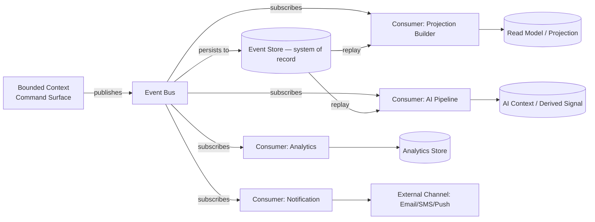

## 1.8 Relationship with DDD

Every event's producer is exactly one bounded context's aggregate root, and every event name is a ubiquitous-language business fact (Part 3) — this document does not introduce a parallel modeling language; it is the wire-level expression of the same DDD model each domain's own architecture (e.g. the Student Academic Domain's WP-ARCH-01B/01C) already defines internally.

## 1.9 Relationship with CQRS

Every domain event is, by construction, a candidate input to a read-model projection (exactly as Phase B's Academic Context, E-10, is built from E-01–E-08's events). This document treats the event stream as the write side of a platform-wide CQRS pattern: commands mutate an aggregate and emit an event; projections consume events and serve queries; no projection is ever queried by a command handler as its source of truth (mirroring Phase B Part 7.5's runtime isolation rule, generalized).

## 1.10 Relationship with REST APIs

REST (or any synchronous API) remains appropriate for **request-scoped, user-blocking reads** (e.g. "show me my profile now") and for **command intake** (a user submits a form, which becomes a synchronous command that, if accepted, emits an event). REST is not used for cross-domain propagation of a fact after the fact — that is EDA's job. The rule of thumb this architecture recommends: if the caller needs an immediate answer to proceed, it's a synchronous API call; if the caller only needs to know that something happened, eventually, it's an event.

## 1.11 Relationship with AI pipelines

AI workloads (embedding generation, inference, RAG retrieval) are modeled as event-triggered, event-completing workflows: `AnalysisStarted` → (asynchronous work) → `AnalysisCompleted`/`InferenceCompleted`, never as a synchronous call that blocks a user-facing request on LLM latency. This is elaborated in Part 19 and is a direct extension of Phase B Part 10's AI Context Generation governance into the event layer.

---

# PART 2 — Enterprise Event Taxonomy

Seven top-level event families, each with a distinct governance, retention, and security posture (cross-referenced in later parts).

| Family | Purpose | Example events | Retention posture (Part 9) | Security posture (Part 15) |
|---|---|---|---|---|
| **Domain Events** | Business facts owned by a bounded context's aggregate | `StudentRegistered`, `ResumeUploaded`, `SkillValidated`, `CareerReadinessCalculated`, `RecommendationGenerated` | Long/indefinite for historical domains (Student Academic, Career Outcome); medium elsewhere | Classified per Phase B Part 5-style rules, domain-specific |
| **Integration Events** | Facts about interaction with systems outside HireRise's own bounded contexts | Third-party API responses, webhook receipts, payment-provider callbacks, learning-provider updates, employer-integration events | Medium, tied to the underlying business record's retention | Elevated — external payloads are untrusted input by default (Part 15.1) |
| **System Events** | Infrastructure and operational facts, not business facts | Deployment completed, cache refreshed, background job started/finished, scheduler tick, health check result | Short (operational, not business, retention) | Low business sensitivity, but infrastructure-sensitive (Part 15) |
| **AI Events** | Facts about AI pipeline execution | `AnalysisStarted`, `AnalysisCompleted`, `PromptGenerated`, `EmbeddingGenerated`, `VectorIndexed`, `KnowledgeUpdated`, `ModelSelected`, `InferenceCompleted`, `AIResponseCached` | Long — required for explainability (Phase B Part 10.6) | High — may reference sensitive derived data; never carries raw prompts with unredacted PII (Part 15.6) |
| **Workflow Events** | Facts about multi-step orchestrations | `WorkflowStarted`, `WorkflowCompleted`, `WorkflowFailed`, `RetryScheduled`, `ApprovalCompleted` | Medium, tied to the workflow's own audit need | Inherits the sensitivity of the domain the workflow operates in |
| **Notification Events** | Facts about outbound communication | `EmailQueued`, `EmailSent`, `PushSent`, `SMSDelivered` | Short-to-medium (delivery audit, not indefinite) | Elevated for PII in payload (recipient contact detail) |
| **Security Events** | Facts about authentication/authorization state | `LoginSucceeded`, `LoginFailed`, `PermissionChanged`, `SuspiciousActivityDetected`, `AccountLocked` | Long (matches Phase B Part 11's audit retention) | Highest — feeds directly into Phase B's Audit Domain |
| **Audit Events** | Facts about administrative/configuration change | `UserUpdated`, `AdminActionPerformed`, `ConfigurationChanged`, `PolicyUpdated` | Long, tamper-evident (Phase B Part 8.6, extended platform-wide in Part 15.9) | Highest — same tier as Security Events |

**Design rule:** every event belongs to exactly one family. An event that seems to span two families (e.g. an AI-triggered notification) is modeled as two events — an AI Event and a Notification Event, causally linked (Part 4's Causation ID) — never as one event serving two families' governance rules simultaneously.

---

# PART 3 — Canonical Event Naming Standard

## 3.1 Naming rule

`<bounded_context>.<aggregate_or_subject>[.<sub_concept>].<past_tense_fact>[.v<major_version>]`

All lowercase, dot-delimited, snake_case within a segment if a segment is itself multi-word (e.g. `career_readiness`). This mirrors, at the event-name layer, the same past-tense-business-fact convention Phase B's underlying domain (WP-ARCH-01C Part 14 rule 10) already established for entity events.

## 3.2 Examples, corrected to the standard

| Informal name (from the brief) | Canonical name |
|---|---|
| student.created | `student.profile.created` |
| student.updated | `student.profile.updated` |
| student.deleted | `student.account.deletion_requested` *(never a hard "deleted" fact, per Phase B §12.5's erasure model)* |
| academic.semester.completed | `academic.record.committed.v1` |
| resume.uploaded | `resume.document.uploaded` |
| resume.parsed | `resume.document.parsed` |
| career.analysis.completed | `career.analysis.completed` |
| recommendation.generated | `recommendation.result.generated` |
| payment.completed | `payment.transaction.completed` |
| credit.consumed | `credit.balance.consumed` |
| notification.sent | `notification.message.sent` |

## 3.3 Namespaces / bounded context prefixes

One namespace per bounded context, matching Part 6's catalog exactly: `student`, `academic`, `skills`, `certifications`, `resume`, `career_intelligence`, `career_pathing`, `skill_gap`, `learning`, `jobs`, `companies`, `salary`, `career_readiness`, `recommendation`, `ai`, `search`, `payment`, `credit`, `notification`, `auth`, `admin`, `analytics`, `data_feed`, `career_outcome`. No event may be published under a namespace its bounded context does not own — this is the event-layer expression of Phase B's single-writer rule (Part 4.7), and is mechanically enforceable by the Schema Registry (Part 10.7)/broker ACLs (Part 15.4) binding a namespace to a producer identity.

## 3.4 Event suffixes (the fact itself)

Always past tense: `.created`, `.updated`, `.committed`, `.completed`, `.failed`, `.started`, `.requested`, `.confirmed`, `.cancelled`, `.deprecated`, `.published`. Never an imperative (`.create`, `.update`) — an imperative in an event name is a command wearing an event's clothing, the single most common EDA anti-pattern this standard exists to prevent.

## 3.5 Reserved names

`*.deleted` is reserved and disallowed for any entity governed by an append-only/immutable policy (Student Academic Domain historical entities, per Phase B §12.5) — use `.withdrawal_requested`, `.superseded`, or `.discontinued` instead, matching the specific lifecycle verb the owning domain already uses (Phase B Part 6.6). `*.test` and `*.internal` prefixes are reserved for non-production traffic and must never appear in a production topic.

## 3.6 Version suffixes

A breaking schema change increments `.v<N>` in the event name itself (e.g. `resume.document.parsed.v2`), never a silent redefinition of `.v1`'s shape — directly extending WP-ARCH-01C Part 14 rule 5's "new event name, not a redefinition" rule platform-wide. A non-breaking, additive change does not require a new version suffix (Part 10).

---

# PART 4 — Enterprise Event Metadata

| Field | Purpose | Why it exists |
|---|---|---|
| **Event ID** | Globally unique identifier for this specific event instance | Enables idempotent consumer processing (Part 11) and precise audit lookup (Phase B Part 11.12) |
| **Aggregate ID** | The identifier of the aggregate that produced this event | Lets a consumer group events by the business entity they describe, and is the natural partition key (Part 12) |
| **Aggregate Type** | The entity/aggregate class (e.g. `AcademicRecord`, `ResumeDocument`) | Disambiguates Aggregate ID across bounded contexts sharing an ID space, and drives schema lookup (Part 10.7) |
| **Correlation ID** | Identifier shared by every event in one end-to-end business flow (e.g. one resume-analysis request) | Enables the "show me everything that happened for this one request" trace Phase B's Observability Domain (Part 2) already requires at the runtime layer, now at the event layer |
| **Causation ID** | The Event ID of the event that directly caused this one | Builds the causal chain within a Correlation ID's flow — answers "what specifically triggered this," not just "what flow was this part of" |
| **Trace ID** | OpenTelemetry-compatible distributed trace identifier | Bridges the event layer to infrastructure-level tracing/APM tooling (Part 16) |
| **Tenant ID** | The owning organizational/customer boundary, where multi-tenancy applies (e.g. institutional/employer accounts) | Enables tenant isolation at the event layer, mirroring Phase B's student row-level isolation for a different actor class |
| **User ID** | The human or service identity that initiated the underlying action, per Phase B Part 3's identity classes | Feeds directly into Security/Audit Events and Phase B's audit requirements |
| **Source** | The specific service/deployment instance that produced the event | Operational triage — which running instance emitted this |
| **Event Version** | The schema version of this specific event's payload shape | Consumer-side compatibility decision input (Part 10) |
| **Schema Version** | Reference to the Schema Registry's schema identifier/hash | Enables strict validation at publish and consume time (Part 10.7) |
| **Timestamp** | When the fact occurred (business time, not necessarily publish time) | Essential for ordering (Part 12) and for historical/replay correctness (Part 14) |
| **Region** | The geographic/cloud region of origin | Supports Phase B §12.10's cross-border data-residency requirements at the event layer |
| **Environment** | production / staging / development | Prevents non-production traffic from ever being mistaken for a production fact (3.5) |
| **Security Classification** | Maps to Phase B Part 5's classification tiers (Public Reference, Confidential, Sensitive, Restricted, etc.) | Drives encryption, masking, and access policy at the transport and storage layer (Part 15) |
| **Retry Count** | How many times this event's processing has been attempted by the current consumer | Feeds DLQ/backoff logic (Part 13) |
| **Producer** | The bounded context / service identity that published this event | Enforces the single-writer/namespace-ownership rule (3.3) and is the audit "who" |
| **Consumer Group** | The logical consumer group this delivery is scoped to (for competing-consumer semantics) | Enables horizontal scaling of consumers without duplicate processing across the same group (Part 8, Part 11) |

---

# PART 5 — Canonical Event Envelope

```json
{
  "eventId": "6f2e6f2e-9a3c-4b0e-8b1a-6b6f1c2e9a11",
  "eventName": "resume.document.parsed",
  "eventVersion": "1.2",
  "schemaVersion": "resume.document.parsed-1.2.0",
  "occurredAt": "2026-07-08T09:14:22.331Z",
  "publishedAt": "2026-07-08T09:14:22.410Z",
  "aggregateId": "res_9f3a1c...",
  "aggregateType": "ResumeDocument",
  "correlationId": "corr_8b71...",
  "causationId": "res_upload_evt_44a1...",
  "traceId": "0af7651916cd43dd8448eb211c80319c",
  "tenantId": null,
  "userId": "stu_44e9...",
  "source": "resume-intelligence-service:prod-ap-south-1",
  "region": "ap-south-1",
  "environment": "production",
  "producer": "resume-intelligence-context",
  "consumerGroup": null,
  "securityClassification": "Confidential",
  "retryCount": 0,
  "payload": {
    "resumeId": "res_9f3a1c...",
    "parsedSkills": ["Python", "Data Analysis"],
    "parsedEducation": [{ "level": "Undergraduate", "field": "Computer Science" }],
    "parserVersion": "2.3.0"
  },
  "schemaRef": "https://schema-registry.hirerise.internal/schemas/resume.document.parsed/1.2.0",
  "signature": {
    "algorithm": "Ed25519",
    "keyId": "resume-intelligence-signing-key-2026-q3",
    "value": "base64:MEUCIQ..."
  },
  "encryption": {
    "envelopeEncrypted": true,
    "algorithm": "AES-256-GCM",
    "keyId": "kms:hirerise/resume-domain/2026-q3",
    "encryptedFields": ["payload.parsedEducation"]
  }
}
```

- **Metadata** — everything outside `payload`, per Part 4's full field list.
- **Payload** — the business fact's specific data, minimized per the same data-minimization rule Phase B Part 12.2 already applies to projections.
- **Schema reference** — `schemaRef` always resolves against the Schema Registry (Part 10.7); no consumer should ever validate an event's shape against a hard-coded local copy of the schema.
- **Signatures** — every event is signed by its producer (Part 15.2) so a consumer can verify authenticity independent of transport-layer trust (defense in depth, Phase B §1.6).
- **Encryption metadata** — field-level encryption is declared explicitly (`encryptedFields`) rather than assumed, so a consumer without the relevant key can still process the unencrypted parts of the payload if the schema allows partial processing.
- **Tracing metadata** — `traceId`, `correlationId`, `causationId` together give full lineage, mirroring Phase B Part 10.3's provenance requirement, generalized to every event in the platform, not only AI events.

---

# PART 6 — Enterprise Domain Event Catalog

For every major bounded context: aggregate, representative events, producer, consumers, trigger, payload summary. This catalog is illustrative of the pattern each domain must follow, not an exhaustive final list — new events are added additively per Part 17's governance, following the naming standard in Part 3.

| Domain | Aggregate | Representative events | Producer | Consumers | Trigger | Payload summary |
|---|---|---|---|---|---|---|
| **Student** | StudentProfile | `student.profile.created`, `student.profile.updated`, `student.account.deletion_requested` | Student Identity Context | Student Context Runtime, Notification, Analytics, Search | Registration, profile edit, account closure request | Profile identifiers, non-sensitive display attributes |
| **Academic** | AcademicRecord / Qualification (per Phase B/01C) | `academic.profile.established`, `academic.qualification.started`, `academic.record.committed`, `academic.record.amended` | Student Academic Identity/Performance Contexts | Composition Context, Derived Intelligence, Career Outcome Intelligence Engine | Onboarding, result entry/commit, correction | Taxonomy-referenced identity/performance facts (Phase B Part 5/6) |
| **Skills** | SkillProfile | `skills.skill.declared`, `skills.skill.validated`, `skills.skill.gap_identified` | Skills Context | Career Intelligence, Learning Recommendations, Recommendation Engine | Self-declaration, validation event, gap-analysis run | Skill code (taxonomy-referenced), proficiency level, validation source |
| **Certifications** | CertificationRecord | `certifications.certificate.issued`, `certifications.certificate.verified`, `certifications.certificate.expired` | Certifications Context | Skills, Career Readiness, Search | Provider callback, verification job, expiry scheduler | Certificate ID, issuing body reference, validity window |
| **Resume** | ResumeDocument | `resume.document.uploaded`, `resume.document.parsed`, `resume.document.scored` | Resume Intelligence Context | Skills, Career Intelligence, AI Analysis, Search | User upload, parser completion, scoring model run | Document reference, parsed entities, no raw file bytes in-event |
| **Career Intelligence** | CareerProfile | `career_intelligence.pathway.identified`, `career_intelligence.affinity.updated` | Career Intelligence Context | Career Pathing, Recommendation Engine, Career Outcome Intelligence Engine | Composition of academic + skills + market signals | Pathway reference, affinity score, source-version stamps (Phase B Part 10.3 pattern) |
| **Career Pathing** | CareerPath | `career_pathing.path.proposed`, `career_pathing.milestone.reached` | Career Pathing Context | Recommendation Engine, Notification | Career Intelligence output consumed | Path steps (taxonomy-referenced), milestone identifiers |
| **Skill Gap Analysis** | SkillGapReport | `skill_gap.analysis.completed` | Skill Gap Context | Learning Recommendations, Career Readiness | Scheduled or on-demand analysis | Gap list, target-role reference, confidence score |
| **Learning Recommendations** | LearningPlan | `learning.plan.generated`, `learning.resource.consumed` | Learning Context | Notification, Analytics, Recommendation Engine | Skill Gap output, user consumption action | Recommended resource references, provider reference |
| **Jobs (Job Intelligence)** | JobPosting | `jobs.posting.ingested`, `jobs.posting.matched` | Data Feed Engine → Jobs Context | Recommendation Engine, Career Intelligence, Search | External feed ingestion, matching job run | Posting reference, employer reference, taxonomy-tagged skills required |
| **Companies (Company Intelligence)** | CompanyProfile | `companies.profile.updated`, `companies.rating.computed` | Data Feed Engine → Companies Context | Career Intelligence, Job Intelligence, Search | Feed update, rating computation | Company reference, non-PII aggregate signals |
| **Salary (Salary Intelligence)** | SalaryBenchmark | `salary.benchmark.updated` | Data Feed Engine → Salary Context | Career Intelligence, Career Pathing | Periodic market-data ingestion | Role/region reference, benchmark bands (never individual compensation data) |
| **Career Readiness** | ReadinessScore | `career_readiness.score.calculated` | Career Readiness Context | Recommendation Engine, Notification, Analytics | Composition of academic + skills + certifications | Readiness score, contributing-signal version stamps |
| **Recommendations** | RecommendationResult | `recommendation.result.generated`, `recommendation.result.dismissed` | Recommendation Engine | Notification, Analytics, AI Context Generation | Request-scoped computation, user dismissal action | Ranked result set, source Knowledge Runtime version (Phase B Part 10.8 pattern) |
| **AI Analysis** | AnalysisRun | `ai.analysis.started`, `ai.analysis.completed`, `ai.embedding.generated`, `ai.inference.completed` | AI Platform Context | Recommendation Engine, Career Intelligence, Search (vector index), Analytics | Any domain event requiring AI processing | Model/engine version, input version references, output reference (never raw prompt with unredacted PII, Part 15.6) |
| **Search** | SearchIndexEntry | `search.index.updated`, `search.query.executed` | Search Context | Analytics | Any domain publishing indexable content | Index reference, query facets (query text itself minimized/anonymized in analytics use) |
| **Payments** | PaymentTransaction | `payment.transaction.initiated`, `payment.transaction.completed`, `payment.transaction.failed`, `payment.refund.issued` | Payments Context | Credits, Notification, Analytics, Audit | User checkout action, provider webhook (Integration Event) | Transaction reference, amount, provider reference — card/bank detail never in-event (tokenized reference only) |
| **Credits** | CreditLedger | `credit.balance.credited`, `credit.balance.consumed`, `credit.balance.expired` | Credits Context | Notification, Analytics, Feature-gating consumers (AI Analysis, Recommendation Engine) | Payment completion, feature usage, expiry scheduler | Ledger delta, reason code, resulting balance |
| **Notifications** | NotificationMessage | `notification.message.queued`, `notification.message.sent`, `notification.push.sent`, `notification.sms.delivered` | Notification Context | Analytics | Any domain event configured to trigger a user-facing message | Channel, template reference, delivery status — recipient contact detail encrypted (Part 15) |
| **Authentication** | Session / Credential | `auth.login.succeeded`, `auth.login.failed`, `auth.session.revoked`, `auth.permission.changed` | Identity Domain (Phase B Part 2/3) | Security monitoring, Audit, Admin | Login attempt, credential lifecycle event, permission grant/revoke | Identity reference, outcome, never the credential material itself |
| **Administration** | AdminAction | `admin.action.performed`, `admin.configuration.changed`, `admin.policy.updated` | Administration Context | Audit, Security monitoring | Any administrative correction or configuration change | Actor reference, Change Reason (Phase B Part 9.1 pattern), before/after summary |
| **Analytics** | AnalyticsFact | (consumes, does not typically produce cross-domain events) | Analytics Context | — | Every event family, as a universal consumer | Aggregated/derived, never a re-publication of source PII |
| **Data Feed Engine** | FeedIngestionRun | `data_feed.source.ingested`, `data_feed.source.validated`, `data_feed.source.rejected` | Data Feed Engine | Jobs, Companies, Salary, Search, Career Intelligence | Scheduled or webhook-triggered external ingestion | Source reference, validation outcome, record counts — the trusted-knowledge-source boundary (Part 19.8) |
| **Career Outcome Intelligence Engine** | OutcomeAnalysisRun | `career_outcome.analysis.completed`, `career_outcome.trend.updated` | Career Outcome Intelligence Engine | Enterprise reporting, Recommendation Engine (long-horizon signal) | Batch/periodic longitudinal recompute (Phase B Part 5 step 13 pattern) | Cohort/individual trend reference, engine version, source Academic Record version range |

---

# PART 7 — Event Choreography

## 7.1 Student Registration

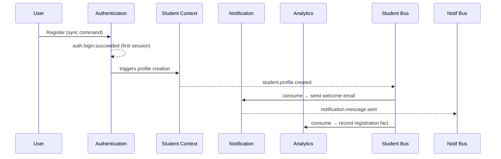

## 7.2 Resume Analysis

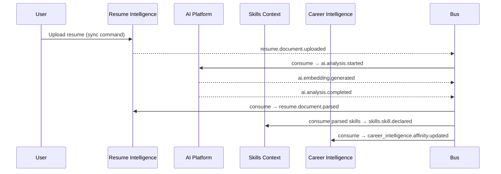

## 7.3 Career Analysis

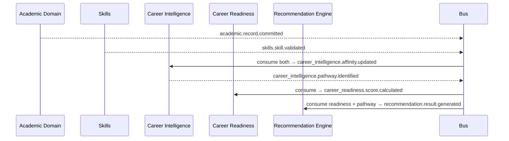

## 7.4 Learning Recommendation

`skill_gap.analysis.completed` → Learning Context consumes → `learning.plan.generated` → Notification consumes → `notification.message.sent`; user consumption produces `learning.resource.consumed`, consumed by Analytics and fed back into a future Skill Gap Analysis run (closing the loop, not a one-way pipeline).

## 7.5 Job Recommendation

`data_feed.source.ingested` (new postings) → Jobs Context validates → `jobs.posting.ingested` → matching process consumes Career Intelligence + Skills state → `jobs.posting.matched` → Recommendation Engine consumes → `recommendation.result.generated` → Notification.

## 7.6 Payment

`payment.transaction.initiated` (sync command intake) → external provider webhook (Integration Event) → `payment.transaction.completed` or `.failed` → Credits Context consumes on success → `credit.balance.credited` → Notification + Analytics consume both payment and credit events; Audit consumes the transaction event unconditionally (Security/Audit family, Part 2).

## 7.7 Credits

Feature usage (e.g. an AI Analysis run) checks balance synchronously (a query, not an event) before proceeding, then emits `credit.balance.consumed` as a fact after the deduction commits — the check is synchronous because it is blocking and must not proceed on a false-optimistic read, but the resulting ledger fact is still published as an event for Analytics/Audit.

## 7.8 Notifications

Any domain event configured as notification-worthy is consumed by the Notification Context, which itself never re-publishes the triggering domain's payload verbatim — it publishes its own `notification.message.queued` → `.sent`/`.push.sent`/`.sms.delivered` chain, keeping Notification's own event family self-contained (Part 2).

## 7.9 AI Analysis

`ai.analysis.started` (caused by any of: `resume.document.uploaded`, `academic.record.committed`, a scheduled Career Outcome batch trigger) → `ai.prompt_generated` (internal, not published outside the AI Platform context's own audit trail per Phase B Part 10.1's "single named integration point" rule) → `ai.embedding.generated`/`ai.inference.completed` → `ai.analysis.completed`, always carrying the full input-version provenance chain Phase B Part 10.3 already requires.

## 7.10 Knowledge Updates

`data_feed.source.validated` → `data_feed.source.ingested` (only after validation, never before — Part 19.8) → consumed by Jobs/Companies/Salary/Search → each publishes its own domain-specific update event (`jobs.posting.ingested`, etc.) → `ai.knowledge_updated` is published by the AI Platform context once it has re-indexed/re-embedded the changed knowledge, closing the loop back to Search's vector index.

## 7.11 Data Feed Synchronization

Scheduled or webhook-triggered ingestion → `data_feed.source.ingested` (raw receipt) → validation step (untrusted-input assumption, Part 15.1) → `data_feed.source.validated` or `data_feed.source.rejected` → only validated records ever reach Jobs/Companies/Salary consumers, enforcing the Data Feed Engine's role as HireRise's one trusted knowledge-ingestion boundary (Part 19.8).

## 7.12 Career Outcome Intelligence Pipeline

Periodic batch trigger (System Event) → Career Outcome Intelligence Engine reads Career Intelligence projection plus immutable Academic Record history directly (the one justified exception Phase B Part 9 already names) → `career_outcome.analysis.completed` → `career_outcome.trend.updated` consumed by enterprise reporting and, as a long-horizon signal, by the Recommendation Engine for cohort-level (never individually re-identifying) trend context.

---

# PART 8 — Enterprise Event Bus Architecture

| Criterion | Apache Kafka | RabbitMQ | NATS (JetStream) | Redis Streams | Google Pub/Sub | AWS EventBridge | Azure Event Grid |
|---|---|---|---|---|---|---|---|
| Scalability | Excellent, horizontally partitioned | Good, clustered | Excellent, lightweight | Moderate — bound by a single Redis node/cluster's memory | Excellent, fully managed | Excellent, fully managed | Excellent, fully managed |
| Throughput | Very high | Moderate-high | Very high, low overhead | High for short retention, memory-bound | High | High but rule/target-count bound | High |
| Ordering | Per-partition, strict | Per-queue, with caveats under multiple consumers | Per-subject with JetStream | Per-stream | No strict cross-subscriber ordering guarantee | No cross-event ordering guarantee | No ordering guarantee |
| Replay | Native, log-based, the strongest fit for Part 14 | Limited — not log-based by default | Native with JetStream | Native, but retention is memory/RDB-bound | Limited (seek-to-timestamp, not full log replay in all tiers) | Not designed for replay | Not designed for replay |
| Persistence | Durable log, configurable retention including indefinite | Durable with plugins, not log-native | Durable with JetStream | Durable but memory-pressure sensitive | Durable, managed | Durable, managed, short default retention | Durable, managed, short default retention |
| Latency | Low-ms, tunable | Low-ms | Sub-ms, very low | Sub-ms | Low-tens-ms | Low-tens-ms | Low-tens-ms |
| Cloud support | Any cloud, or self-managed/managed (Confluent, MSK) | Any cloud | Any cloud | Any cloud | GCP-native | AWS-native | Azure-native |
| Operational complexity | Higher (partition/broker management) unless using a managed offering | Moderate | Low | Low | Low (managed) | Low (managed) | Low (managed) |
| Suitability for HireRise | **Best fit** — replay (Part 14), retention (Part 9), and ordering (Part 12) requirements all favor a log-based broker | Adequate for lower-throughput workflow/task-queue use cases (e.g. internal job queues) but weak on replay | Strong lightweight alternative, particularly for low-latency internal signaling, weaker ecosystem for schema registry/enterprise tooling | Not recommended as the platform backbone — good only for ephemeral, high-velocity, short-retention signals | Viable if the platform commits fully to GCP, but replay/retention trade-offs remain | Good for AWS-native integration events (payment/webhook fan-out) but not as the domain-event backbone | Good for Azure-native integration events, same caveat |

## Recommendation

**Apache Kafka (or a managed-Kafka-compatible service) as the platform's primary Enterprise Event Bus**, for three decisive reasons that follow directly from this document's own requirements: (1) Part 9's storage/retention strategy and Part 14's replay strategy both require a durable, replayable log — Kafka is purpose-built for this, most of the alternatives are not; (2) Part 12's ordering strategy relies on per-aggregate partition ordering, which Kafka provides natively via partition keys; (3) the platform's multi-year, multi-domain, ever-growing consumer count (Part 6's ~24 domains today, more over ten years) benefits from Kafka's mature ecosystem for schema registries (Part 10.7), consumer-group scaling, and cross-cloud portability, avoiding a single-cloud lock-in that EventBridge/Event Grid/Pub&#8203;Sub would impose. RabbitMQ or NATS remain appropriate as **secondary, intra-service task queues** (e.g. a single domain's internal retry queue, Part 13) — not as a replacement for the enterprise-wide backbone.

**Trade-off acknowledged:** Kafka's operational complexity is real; this is mitigated by adopting a managed offering (e.g. Confluent Cloud or a cloud provider's managed Kafka) rather than self-hosting brokers, converting an operational cost into a vendor-managed one, consistent with the platform's cloud-native goal (Quality Requirements).

---

# PART 9 — Event Storage Strategy

- **Event Store:** the Kafka log itself is the system of record for replay purposes (Part 14); a subset of domains (Student Academic, Career Outcome Intelligence, Audit/Security) additionally persist to a dedicated, append-only event store optimized for long-term query, mirroring Phase B Part 11.10's audit-retention requirement.
- **Retention:** tiered by event family (Part 2) — Domain Events for historical/append-only entities (Student Academic, Career Outcome) retained indefinitely; System/Notification events retained on the order of weeks to months; Security/Audit events retained per Phase B Part 11.10 (as long as the longest-retained entity they describe, longer where jurisdiction requires, Part 12.4-style).
- **Archival:** cold-tier archival (object storage) for events past their "hot" operational retention window but still within their required retention — replayable, but at higher latency, mirroring the storage-tiering already implied by Phase B Part 9.3's "shorter retention for rebuildable projections."
- **Snapshots:** for high-volume aggregates, periodic snapshots reduce replay time (Part 14) without abandoning full event history — a snapshot is always accompanied by the event range it summarizes, never a substitute for retaining the underlying events themselves (this preserves the same "never lose the ability to explain a past decision" guarantee Phase B Part 10.9 requires).
- **Replay:** covered fully in Part 14.
- **Partitioning:** by Aggregate ID (Part 4, Part 12) within each topic, so a single aggregate's events are always strictly ordered and always land in the same partition for replay correctness.
- **Compression:** payload-level compression (e.g. LZ4/Zstd) applied uniformly to reduce storage and network cost, applied before field-level encryption where both are required (Part 15) so compression is not defeated by encrypted-field entropy.
- **Storage tiers:** hot (broker-resident, low-latency replay) → warm (extended broker retention or a queryable event-store) → cold (object storage archive) → tiering thresholds set per event family's retention policy above.
- **Disaster recovery:** cross-region replication of the event log for the platform's most critical domains (Student Academic, Payments, Credits, Security/Audit), with documented RPO/RTO targets reviewed under the same governance process as every other architectural decision (Part 17).
- **Backups:** periodic, immutable snapshots of the event store and schema registry (Part 10.7), stored separately from the primary cluster, tested by periodic restore drills — a backup that has never been restored in a drill is not a validated backup.

---

# PART 10 — Event Versioning Strategy

- **Schema evolution:** additive-only by default (new optional fields), matching the platform-wide discipline WP-ARCH-01C Part 14 rule 5 and Phase B already established for the Student Academic Domain, now generalized to every event in the catalog.
- **Backward compatibility:** a new producer version must remain readable by consumers built against the immediately prior schema version — enforced by the Schema Registry's compatibility mode (below), not by convention.
- **Forward compatibility:** consumers must be built to ignore unrecognized additive fields, exactly as WP-ARCH-01C Part 11 already requires for the domain's own projections — this is the same rule, restated for every event in the platform.
- **Consumer evolution:** a consumer may adopt a new optional field at its own pace; it is never required to upgrade in lockstep with a producer's additive change.
- **Deprecation:** an old event version is marked deprecated (continues to be honored) before it is ever removed, following the same "deprecation is never removal" governance rule Phase B Part 14.11/WP-ARCH-01C Part 14 rule 8 already establishes for the domain layer.
- **Migration:** a breaking change ships as a new event name/version (Part 3.6), published alongside the old one for a defined dual-publish window, giving every consumer time to migrate before the old version is deprecated.
- **Schema Registry:** a centralized registry (e.g. Confluent Schema Registry or equivalent) is authoritative for every event schema; publishing an event whose payload does not validate against its declared `schemaRef` (Part 5) is rejected at the bus layer, not merely logged as a warning.
- **Version negotiation:** a consumer declares which schema versions it can handle at subscription time; the bus/registry tooling is responsible for surfacing an incompatibility as a build-time or deploy-time failure, never a silent runtime data-quality issue discovered later.

---

# PART 11 — Idempotency Strategy

- **Idempotency Keys:** every event's Event ID (Part 4) doubles as its idempotency key; a consumer that has already processed a given Event ID must treat redelivery as a no-op — directly reusing the same idempotency pattern WP-ARCH-01C Part 11 already specifies per-event (e.g. "establishing an already-established profile is a no-op").
- **Duplicate Detection:** consumers maintain a processed-Event-ID ledger (bounded by a reasonable dedupe window, not infinite) to detect and discard redelivery without re-executing side effects.
- **Consumer Safety:** side-effecting consumers (e.g. Notification, Payments) must design their side effect itself to be idempotent where possible (e.g. an email-send keyed by Event ID so a redelivered event does not send a second email), not rely solely on the dedupe ledger.
- **Retry Safety:** a failed consumer attempt must be safely retryable — this requires that partial processing be rolled back or designed to be safely repeated, never left in a half-applied state that a retry would double-apply.
- **Exactly-once vs. at-least-once:** this architecture adopts **at-least-once delivery with idempotent consumers** as the platform default, rather than chasing exactly-once delivery semantics end-to-end — exactly-once is achievable within a single Kafka-to-Kafka transactional pipeline but breaks down the moment a consumer's side effect crosses into an external system (an email provider, a payment gateway) that does not participate in the same transaction; idempotent consumers are a more honest and more broadly applicable guarantee.
- **Processing Guarantees:** every consumer group's processing guarantee (at-least-once, with idempotent handling) is documented per consumer in the governance registry (Part 17), so no team assumes a stronger guarantee than the platform actually provides.

---

# PART 12 — Ordering Strategy

- **Aggregate Ordering:** strict ordering is guaranteed only within a single aggregate's own event stream (partitioned by Aggregate ID, Part 9) — exactly the same scoping WP-ARCH-01C Part 11 already requires at the domain layer ("per-profile ordering required"), generalized to every aggregate in the catalog.
- **Partition Keys:** Aggregate ID is the default partition key for every domain-event topic; a domain with a documented need for a different partitioning (e.g. Tenant ID for a future multi-tenant institutional domain) must justify the deviation through the same architectural-decision process as any other boundary change (Part 17).
- **Global Ordering:** not guaranteed, and not required — no consumer in this catalog needs a total order across all aggregates simultaneously; where a global sequence genuinely matters (e.g. Taxonomy Version, per WP-ARCH-01C Part 11's "Taxonomy Version is a single, global sequence"), that specific event stream is exempted from per-aggregate partitioning and given its own strictly-ordered, single-partition topic.
- **Distributed Ordering:** across domains (e.g. "did the resume upload happen before the academic record commit"), ordering is established via Correlation ID and Causation ID (Part 4), never assumed from wall-clock timestamps alone, since distributed clocks are not perfectly synchronized.
- **Event Sequencing:** every event carries a monotonically increasing sequence number scoped to its own aggregate's partition, enabling a consumer to detect gaps or out-of-order delivery within that aggregate's stream.
- **Concurrency:** two commands racing against the same aggregate are resolved by the owning bounded context's own command-handling concurrency control (optimistic concurrency on the aggregate's current version) before an event is ever published — the event stream itself does not resolve write conflicts, it only records the outcome the aggregate's command handler already resolved.
- **Conflict Resolution:** where two events for the same aggregate are received out of order by a consumer (a redelivery/reordering edge case, not a normal-path occurrence), the consumer resolves using each event's sequence number, never wall-clock arrival time — directly mirroring WP-ARCH-01C's "replay must apply amendments in Record Version order" rule.

---

# PART 13 — Dead Letter Queue Architecture

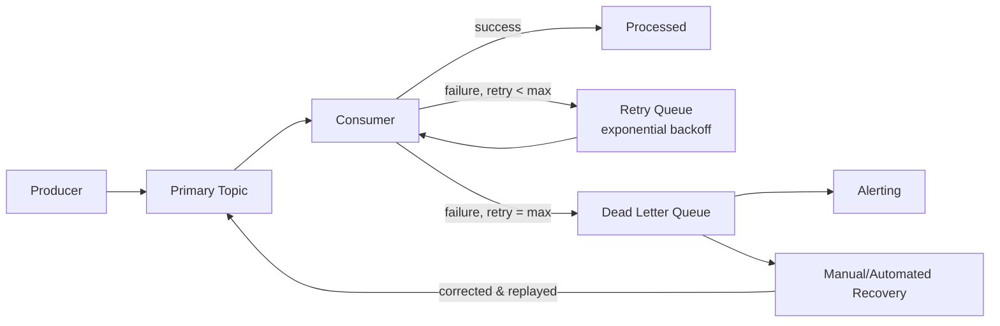

- **DLQ:** every consumer group has its own dedicated DLQ topic; a poison event is never left retrying indefinitely against the primary topic, which would block ordered processing of every subsequent event for the same aggregate (Part 12).
- **Retry Queues:** a bounded number of retries (e.g. 3–5) with **exponential backoff** (e.g. 1s, 5s, 30s, 2m, 10m) before an event is routed to the DLQ, giving transient failures (a downstream dependency's brief outage) a real chance to self-resolve without immediately escalating to manual recovery.
- **Poison Events:** an event that fails deterministically (a schema-validation failure, a permanently invalid payload) should be detected and routed to DLQ immediately, without exhausting the full retry budget, since retrying a deterministic failure only delays detection.
- **Recovery:** DLQ entries are triaged by the owning domain team; recovery is either (a) a corrected/replayed event, re-published to the primary topic once the root cause is fixed, or (b) an explicit, documented decision to discard the event, itself logged as an Audit Event (Part 2) — a DLQ entry is never silently dropped without a recorded decision.
- **Monitoring:** DLQ depth and age are first-class health metrics (Part 16), not an afterthought — a growing DLQ for any consumer group is a standing alert condition.
- **Replay:** DLQ recovery is a specific, narrow instance of the platform's general replay capability (Part 14), not a separate mechanism.
- **Alerting:** any DLQ receiving an event triggers an alert to the owning domain's on-call rotation; DLQ depth crossing a threshold escalates further, per the governance-defined severity ladder (Part 17).

---

# PART 14 — Event Replay

- **Replay Architecture:** every projection in the platform (mirroring WP-ARCH-01C Part 14 rule 6's "every projection must be fully reconstructable from its source events") must be rebuildable by replaying its owning domain's event log from the beginning, or from the last valid snapshot (Part 9) forward — this is a design requirement checked at review time (Part 17), not an operational nice-to-have.
- **Projection Rebuild:** a rebuild is always logged with the source-event range it replayed (extending WP-ARCH-01C Part 3 E-10's "each rebuild is logged with the set of source-entity events" rule to every projection in the platform, not just Academic Context).
- **Disaster Recovery:** in a full data-loss scenario for a downstream read model, the event log (retained per Part 9) is the recovery mechanism — no projection's own storage is ever the only copy of information needed to reconstruct it.
- **Historical Reprocessing:** a corrected consumer bug is fixed by replaying the affected event range through the corrected logic, never by manually patching the resulting projection — directly extending Phase B Part 7's "any bug in a past composition can be fixed by replaying history" guarantee platform-wide.
- **Analytics Replay:** the Analytics domain (Part 6) is explicitly designed to be able to reprocess the full historical event log to backfill a new analytical dimension, without requiring every producing domain to re-emit anything — this is what indefinite retention (Part 9) for the domains Analytics cares about most is for.
- **Testing Replay:** replay is a first-class testing tool — a candidate change to any consumer's logic is validated by replaying a representative historical event sample against it in a non-production environment before deployment, catching regressions replay would otherwise only surface in production.

---

# PART 15 — Event Security

1. **Encryption.** Every event is encrypted in transit (mandatory, no exception) and at rest for every classification above Public Reference (Part 4's Security Classification field, mirroring Phase B Part 5). Field-level encryption (Part 5's `encryptedFields`) is applied to Sensitive/Restricted-classified payload fields specifically, not the whole envelope, so routing metadata remains usable by the bus without decryption.
2. **Signing.** Every event is signed by its producer's identity (Phase B Part 3.3's service identities, extended to event-publishing) using an asymmetric signature, verified by consumers independent of transport trust — this is Defense in Depth (Phase B §1.6) applied at the event layer: even a compromised broker cannot forge a valid signature for a producer it does not hold keys for.
3. **Integrity.** The signature (2) plus the sequence-number/ordering guarantee (Part 12) together let a consumer detect both forged and tampered-in-transit events and gaps/reordering in an aggregate's stream.
4. **Authentication.** Every producer and consumer authenticates to the bus using its own service identity (Phase B Part 3), never a shared broker-wide credential — directly extending Phase B's per-context, non-shared service identity principle (Part 3.3, Part 4.8.3) to the event bus.
5. **Authorization.** Broker-level ACLs bind each producer identity to the specific topic namespace it owns (Part 3.3) and each consumer identity to the specific topics its declared contract (WP-ARCH-01D Part 8-style) allows it to subscribe to — a consumer is never granted "subscribe to everything" by default.
6. **PII Protection.** No event payload carries a direct identifier or raw sensitive field (Phase B Part 8's classifications) unless the specific declared consumer contract requires it and the field is additionally protected per (1); AI Events in particular never carry an unredacted prompt or raw cognitive-assessment payload (Phase B Part 8.3), extending Phase B Part 10.4's source-side filtering rule to the event layer directly.
7. **Data Masking.** Where an event must reference sensitive data for correlation purposes without exposing its value (e.g. referencing that a correction occurred without repeating the corrected value), the event carries a reference/version pointer (Part 4, Part 5) rather than the value itself, mirroring Phase B's "reference, never duplication" taxonomy rule (Phase B, referencing WP-ARCH-01B ADR-05) applied to events.
8. **Tamper Detection.** Beyond per-event signing (2), the event store additionally maintains a chained integrity mechanism for its most sensitive streams (Security, Audit, Student Academic Domain events), directly extending Phase B Part 8.6/11.11's tamper-evidence requirement to the event-storage layer.
9. **Key Rotation.** Signing and encryption keys are rotated on a defined cadence (mirroring Phase B Part 14.2's key-management principle) without invalidating the ability to verify/decrypt historical events — achieved by key-ID referencing (Part 5's `keyId` fields), never a shared, unversioned key.
10. **Compliance.** Cross-border event flow (e.g. a Region-tagged event processed outside its origin region) is governed by the same Region/Country compliance metadata Phase B Part 12.10 already recommends at the data layer, carried through explicitly in every event's `region` field (Part 4) so a compliance rule can be enforced declaratively at the bus/consumer level.

---

# PART 16 — Event Observability

- **OpenTelemetry:** every producer and consumer instrumented with OpenTelemetry-compatible tracing and metrics as a baseline requirement (Quality Requirements), using the `traceId` field (Part 4) as the binding key between the event layer and the platform's broader distributed tracing.
- **Tracing:** a single Correlation ID (Part 4) lets an operator reconstruct the full cross-domain flow for one business transaction (e.g. one resume analysis, Part 7.2) as a single trace, directly extending WP-ARCH-01D Part 9.1's runtime-layer correlation requirement to the event bus.
- **Metrics:** per-topic and per-consumer-group throughput, latency (publish-to-consume), error rate, and DLQ depth (Part 13) are first-class metrics, not derived from log parsing after the fact.
- **Consumer Lag:** the single most important operational health signal for an event-driven platform — every consumer group's lag (how far behind the latest published event it is) is monitored continuously, since lag is the event-layer equivalent of WP-ARCH-01D Part 9.5's "Degraded" health state.
- **Latency:** end-to-end latency from `occurredAt` to final consumer processing is tracked per flow (Part 7), not only per hop, since a fast individual hop can still combine into an unacceptably slow end-to-end user-facing experience (e.g. resume analysis).
- **Error Rates:** tracked per event type and per consumer, distinguishing transient (retryable) from deterministic (poison, Part 13) failures.
- **Dashboards:** a holistic, per-domain and cross-domain view — directly extending WP-ARCH-01D Part 9.6's "operator should be able to ask what is the current health of the entire pipeline... in one view" to the full ~24-domain event catalog, not just the nine Student Academic Domain runtimes.
- **Distributed Tracing:** trace propagation is mandatory across every event hop, including through the bus itself (not only within a single service's internal calls).
- **Logging Standards:** structured, correlation-ID-tagged logging is required for every producer/consumer; unstructured free-text logging of event processing is disallowed for anything above System Events' sensitivity tier.
- **Alerting:** severity-tiered alerting (Part 13's DLQ alerting is one instance of this general framework) covering consumer lag thresholds, DLQ depth, schema-validation rejection spikes (Part 10), and signature/authorization failures (Part 15), routed to the owning domain's on-call rotation per Part 17's ownership model.

---

# PART 17 — Enterprise Governance

1. **Ownership.** Every event namespace (Part 3.3) has exactly one owning bounded-context team, mirroring the single-writer principle already established at the entity layer (Phase B Part 4.7) and now applied to event publication rights.
2. **Approval Workflow.** A new event, or a breaking change to an existing one (Part 10), requires review and sign-off from the owning domain's architecture lead plus the Enterprise Governance Architect role named in this document's authorship — mirroring the architectural-decision-record discipline Phase B Part 14.5 already requires for security-relevant changes, extended to event-shape changes generally.
3. **Schema Registry.** The Schema Registry (Part 10.7) is the enforcement mechanism for ownership (1) and naming (Part 3) — a publish attempt for an event name outside a producer's declared namespace, or with a payload that does not validate against its registered schema, is rejected, not merely flagged.
4. **Documentation Standards.** Every registered event carries, at minimum, its business meaning, its owning domain, its full metadata/payload schema, its producer and known consumers, and a link to the choreography (Part 7) it participates in — an event without this documentation is not eligible for production publication.
5. **Naming Governance.** Enforced automatically by the Schema Registry and broker ACLs (3) against the standard in Part 3, not left to code review discretion alone.
6. **Review Process.** New domains onboarding to the event bus (a new bounded context, or a future microservice per Part 19) must have their initial event catalog reviewed against this document before their first production publish, mirroring WP-ARCH-01D Part 10.13's "future runtime onboarding" governance, generalized to any future event producer.
7. **Lifecycle Management.** Every event's stage (Part 18) is tracked in the governance registry alongside its schema; a deprecated event's remaining consumers are tracked explicitly so deprecation can proceed to removal only once zero active consumers remain.
8. **Deprecation Policy.** Mirrors Part 10's versioning rule: deprecation means "no longer available for new producers," never "removed from history" — the event remains replayable (Part 14) indefinitely per its retention policy (Part 9) even after its schema is deprecated for new publication.
9. **Compliance.** Every event's Region and Security Classification metadata (Part 4) is reviewed against the platform's current multi-country compliance posture (Phase B Part 12) on the same governance cadence as Phase B Part 14.4's identity re-certification — compliance review is periodic, not one-time-at-launch.

---

# PART 18 — Event Lifecycle

| Stage | Meaning | Governance requirement |
|---|---|---|
| **Draft** | Proposed event, not yet registered | Owning team drafts schema + documentation (Part 17.4); no production publish permitted |
| **Approved** | Reviewed and signed off per Part 17.2 | Registered in the Schema Registry as `approved`, still not yet live in production traffic |
| **Published** | Schema is live in the registry, producers may begin emitting it | Consumers may begin subscribing; this is the first stage real production traffic may flow |
| **Active** | In steady-state production use, with known consumers | Subject to ongoing observability (Part 16) and compliance review (Part 17.9) |
| **Deprecated** | A newer version/replacement exists; no new producers should adopt it | Existing consumers continue to be honored (Part 10, Part 17.8); dual-publish window tracked explicitly |
| **Archived** | No longer actively published; retained in the event store per its retention policy (Part 9) | Replayable for historical/compliance/audit purposes only; not subscribable for new consumers |
| **Removed** | Schema formally retired from the registry after its full retention period has elapsed and zero replay/compliance need remains | Requires explicit governance sign-off (Part 17.2) at the same rigor as the original approval — removal is the one lifecycle transition that is not reversible, and is therefore the most heavily gated |

---

# PART 19 — AI & Future Expansion

1. **Multi-Agent AI.** Each agent in a future multi-agent system is modeled as its own event producer/consumer with its own service identity (Phase B Part 3 pattern), never a shared "AI" identity — preserving the least-privilege and blast-radius-containment properties Phase B Part 3.4/4.8.3 already established for single-purpose service identities.
2. **AI Orchestration.** Orchestration between agents is expressed as Workflow Events (Part 2) — `workflow.started`/`.completed`/`.failed` — with each agent's individual contribution as its own AI Event, giving the same full-lineage replay/audit guarantee (Part 14, Phase B Part 10.9) to multi-step AI orchestration as to any single-step one.
3. **MCP Integration.** A future Model Context Protocol integration is treated as an Integration Event producer/consumer (Part 2) at the platform's boundary, subject to the same untrusted-input assumption (Part 15.1) as any other external integration — no MCP-sourced fact is trusted into a domain's event stream without the same validation Data Feed Engine already applies (Part 19.8) to external knowledge sources.
4. **Workflow Engines.** A future dedicated workflow-orchestration engine consumes and produces Workflow Events exclusively, per (2); it does not gain direct write access to any domain's aggregates, mirroring Phase B Part 9's "no runtime is ever granted Administrative access" rule generalized to orchestration engines.
5. **Human-in-the-loop.** An approval step is modeled as `workflow.approval_requested` → (human action, out of band) → `workflow.approval_completed`, keeping the human decision point a first-class, audited event rather than an implicit pause inside application code.
6. **Retrieval-Augmented Generation (RAG).** RAG retrieval is modeled as an AI Event sub-flow: `ai.vector_indexed` (from Search/Knowledge Updates, Part 7.10) feeds a retrieval step that is itself logged as part of `ai.prompt_generated`'s provenance chain (Phase B Part 10.3), so a RAG-augmented AI response remains as explainable as any other AI Context Generation bundle.
7. **Vector Search.** `ai.embedding.generated` → `ai.vector_indexed` is the canonical event pair for any content entering vector search, whether sourced from Resume, Academic, Jobs, or Companies domains — one consistent pattern regardless of source domain.
8. **Data Feed App.** The Data Feed Engine (Part 6, Part 7.11) is architected as the platform's **single trusted external-knowledge ingestion boundary** — every external market/job/company/salary fact enters the platform through it, is validated (`data_feed.source.validated`/`.rejected`), and only then is published into the domain-specific event streams (Jobs, Companies, Salary) that other domains consume — directly extending the same "no ungoverned second data path" discipline Phase B/WP-ARCH-01B ADR-06 established for the Student Academic Domain to the platform's external-data boundary as a whole.
9. **Career Outcome Intelligence Engine.** Already modeled in Part 6/7.12 as a batch-oriented, longitudinal consumer with the same justified-direct-history-read exception Phase B already names — this document does not grant it any broader access as the platform scales; new outcome-intelligence capability is added as new event types (Part 17.6), not broadened access.
10. **Future AI Providers.** A new model/provider is onboarded as a new `ModelSelected`/`InferenceCompleted` producer variant, additive to the existing AI Event family (Part 2) — switching providers never requires a consumer-facing event-shape change, only a new value in the existing `Model Selected` field, preserving Part 10's backward-compatibility guarantee.
11. **Future Microservices.** Any new bounded context follows Part 17.6's onboarding review before its first production publish — this document's naming (Part 3), envelope (Part 5), and governance (Part 17) rules apply uniformly to every future service, with no service exempted by virtue of being new or small.
12. **Enterprise Automation.** Cross-domain automation (e.g. an automated intervention triggered by a Career Readiness score crossing a threshold) is expressed as ordinary event choreography (Part 7's pattern), never as a hidden, undocumented cross-service call — if it crosses a bounded-context boundary, it is an event, full stop.

---

# PART 20 — Enterprise Architecture Diagrams

## 20.1 Enterprise Event Architecture (platform-wide)

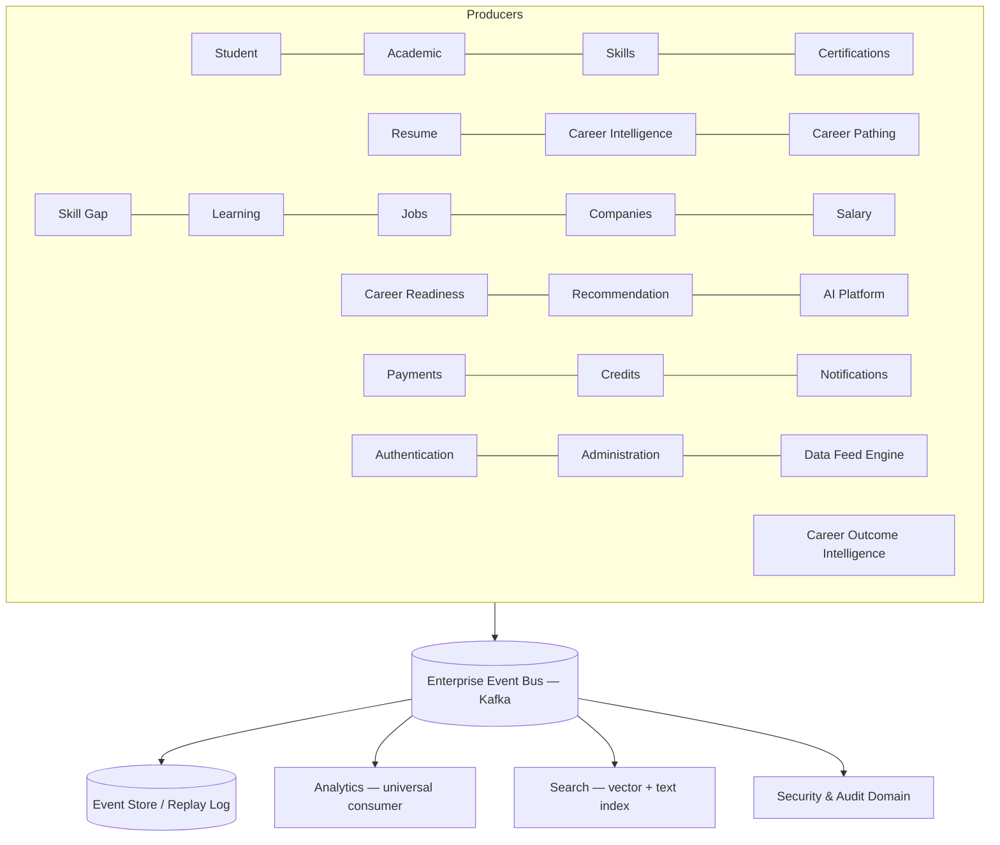

## 20.2 Producer–Consumer Architecture

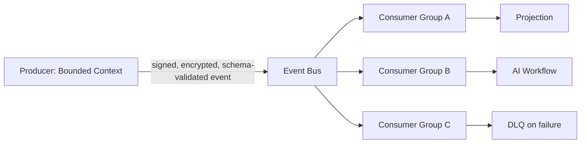

## 20.3 Event Bus (internal)

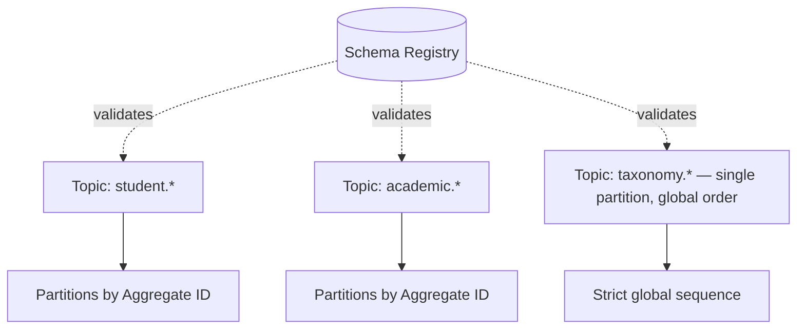

## 20.4 Event Store

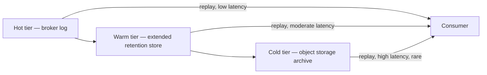

## 20.5 Event Replay

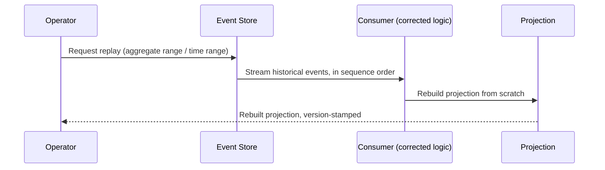

## 20.6 Retry Pipeline

Covered in Part 13's diagram — restated here as the canonical retry-pipeline reference.

## 20.7 DLQ Flow

Covered in Part 13's diagram.

## 20.8 CQRS Integration

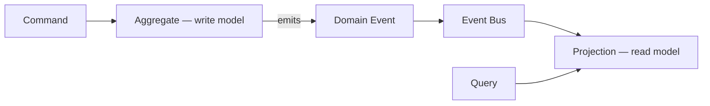

## 20.9 AI Pipeline

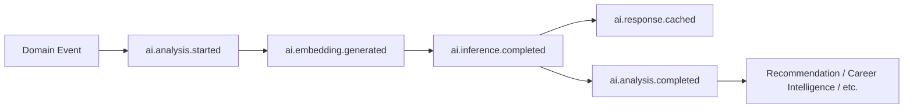

## 20.10 Knowledge Synchronization

Covered in Part 7.10's choreography.

## 20.11 Cross-domain Event Flow

Covered in Part 7's twelve choreographies collectively.

## 20.12–20.18 Domain-specific flows

Career Intelligence, Resume Intelligence, Learning Recommendation, Payment, Credit Consumption, Notification, and Data Feed Engine flows are each covered individually in Part 7.2–7.11 above; this section does not repeat them to avoid duplicating diagrams already provided in context.

## 20.19 Career Outcome Intelligence Pipeline

Covered in Part 7.12.

---

# Architectural Decision Records (ADR)

### ADR-E01: Kafka as the enterprise event bus
- **Context:** the platform needs a single backbone supporting ~24 domains, replay, and long retention.
- **Problem:** no single-purpose broker (RabbitMQ, Redis Streams) satisfies both replay and ordering requirements at platform scale.
- **Options considered:** Kafka, NATS JetStream, cloud-native managed buses (EventBridge/Event Grid/Pub/Sub).
- **Decision:** Kafka (managed), per Part 8.
- **Consequences:** operational complexity is real but mitigated by a managed offering; strongest fit for Part 9/12/14's requirements.
- **Future evolution:** re-evaluated only if a materially superior replay-capable, ordering-capable alternative emerges; not re-litigated per domain.

### ADR-E02: At-least-once delivery with idempotent consumers, not exactly-once end-to-end
- **Context:** many consumers cross into external systems (payment gateways, email providers) that cannot participate in a distributed transaction.
- **Decision:** Part 11's idempotency-key pattern, platform-wide.
- **Consequences:** every consumer must be built idempotent; this is a design requirement, not optional.
- **Future evolution:** exactly-once may be adopted for specific, fully-internal Kafka-to-Kafka pipelines where it is achievable, as a local optimization, never as a platform-wide guarantee replacing this ADR.

### ADR-E03: Aggregate-scoped ordering only, no global ordering guarantee
- **Context:** a platform-wide total order across ~24 domains would not scale and is not needed by any named consumer.
- **Decision:** Part 12's per-aggregate partition ordering, with Taxonomy Version as the sole named exception requiring global order.
- **Consequences:** distributed cross-domain ordering questions are answered via Correlation/Causation ID, never wall-clock time.
- **Future evolution:** a future domain requiring genuine global ordering must justify a dedicated, single-partition topic through the same governance process as any other exception.

### ADR-E04: Additive-only schema evolution, new event name for breaking changes
- **Context:** dozens of independently-deployed consumers cannot upgrade in lockstep.
- **Decision:** Part 10, Part 3.6 — directly extending WP-ARCH-01C Part 14 rule 5's discipline platform-wide.
- **Consequences:** a breaking change always costs a new event name and a dual-publish migration window; this is accepted as the cost of long-term consumer independence.
- **Future evolution:** none required — this is the same rule already validated at the domain layer in Phase A/B.

### ADR-E05: Data Feed Engine as the platform's single trusted external-knowledge boundary
- **Context:** without a single ingestion boundary, multiple domains could independently and inconsistently ingest external market/job/company data, exactly the fragmentation risk WP-ARCH-01B found and closed for internal academic data.
- **Decision:** Part 19.8 — all external knowledge enters through Data Feed Engine's validate-then-publish pattern.
- **Consequences:** Jobs/Companies/Salary domains never integrate directly with an external provider themselves.
- **Future evolution:** a new external data category is onboarded as a new Data Feed Engine source, never as a new domain-level direct integration.

### ADR-E06: No AI system or runtime holds a standing credential to raw domain aggregates
- **Context:** direct extension of Phase B ADR-06 to the event layer.
- **Decision:** every AI/Recommendation/Decision/Analytics consumer subscribes only to published domain/derived events and projections, never queries an aggregate's underlying store directly.
- **Consequences:** every AI-facing fact remains traceable to a specific event/projection version (Part 15.6, Phase B Part 10).
- **Future evolution:** any proposed exception requires the same rigor as Phase B's two named historical exceptions — a dedicated, reviewed justification, not a default.

### ADR-E07: Field-level encryption over whole-envelope encryption
- **Context:** the bus and downstream tooling need routing metadata (Part 4) readable without decrypting sensitive payload content.
- **Decision:** Part 5/15.1 — encrypt sensitive payload fields specifically, sign the whole envelope.
- **Consequences:** slightly more complex event construction; preserves operability of monitoring/routing infrastructure.
- **Future evolution:** whole-envelope encryption may be adopted for a specific future high-sensitivity domain if justified, as a local exception.

---

# Quality Requirements — Compliance Statement

| Requirement | How this document satisfies it |
|---|---|
| Enterprise-grade quality | Full 20-part specification, governance (Part 17), and ADRs above |
| Cloud-native deployment | Managed Kafka recommendation (Part 8), tiered storage (Part 9) designed for cloud object storage |
| Production readiness | DLQ (Part 13), replay (Part 14), observability (Part 16) all specified to operational, not aspirational, detail |
| High availability | Cross-region replication (Part 9), consumer-group horizontal scaling (Part 8) |
| Horizontal scalability | Kafka partitioning (Part 9, Part 12), consumer groups (Part 4, Part 8) |
| Fault tolerance | Retry/backoff/DLQ (Part 13), degraded-mode consumer design implied by idempotency (Part 11) |
| Security by design | Part 15's ten-point security model, built on Phase B's existing security architecture |
| Zero Trust | Every producer/consumer authenticates independently (Part 15.4); no implicit trust between domains |
| DDD alignment | Part 1.8, event ownership mirrors bounded-context/aggregate ownership throughout |
| EDA best practices | Parts 1–3, 11–14 |
| CQRS compatibility | Part 1.9, Part 20.8 |
| OpenTelemetry compatibility | Part 16, Part 4's `traceId` field |
| Kubernetes compatibility | Managed-Kafka/cloud-native recommendation (Part 8) is Kubernetes-deployable via standard operators; no architectural element in this document assumes non-containerized infrastructure |
| AI-first architecture | Part 2's AI Event family, Part 7.9, Part 10.3/15.6, Part 19 in full |
| Future microservice evolution | Part 17.6, Part 19.11 |
| Long-term maintainability | Additive-only versioning (Part 10), governance (Part 17), lifecycle model (Part 18) |

---

# Expected Output — Closing Statement

This document is the canonical Enterprise Event Architecture for the HireRise Career Intelligence Platform. It extends, rather than replaces, the security and data-modeling discipline already established in EEP-01 Phases A and B — Phase B's single-writer rule, projection-only downstream access, and full provenance requirement are the same rules this document applies at the event layer, platform-wide, across all ~24 bounded contexts named in the brief, including the Data Feed Engine as the platform's sole trusted external-knowledge boundary and the Career Outcome Intelligence Engine as a longitudinal, justified-exception consumer of immutable historical data. The architecture is designed to remain extensible for future AI capability, additional domains, and additional microservices without requiring a redesign of this document itself — only additive extension of its tables, per Part 10/17's governance discipline.

*End of EEP-01 Phase C. Awaiting approval before proceeding to Phase D.*
