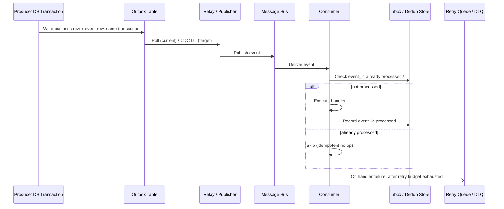
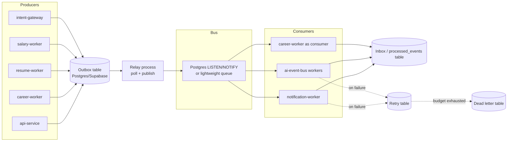
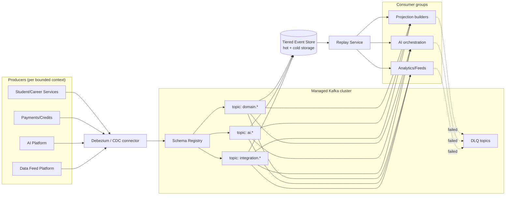
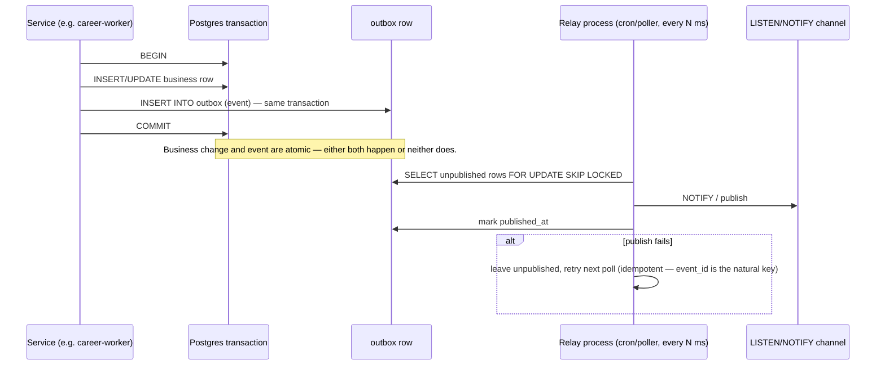
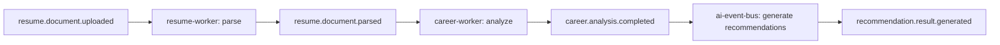
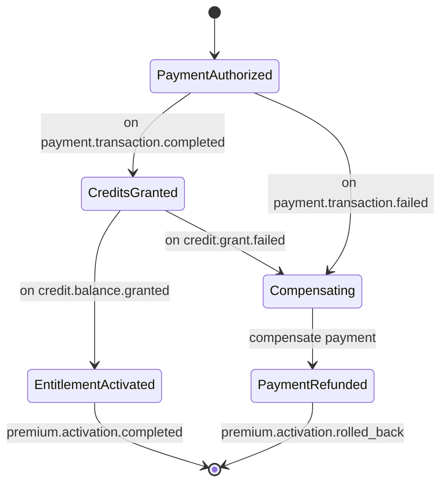
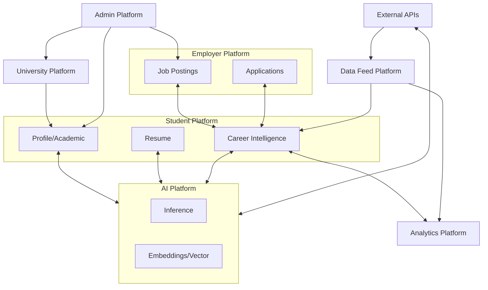
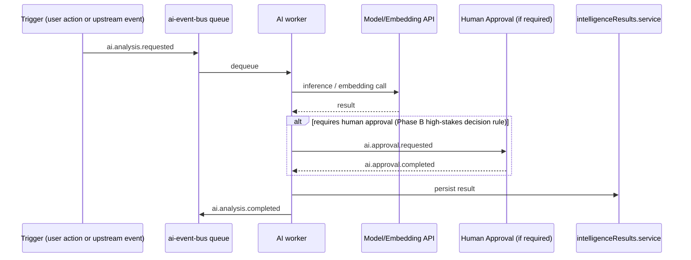
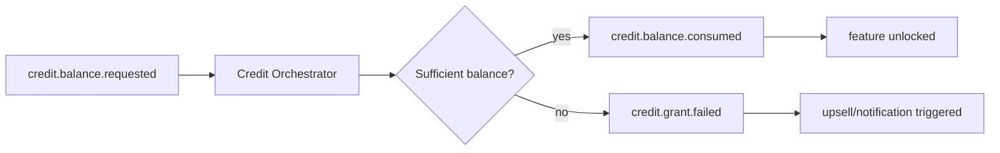

# EEP-01 — Phase D
## Enterprise Messaging & Event Processing Architecture
### HireRise Career Intelligence Platform

**Role:** Chief Enterprise Architect / Enterprise Integration Architect / Event-Driven Architecture Specialist / Distributed Systems Architect / Kafka Platform Architect / Cloud Infrastructure Architect / AI Platform Architect / SRE / DevOps Architect / Enterprise Governance Architect — combined deliverable.

**Inputs treated as authoritative, not redesigned:** EEP-01 Phase A (Enterprise Physical Data Model), Phase B (Enterprise Security Architecture), Phase C (Enterprise Event Architecture). This document does not re-derive event naming, envelope shape, taxonomy, or security classification — those are Phase C's job. Phase D answers a narrower question: **how do events physically move, get retried, get replayed, and get operated, at each stage of the platform's growth.**

---

## How to read this document

Every part in this document is written in **two tracks**, per the agreed EEP convention:

> 🔧 **CURRENT STATE (Implementation-Ready)** — describes what exists in the `hirerise/core` repository today, or the smallest reasonable extension of it. Nothing in a CURRENT STATE box requires new infrastructure, a new platform team, or a migration.

> 🎯 **TARGET STATE (5–10yr Reference Architecture)** — describes the eventual, technology-forward architecture Phase D exists to define, for the scale point at which it becomes justified (see Part 0 trigger table). Nothing in a TARGET STATE box is a near-term requirement.

Every ADR in Part 20 has a **"Trigger to adopt"** field for exactly this reason: the target state is a blueprint to grow into, not a backlog to build now.

---

# PART 0 — Scale Reality Check and Migration Triggers

Before topology: a platform doesn't move from CURRENT to TARGET on a calendar date, it moves when a measurable trigger fires. This table is the thing every later "future evolution" note in this document points back to.

| Signal | Current-state ceiling | Trigger to begin TARGET migration |
|---|---|---|
| Sustained event throughput | Postgres LISTEN/NOTIFY + outbox poller comfortably handles low thousands of events/min | Sustained > ~5,000 events/sec, or bursty spikes that starve the outbox poller |
| Number of independently-deployed consumer services | 6 workers (`career-worker`, `resume-worker`, `salary-worker`, `notification-worker`, `ai-event-bus` workers, `intent-gateway`) | > ~20 independently deployed consumers, or 2+ teams stepping on each other's deploys |
| Cross-region requirement | Single Supabase region | Real user base or compliance requirement in a second region |
| Replay requirement | "Re-run the outbox row" is sufficient | Need to replay weeks/months of history against a new consumer that didn't exist when the event was first published |
| Ordering/partitioning need | Per-aggregate ordering via Postgres row locking is sufficient | Need partition-level ordering across independently scaling consumer instances |
| Team size / ownership model | One team owns all producers and consumers | Multiple teams each owning topics/consumers independently, needing enforced contracts instead of shared-repo conventions |

**Rule this document follows throughout:** if a Part's TARGET STATE content doesn't correspond to at least one row above eventually firing, it doesn't belong in this architecture — it's decoration. Kafka, Kubernetes, and multi-region replication appear in this document because HireRise's stated 5–10 year ambition includes crossing these lines, not because they are needed today.

---

# PART 1 — Enterprise Messaging Overview

## 1.1 Relationship to Phase C

Phase C defined *what* an event is (envelope, naming, taxonomy, classification). Phase D defines *how it travels*: transport, delivery guarantees, retry, ordering, replay, and the operational apparatus around all of that. Every event that satisfies Phase C's contract must also satisfy Phase D's transport contract; Phase D never redefines an event's shape.

## 1.2 Event processing lifecycle (both tracks)



This lifecycle is identical in shape across both tracks — CURRENT STATE and TARGET STATE swap out the boxes ("Outbox Table poller" → "Debezium CDC", "Postgres NOTIFY" → "Kafka topic") without changing the contract any producer or consumer code depends on. That invariance is the point: application code should not need to change when the transport underneath is upgraded.

## 1.3 🔧 CURRENT STATE — Message flow today

`shared/events/index.js` and the `ai-event-bus` module already implement most of the pattern above informally: an event is written, workers poll or subscribe, `baseWorker.js` provides a shared execution wrapper. Phase D's current-state contribution is to make the *implicit* parts of this explicit and uniform: every producer must write through an outbox row (Part 4), every consumer must check an inbox/dedup record before acting (Part 5), and every worker must inherit retry/DLQ behavior from one shared library rather than reimplementing it per worker.

## 1.4 🎯 TARGET STATE — Message flow at platform scale

At the trigger point in Part 0, the same lifecycle runs over a durable, partitioned, replayable log (Kafka or equivalent) instead of a polled Postgres table, with a schema registry enforcing the Phase C contract at publish time rather than by code review.

---

# PART 2 — Enterprise Messaging Topology

## 2.1 🔧 CURRENT STATE topology



No new infrastructure component here is hypothetical — every box maps to a table or process that either already exists (`shared/events`, `ai-event-bus`) or is a small, boring addition to Supabase (an `outbox`, `processed_events`, and `dead_letters` table plus one relay process). This is the actual near-term deliverable.

## 2.2 🎯 TARGET STATE topology



**Topology components, both tracks:** Producers, Consumers, Topics/Channels, Partitions (single-partition-equivalent = per-aggregate row locking today; real partitions later), Consumer Groups (today: one worker type = one group, informally; later: formal Kafka consumer groups), Brokers (today: Postgres itself is the broker; later: a Kafka cluster), Schema Registry (today: JSON Schema files checked in-repo + CI validation; later: Confluent/Redpanda-style registry), Event Store (today: the append-only `domain_events` audit table Phase B already requires; later: tiered hot/cold storage), Replay Service (today: a script that re-reads the audit table and re-publishes; later: a first-class service), DLQ/Retry Queues (today: Postgres tables; later: Kafka DLQ topics).

---

# PART 3 — Kafka Topic Architecture (🎯 TARGET STATE)

This entire part is target-state by definition — there is no Kafka today, and there should not be, per Part 0.

## 3.1 Naming standard (inherits Phase C Part 3)

`<bounded_context>.<subject>.<fact>.v<major>` — identical to the Phase C event-name standard, because a topic name should never diverge from the event names it carries. E.g. `career.analysis.completed.v1`.

## 3.2 Partitioning

Partition key = the aggregate ID Phase C already assigns each event (Phase C's Causation/Correlation model). This guarantees per-aggregate ordering without a global order, which is the correct guarantee for a fan-out platform like HireRise (Phase C §1.2).

## 3.3 Replication, retention, cleanup policy

| Topic family | Replication factor | Retention | Cleanup policy |
|---|---|---|---|
| `domain.*` (business facts) | 3 | Indefinite for Student Academic / Career Outcome (matches Phase B audit retention); 2 years elsewhere | `delete` after tiering to cold storage |
| `ai.*` | 3 | Long (explainability requirement, Phase B §10.6) | `delete` after tiering |
| `integration.*` | 3 | Medium (tied to underlying record) | `delete` |
| `notification.*` | 2 | Short (30–90 days) | `delete` |
| `*.dlq` | 3 | 90 days minimum, alert-gated deletion | `delete` |
| Compacted state topics (e.g. `student.profile.state`) | 3 | Infinite | `compact` |

## 3.4 Tiered storage & multi-region

Hot tier on broker disk for the active retention window; cold tier (object storage) for anything beyond, fronted by the Replay Service so a consumer never needs to know which tier an event lives in. Multi-region: active-passive to start (single write region, async-replicated read region), upgraded to active-active only if Part 0's cross-region trigger fires with a *write* requirement, not just a read one — active-active messaging is a materially harder problem than active-passive and should not be adopted preemptively.

## 3.5 Topic ownership and lifecycle

Every topic has exactly one owning bounded context (never co-owned — mirrors Phase B's single-writer rule). Topic creation goes through the governance workflow in Part 18; topic deprecation requires a consumer migration window (minimum 90 days) before deletion.

---

# PART 4 — Transactional Outbox Pattern

## 4.1 🔧 CURRENT STATE (build this now)



**Schema (current state — additive migration, no new infra):**

```sql
create table outbox_events (
  event_id        uuid primary key default gen_random_uuid(),
  event_name      text not null,        -- Phase C canonical name
  aggregate_id    uuid not null,
  payload         jsonb not null,
  occurred_at     timestamptz not null default now(),
  published_at    timestamptz,
  publish_attempts int not null default 0
);
create index on outbox_events (published_at) where published_at is null;
```

**Failure recovery:** relay crash mid-publish is safe — `published_at` is only set after a confirmed publish, so a crashed relay simply re-polls the same unpublished rows on restart; downstream idempotent consumers (Part 5) absorb the resulting at-least-once duplicate.

**Outbox cleanup:** a scheduled job deletes rows where `published_at` is older than the retention window for that event family (Part 3.3's retention table applies here too, even pre-Kafka).

## 4.2 🎯 TARGET STATE

Same table, but tailed by a CDC connector (Debezium) instead of polled — publish latency drops from "poll interval" to near-real-time, and the relay process is retired in favor of the connector. The outbox table itself does not change shape; this is a transport swap, not a redesign, which is exactly the invariance Part 1.2 is designed to preserve.

---

# PART 5 — Consumer Inbox Pattern

## 5.1 🔧 CURRENT STATE

```sql
create table processed_events (
  event_id     uuid primary key,
  consumer     text not null,     -- e.g. 'notification-worker'
  processed_at timestamptz not null default now()
);
```

Every consumer handler wraps its business logic in: check `processed_events` for `(event_id, consumer)` → if present, skip (already-processed, safe to no-op) → if absent, execute handler, then insert the record **in the same transaction as the handler's own writes** wherever the consumer's own state lives in the same database. Where the consumer's side effect is external (e.g. sending an email via `notification-worker`), the insert happens immediately after a confirmed external call, accepting the narrow at-most-once-vs-at-least-once tradeoff on that specific boundary — a decision recorded as ADR-D3 (Part 20).

**Cleanup:** `processed_events` rows older than the longest plausible redelivery window (current state: a few days, since the relay retries quickly) can be pruned; this table is a dedup cache, not an audit record — the audit record is Phase B's `domain_events` table.

## 5.2 🎯 TARGET STATE

Same logical check, backed by a compacted Kafka topic or a fast key-value store instead of a Postgres table, sized for the redelivery window of a real consumer-group rebalance rather than a relay retry.

---

# PART 6 — Saga Architecture

## 6.1 Choice of pattern by workflow

| Workflow | Pattern | Why |
|---|---|---|
| Resume Analysis | Choreography | Linear pipeline (`ResumeUploaded` → `ResumeParsed` → `AnalysisCompleted`), each step only needs to know the previous fact — no central coordinator adds value |
| AI Processing (multi-step inference) | Choreography, with a Workflow Event pair (`WorkflowStarted`/`WorkflowCompleted`) for observability | Same reasoning; the workflow events exist so operators can trace it, not to coordinate it |
| Payments | Orchestration | Multiple possible failure/compensation paths (auth succeeds, capture fails; refund partially fails) — a single orchestrator makes the compensation logic auditable in one place, which payment reconciliation requires |
| Credits | Orchestration | Same reasoning — a credit grant/consumption saga has monetary compensation requirements that benefit from centralized control |
| Premium Activation | Orchestration | Spans Payments + Credits + Entitlements; needs one place that knows "is this user's premium fully activated" |

## 6.2 🔧 CURRENT STATE example — Resume Analysis (choreography)



Each arrow is an outbox-published event; each box is a consumer with its own inbox check. No coordinator process exists or is needed — this is buildable in the current worker set with the Part 4/5 patterns and nothing else.

## 6.3 🎯 TARGET STATE example — Premium Activation (orchestration)



An orchestrator service (target-state) owns this state machine explicitly; each transition is still triggered by the same Phase C events, but a single component — not five independently-choreographed workers — owns "what happens if step 3 fails after step 1 and 2 already succeeded." This is the concrete justification for orchestration over choreography specifically for money-touching sagas, and only for those.

---

# PART 7 — Enterprise Integration Patterns

| Pattern | Where it applies at HireRise | Track |
|---|---|---|
| Publish–Subscribe | Every domain event fan-out (Part 1.2's whole lifecycle) | 🔧 today, unchanged at 🎯 |
| Request–Reply | Synchronous API calls (Phase C §1.10) — explicitly *not* how domain facts propagate | 🔧 |
| Aggregator | Combining `resume.document.parsed` + `career.analysis.completed` into one recommendation input | 🔧 today (in-process in career-worker); 🎯 as a dedicated stream-processing step (ksqlDB/Flink) at scale |
| Splitter | Data Feed ingestion: one external batch file → many per-record `feed.record.ingested` events | 🔧 |
| Content-Based Router | Notification routing by channel (email/SMS/push) based on event payload | 🔧 |
| Resequencer | Reordering out-of-order career-timeline events before projection | 🎯 — not needed until partitioned consumers can genuinely reorder; single-consumer current state processes in arrival order already |
| Claim Check | Large payloads (parsed resume text, embedding vectors) — event carries a reference, not the blob | 🔧 today (Supabase Storage reference); same pattern at 🎯 with object storage |
| Dead Letter Channel | Every consumer, per Part 4/5's retry budget | 🔧 |
| Message Filter | AI Event routing — only `AnalysisCompleted` events above a confidence threshold reach the Recommendation Engine | 🔧 |
| Competing Consumers | Multiple `notification-worker` instances pulling from the same retry queue | 🔧 today (multiple worker processes); formal consumer-group semantics at 🎯 |
| Event Gateway | Single ingress for external partner/API events before they enter the internal bus | 🎯 — `intent-gateway` is the current-state seed of this; formalizes at target scale |

---

# PART 8 — Event Contract Management

## 8.1 🔧 CURRENT STATE

JSON Schema files checked into `shared/events/schemas/`, validated in CI (`.github/workflows`) against every producer's outbox write and every consumer's expected shape. A breaking change to a schema requires: (1) a new `.v2` event name (Phase C's versioning rule), never a silent field change; (2) both old and new consumers running during a migration window; (3) sign-off recorded per Part 18's governance workflow. This is enforceable today with a CI check and a PR template — `.github/PULL_REQUEST_TEMPLATE.md` already exists and is the natural place to add a "schema compatibility checked" line item.

## 8.2 🎯 TARGET STATE

The same rules, enforced automatically by a Schema Registry at publish time (reject an incompatible publish before it reaches a topic) rather than by CI + code review. Consumer-driven contract tests (e.g. Pact-style) formalize what today is an informal "don't break a consumer" review norm.

---

# PART 9 — Enterprise Event Mesh



🔧 **CURRENT STATE:** this mesh exists today as direct table/service relationships within a single Supabase instance plus the existing worker set — the diagram is accurate as an *information flow* map now, just not as a literal message-bus topology. 🎯 **TARGET STATE:** the same arrows become topic subscriptions once each platform above is its own deployable unit with its own producer/consumer boundary, per Part 0's trigger on independent-consumer count.

---

# PART 10 — Event Processing Runtime

| Concern | 🔧 Current state | 🎯 Target state |
|---|---|---|
| Worker architecture | Node.js worker processes (`career-worker`, `resume-worker`, etc.), `baseWorker.js` shared base | Same worker logic, running as Kubernetes-scheduled pods with a consumer-group client library |
| Scaling | Horizontal — run more instances of a worker process pointed at the same outbox/retry tables, `SELECT ... FOR UPDATE SKIP LOCKED` prevents double-processing | Kafka consumer-group partition assignment, HPA on consumer lag |
| Ordering | Per-aggregate via row locking on the outbox/retry tables | Per-partition ordering, keyed by aggregate ID |
| Backpressure | Poller interval + row-lock contention naturally throttles; a slow consumer simply lags | Consumer lag metrics drive HPA and, if sustained, alerting (Part 15) |
| Rate limiting | `rate-limit.middleware.js` already exists for inbound API; extend the same limiter library to outbound calls consumers make (e.g. LLM API calls) | Same policy, enforced at the mesh/gateway layer for cross-service calls |

---

# PART 11 — AI Messaging Architecture

## 11.1 Pattern (both tracks, same shape)



🔧 **CURRENT STATE:** this is `ai-event-bus/bus/aiEventBus.js`, `queues/queue.config.js`, and `workers/index.js` today, largely as-is — Phase D's contribution is formalizing the DLQ/retry budget (Part 4/5's pattern, applied to AI jobs specifically, since LLM calls fail transiently far more often than a DB write does) and making human-approval steps a first-class event pair rather than an ad hoc callback.

🎯 **TARGET STATE:** vector indexing and multi-agent orchestration become dedicated topics (`ai.embedding.generated`, `ai.agent.task.assigned`) with MCP-integration events modeled the same way — an MCP tool call is an `ai.tool.invoked` → `ai.tool.completed` pair, never a synchronous blocking call from inside an event handler.

---

# PART 12 — Data Feed Runtime

🔧 **CURRENT STATE:** external ingestion (the `Career data/` CSV templates, salary/education benchmark feeds) already flows through a validate → publish pipeline conceptually; Phase D formalizes it as: ingest → schema/quality-gate validation → `feed.record.ingested` (valid) or `feed.record.rejected` (invalid, with reason) → downstream consumers. Quality gates are simple assertions (required fields present, referential integrity against the taxonomy tables) run synchronously before publish, not after.

🎯 **TARGET STATE:** same pipeline, with a Splitter (Part 7) breaking large external batch files into per-record events at ingestion-connector level rather than in application code, and a monitoring dashboard (Part 15) tracking rejection rate as a first-class SLA (Part 16).

---

# PART 13 — Career Outcome Runtime

🔧 **CURRENT STATE:** longitudinal analysis and trend generation are batch jobs today (cron-scheduled workers reading committed academic/career records) — this is appropriate at current data volume and should not be event-ified prematurely; a nightly batch job is simpler and cheaper than a streaming pipeline until the data volume or latency requirement says otherwise.

🎯 **TARGET STATE:** recommendation feedback loops become event-driven (`recommendation.outcome.observed` closing the loop back to the model-training pipeline) once there is enough outcome volume for near-real-time feedback to outperform nightly batch retraining.

---

# PART 14 — Messaging Security

Inherits Phase B's identity/authz model and Phase C's per-family security posture (Part 2 table above) without redefining either.

| Concern | 🔧 Current state | 🎯 Target state |
|---|---|---|
| Broker security | N/A (Postgres itself, protected by Phase B's RLS/roles) | Kafka ACLs, mTLS between brokers and clients |
| Topic ACLs | Table-level grants (Postgres roles) | Per-topic producer/consumer ACLs enforced by the broker |
| Encryption | At-rest via Supabase/Postgres; in-transit via TLS to the DB | At-rest per-topic; in-transit mTLS |
| Signing | Not needed at current trust boundary (single DB, single deploy) | Event signing for cross-boundary integrity, especially `integration.*` and `security.*` families |
| Secret management | `.env` files today — **flagged in this review as a live risk (see cover note); target is a proper secret manager regardless of messaging architecture** | Vault/KMS-backed secrets injected per-pod |
| Service auth | Existing `auth.middleware.js` | Service-to-service via mTLS or workload identity |
| Multi-tenant isolation | Not yet a requirement (single-tenant platform) | Namespace/topic-prefix isolation if HireRise ever offers a white-label/B2B tenant model |

---

# PART 15 — Messaging Observability

🔧 **CURRENT STATE:** instrument the outbox relay and every worker with OpenTelemetry spans today — this needs no new infrastructure, just the `otel` SDK added to existing Node services. Minimum metrics from day one: outbox lag (`now() - occurred_at` for unpublished rows), consumer lag (`now() - occurred_at` for unprocessed inbox rows), retry-queue depth, DLQ depth, per-handler error rate. These four numbers alone catch the large majority of production messaging incidents and cost nothing beyond adding the SDK.

🎯 **TARGET STATE:** the same four signals, sourced from Kafka consumer-group lag and broker metrics instead of Postgres queries, feeding the same dashboards and alert thresholds (Part 16) — another instance of Part 1.2's transport-invariance principle.

---

# PART 16 — Enterprise Messaging SLAs

| Metric | 🔧 Current-state target | 🎯 Target-state (at scale) |
|---|---|---|
| Delivery latency (p95, outbox → consumer start) | < 5s (bounded by relay poll interval) | < 500ms |
| Retry window | 3 attempts, exponential backoff, ~5 min total | Configurable per topic, typically 3–5 attempts over ~15 min |
| Recovery objective (RTO) after relay/broker outage | < 15 min (restart relay process) | < 5 min (broker HA) |
| Recovery point (RPO) | 0 — outbox is transactional, nothing is lost, only delayed | 0 |
| Availability | Bound to Supabase's own SLA | 99.9%+ for the messaging tier independent of any single service |
| Consumer lag alert threshold | > 2 min sustained | > 30s sustained (varies by topic criticality) |
| Replay target | Manual script re-publish, hours-scale, rare | Self-service replay, minutes-scale, any historical window within retention |

---

# PART 17 — Cost Optimization

🔧 **CURRENT STATE:** cost is already near-zero incrementally — the outbox/inbox/retry/DLQ tables live in the existing Postgres instance, and the relay is one more small process. The only cost discipline needed now is retention hygiene (Part 4.1's cleanup job) so these tables don't grow unbounded.

🎯 **TARGET STATE:** topic-level retention/compaction tuning (Part 3.3), compression (typically the single biggest Kafka cost lever), tiered storage to push cold data off broker disks, and treating AI-event replay specifically as a cost-tracked operation (LLM re-inference during replay is not free the way a plain event republish is — replaying `ai.*` topics should re-emit stored results by default and only re-invoke a model on explicit request).

---

# PART 18 — Governance

| Governance concern | 🔧 Current state | 🎯 Target state |
|---|---|---|
| Topic/table ownership | One team; ownership is implicit | Formal registry — one owning team per topic, enforced at creation time |
| Producer/consumer ownership | Recorded in code comments / this document | Recorded in the schema registry / a service catalog |
| Approval workflow | PR review, using the existing PR template | Same principle, gated additionally by automated compatibility checks |
| Operational reviews | Ad hoc | Scheduled review cadence tied to the SLA table (Part 16) |
| Compliance | Inherits Phase B's audit/retention rules directly | Same, plus per-topic retention enforcement at the broker level |
| Documentation standard | This EEP series | Same series, kept current as the canonical source — this document is the one that should be updated when the target state actually begins, not left as a static prediction |

---

# PART 19 — Reference Architectures

Each reference below is the *choreography-or-orchestration decision from Part 6* applied to a specific pipeline, current-state-buildable unless marked otherwise.

## 19.1 Resume Intelligence Pipeline (🔧 current-state, see Part 6.2)

## 19.2 Payment Processing (🎯 target-state orchestration, see Part 6.3's pattern applied to payment capture/refund specifically)

## 19.3 Credit Management


🎯 target-state orchestration once Credits and Payments are independently deployed; 🔧 today this is a single service-local transaction, which is simpler and correct at current scale.

## 19.4 Notification Processing (🔧 current-state — Content-Based Router + Competing Consumers, Part 7)

## 19.5 AI Processing (🔧/🎯 — see Part 11 in full)

## 19.6 Data Feed Engine (🔧/🎯 — see Part 12 in full)

## 19.7 Career Outcome Intelligence (🔧 batch today, 🎯 event-driven feedback loop — see Part 13)

---

# PART 20 — Architecture Decision Records

Each ADR below includes a **Trigger to adopt** field distinguishing "decide this now" from "decide this later, but decide it correctly when the time comes."

### ADR-D1: Outbox pattern over dual-write

- **Context:** every producer needs to atomically update its own state and emit an event.
- **Problem:** writing to the DB and publishing to a bus as two separate operations risks partial failure (state changes, event never sent, or vice versa).
- **Options:** (a) dual write with best-effort retry; (b) transactional outbox; (c) event sourcing (state derived entirely from events).
- **Decision:** transactional outbox (b). Event sourcing (c) was rejected as unnecessary complexity — HireRise's aggregates are conventional CRUD-plus-events, not naturally event-sourced domains, and Phase A's physical model already assumes row-based state as the source of truth.
- **Consequences:** requires the outbox table and relay/CDC process; guarantees atomicity between state and event.
- **Trigger to adopt:** now — this is CURRENT STATE and should be the very next implementation step regardless of Kafka timing.
- **Future evolution:** relay → CDC connector at the Part 0 throughput trigger.

### ADR-D2: Postgres-native bus before Kafka

- **Context:** HireRise needs a message bus today and, per the platform's stated ambition, eventually needs Kafka-class infrastructure.
- **Problem:** adopting Kafka now would add an operational burden (cluster ops, schema registry, K8s) disproportionate to current throughput and team size.
- **Options:** (a) adopt Kafka now; (b) build on Postgres primitives (outbox + LISTEN/NOTIFY + tables for inbox/retry/DLQ) now, defined to migrate cleanly later; (c) adopt a managed lightweight queue (SQS-equivalent) as a middle step.
- **Decision:** (b), with (c) as an acceptable substitute for the relay/notify layer specifically if operational simplicity is preferred over building it in-house — either way, the outbox/inbox/DLQ table contracts (ADR-D1, this ADR) stay identical.
- **Consequences:** current team ships without new infra; a deliberate migration project is required later rather than an incremental one.
- **Trigger to adopt Kafka:** Part 0's throughput or consumer-count row firing, sustained (not a one-time spike).
- **Future evolution:** Part 3's full topic architecture, once triggered.

### ADR-D3: At-least-once delivery, idempotent consumers, narrow at-most-once boundary for external side effects

- **Context:** every realistic transport (Postgres-native or Kafka) delivers at-least-once under failure, not exactly-once.
- **Problem:** a naive consumer double-processing an event can double-send an email, double-charge a credit, etc.
- **Options:** (a) exactly-once delivery infrastructure (materially harder, and not truly achievable end-to-end when an external side effect like an email API is involved); (b) at-least-once delivery + idempotent consumers via inbox pattern.
- **Decision:** (b), platform-wide, no exceptions — including for external side effects, accepting a narrow at-most-once risk window specifically at the "insert inbox record right after a confirmed external call" step (Part 5.1), which is the one point where a crash between the external call and the inbox write can cause a duplicate send. This window is judged acceptable because it's small and because the alternative (recording "processed" before the external call is confirmed) is strictly worse — it can cause a *lost* send instead of a rare duplicate one.
- **Consequences:** every consumer must implement the inbox check; no consumer may assume single delivery.
- **Trigger to adopt:** now — this is CURRENT STATE and is required before any consumer ships, Kafka or not.

### ADR-D4: Choreography by default, orchestration only for money-touching sagas

- **Context:** Part 6 needs a default rule, not a case-by-case debate every time a new multi-step workflow is added.
- **Problem:** orchestration adds a coordinator component and its own failure mode; choreography adds implicit coupling if overused for workflows with real compensation logic.
- **Options:** (a) orchestration everywhere (simpler mental model, more infrastructure); (b) choreography everywhere (less infrastructure, harder to audit compensation); (c) choreography by default, orchestration for a named exception list (Payments, Credits, Premium Activation).
- **Decision:** (c).
- **Consequences:** most workflows (Resume, AI Processing, Notifications) stay simple; money-touching workflows get an explicit, auditable state machine.
- **Trigger to adopt orchestration for a new workflow:** the workflow has more than one plausible compensation path, or it touches money/entitlements — not workflow complexity alone.

### ADR-D5: Schema compatibility enforced in CI now, in a registry later

- **Context:** Phase C's event contract needs enforcement, not just documentation, or it will drift.
- **Problem:** a full schema registry is target-state infrastructure; drift risk exists today regardless.
- **Options:** (a) do nothing until Kafka; (b) enforce compatibility in CI now using checked-in JSON Schema files; (c) stand up a registry now, ahead of Kafka.
- **Decision:** (b). (c) was rejected as premature infrastructure for the current producer/consumer count.
- **Consequences:** requires a CI check and PR template line-item now; migrates to registry enforcement later without changing the schema files themselves.
- **Trigger to adopt (c):** Part 0's consumer-count trigger, or the first incident actually caused by an undetected breaking change (whichever comes first).

---

## Closing note on scope discipline

Every 🎯 TARGET STATE section in this document exists because it corresponds to a named trigger in Part 0 or a named ADR "trigger to adopt" — not because an enterprise architecture document is expected to mention Kafka and Kubernetes. If a future revision of this document adds target-state content that can't point back to a Part 0 row, that's a sign the document has drifted from blueprint into decoration, and it should be cut.
