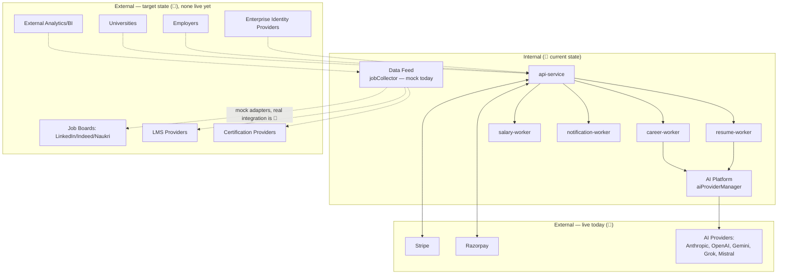
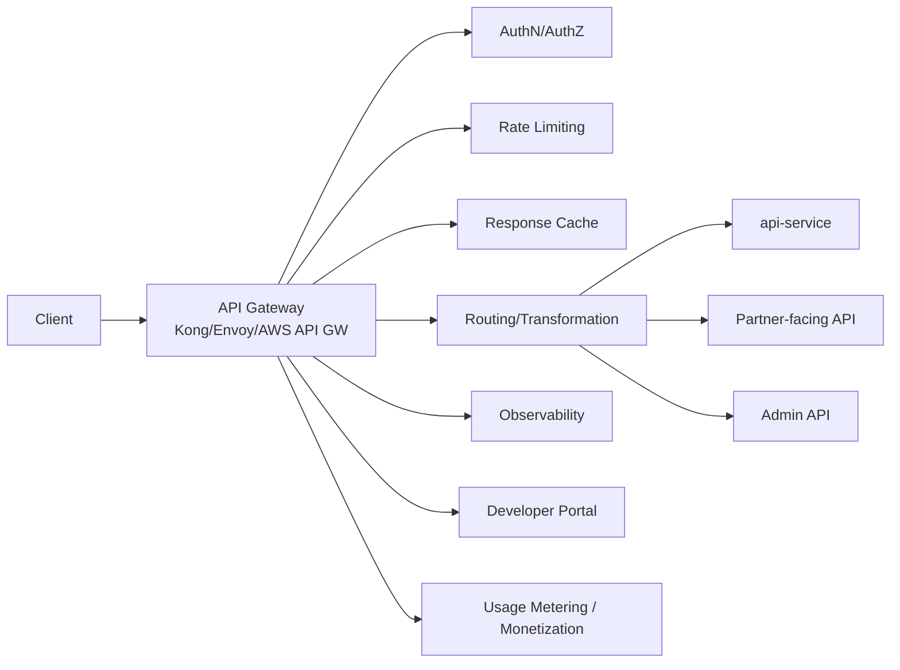
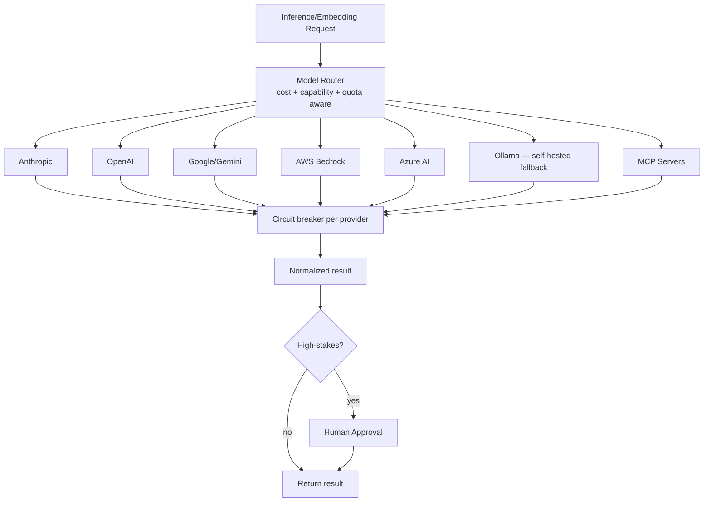
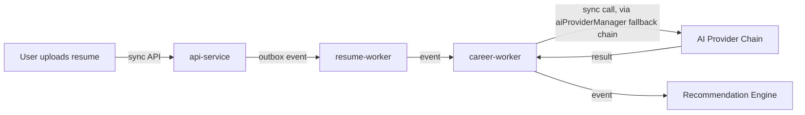

# EEP-01 — Phase E
## Enterprise Integration Architecture
### HireRise Career Intelligence Platform

**Role:** Chief Enterprise Architect / Enterprise Integration Architect / API Architect / Cloud Architect / Distributed Systems Architect / Security Architect / Identity Architect / AI Platform Architect / Platform Engineering Architect / DevSecOps Architect / Enterprise Governance Architect — combined deliverable.

**Inputs treated as authoritative, not redesigned:** EEP-01 Phases A–D. Phase C defined event shape; Phase D defined how events physically move. Phase E answers the remaining question: **how do internal services, external systems, AI providers, and future partners communicate — synchronously, over APIs, across a trust boundary — safely, reliably, and consistently.** Where a topic is really "how does a fact propagate after it happens," that's Phase C/D's job and this document points there instead of restating it.

**Convention (inherited from Phase D):** every major section carries a 🔧 **CURRENT STATE** box (buildable today, on the existing `hirerise/core` codebase, no new infrastructure) and a 🎯 **TARGET STATE** box (the long-term reference architecture, adopted only when a Part 0 trigger fires). This document was written after inspecting the actual repository, not from the taxonomy alone — where the codebase already does something (e.g. multi-provider AI fallback), this document formalizes and extends that, rather than inventing a parallel design.

---

# PART 0 — Integration Reality Check

| Capability | Current-state ceiling | Trigger to adopt target state |
|---|---|---|
| API Gateway | `api-service` + Express middleware (`auth`, `rate-limiting`, `security`) handles this directly | > ~5 independently deployed API-serving services, or a genuine need for a single external-facing hostname/policy point in front of them |
| Service Mesh | Direct service-to-service calls / shared DB; no mesh needed with < 10 internal services | > ~15–20 internally deployed services, or a concrete mTLS/east-west-observability requirement that middleware-per-service can no longer satisfy consistently |
| Enterprise ESB | N/A — EDA (Phase C/D) plus REST covers current integration needs; a classical ESB is not on this platform's roadmap at any scale (superseded by API Gateway + Event Mesh, not reintroduced later) | Not applicable — this row exists to explicitly rule the pattern out, not to defer it |
| External Partner Platform (universities, employers, gov) | None exist yet — labor-market data collection is currently **mock** (`jobCollector.service.js`), not a live partner feed | First signed partner contract (a real university, employer, or job board agreeing to a live integration) |
| Multi-region APIs | Single Supabase region; single deploy region | Real user base or compliance requirement in a second region (same trigger as Phase D Part 0) |
| Integration Hub / iPaaS | Point-to-point adapters per external system (current: Stripe, Razorpay, AI providers) | > ~10 external partner integrations with heterogeneous protocols, where a hub's mapping/monitoring value exceeds its operational cost |
| GraphQL Federation | No GraphQL exists yet; REST is sufficient for current client needs | A genuine multi-client, multi-team schema-composition need — not "GraphQL is more modern" |
| API Marketplace | N/A | A B2B/enterprise-customer business model actually launches (Phase E Part 20) |

**Rule inherited from Phase D:** every 🎯 section below exists because it maps to a row above. If it doesn't, cut it.

---

# PART 1 — Enterprise Integration Overview

## 1.1 Philosophy

Two questions decide how any two components talk to each other at HireRise, and this document does not add a third:

1. **Does the caller need an answer to proceed right now?** → synchronous integration (Part 3/5): REST/gRPC request-reply.
2. **Does the caller only need the rest of the system to know something happened?** → asynchronous integration (Phase C/D): an event.

Everything in this document is a variation on getting one of those two answers right for a specific pair of systems — internal-to-internal, HireRise-to-AI-provider, or HireRise-to-external-partner.

## 1.2 Internal vs. external

Internal integration (api-service ↔ workers) can assume a trusted network, a shared schema-evolution process, and a single deploy owner. External integration (HireRise ↔ Stripe, HireRise ↔ a future university system) can assume none of those — Part 11's Zero Trust posture applies in full to every external boundary and does not relax with partner "trust" or contract size.

## 1.3 Relationship to Phase C / Phase D

Phase C/D own the event side of the hybrid model in 1.1. This document's event-touching sections (7, 8, 9) describe the *integration-specific* shape of a webhook-to-event bridge or an AI-callback-to-event bridge — the event itself, once it exists, is Phase C's contract and Phase D's transport, unchanged.

---

# PART 2 — Enterprise Integration Landscape

**Reading this diagram honestly matters more than drawing it fully:** the solid-line "External — live today" box is two payment processors and a set of AI model APIs. Everything in the dashed "External — future" box is aspirational and should stay dashed in every future revision of this document until a contract is actually signed (Part 0's trigger).

---

# PART 3 — API Architecture

| API style | Where it applies at HireRise | Track |
|---|---|---|
| REST | Every current API — `api-service` routes (`career`, `resume`, `salary`, `billing`, `webhooks`) | 🔧 |
| Webhooks (inbound) | Stripe/Razorpay payment callbacks — already implemented in `webhooks.routes.js` with signature verification | 🔧 |
| Webhooks (outbound) | Notifying a future partner (e.g. a university system) of a status change | 🎯 |
| gRPC | Internal service-to-service, low-latency, strongly-typed | 🎯 — not justified while services share a network and a database; REST/JSON is simpler to debug at current team size |
| GraphQL | Client-facing composition across multiple resources in one call | 🎯 — only if a real multi-team schema-federation need appears (Part 0) |
| Streaming APIs (SSE/WebSocket) | LLM token streaming to the frontend for a responsive UX during AI analysis | 🔧 — worth building now; this is a UX win available with today's stack, not an enterprise-scale concern |
| Public/Partner APIs | A documented, versioned API surface for universities/employers to integrate against | 🎯 — Part 20 |
| Admin APIs | Existing admin/graph-intelligence routes (`core-work/.../graphIntelligence.routes.js`) | 🔧 |

---

# PART 4 — API Gateway Architecture

## 4.1 🔧 CURRENT STATE — `api-service` as the gateway

The existing `api-service` already performs every core gateway function, just embedded rather than centralized: `auth.middleware.js` (authN), presumably role checks in the same layer (authZ), `rate-limit.middleware.js` (rate limiting), `request-logger.middleware.js` (monitoring), and Express routing (`routes/*.js`). **This is correct for the current service count.** Formalizing it further right now means: keep these as shared, versioned middleware modules (already true) rather than duplicating auth/rate-limit logic per worker, and add a response-cache layer (e.g. short-TTL cache on read-heavy, slow-changing endpoints like salary benchmarks) since that's a pure win with no architectural cost.

## 4.2 🎯 TARGET STATE — Enterprise API Gateway

Adopted once Part 0's API-gateway trigger fires — at that point, auth/rate-limit/routing move from in-process middleware to a dedicated gateway tier, a **developer portal** and **API monetization/metering** become relevant (only meaningful once external partners or a marketplace exist — Part 20), and observability consolidates at the edge rather than per-service.

---

# PART 5 — Enterprise Service Communication

| Style | Decision rule | HireRise example | Track |
|---|---|---|---|
| Command (sync) | Caller needs to know the command was *accepted*, not that it *finished* | `POST /resume/upload` accepted, processing continues async | 🔧 |
| Query (sync) | Caller needs an immediate read | `GET /career/profile` | 🔧 |
| Event (async) | Caller only needs the rest of the system to know a fact | Everything in Phase C/D | 🔧 |
| Callback / Webhook (async, inbound) | An external system tells HireRise something happened on *its* side, on its own schedule | Stripe/Razorpay payment webhooks | 🔧 |
| Polling | No callback capability on the other side, or callback reliability is worse than a cheap poll | Job-board scraping once real (`jobCollector` adapters) | 🎯 (mock today) |
| Streaming | High-frequency, low-latency, ordered delivery to a single consumer | LLM token streaming to the browser | 🔧 (Part 3) |
| Request-Reply over a bus | Sync semantics needed but the transport is async (e.g. a slow AI call gated behind a queue) | AI analysis request → completion event, with the caller polling or subscribing for the result | 🔧 — this is exactly `ai-event-bus`'s existing shape |
| Fire-and-forget | Caller genuinely does not need confirmation | Analytics pings, non-critical telemetry | 🔧 |

**Decision matrix, one line:** if a human is looking at a screen waiting for the literal answer, it's sync; if the answer can arrive later without anyone noticing the gap, it's async — the same rule Phase C §1.10 already established, restated here for API-vs-event decisions specifically rather than event-vs-event ones.

---

# PART 6 — Integration Patterns

| Pattern | HireRise example | Track |
|---|---|---|
| API Gateway | Part 4 | 🔧 → 🎯 |
| Backend for Frontend | Not yet needed — one client type (web) consumes one API shape | 🎯 (if/when a mobile client needs a materially different API shape) |
| Aggregator | `career-worker` combining resume + academic + labor-market signals into one readiness score | 🔧 |
| Facade | `api-service` presenting a single coherent surface over multiple internal modules | 🔧 |
| Anti-Corruption Layer | The provider adapter layer in `services/ai/providers/*` — each provider's quirks are translated to one internal shape before touching business logic | 🔧, and this is a textbook ACL already in the codebase, just not labeled as one |
| Adapter | Same provider adapters; `jobCollector`'s `collectFromLinkedIn()`/`collectFromIndeed()` stubs | 🔧 (AI providers) / 🎯 (job boards, currently mocked) |
| Bridge | Webhook → internal event bridge (Stripe webhook handler emitting a `payment.transaction.completed` domain event per Phase C/D) | 🔧 — and worth tightening: confirm every webhook handler ends in an outbox write, not just a direct side effect |
| Proxy | Gateway tier at target state | 🎯 |
| Sidecar / Service Mesh | 🎯 only, per Part 0's service-count trigger | 🎯 |
| Circuit Breaker | `ai/circuit-breaker/model-registry.js` already implements this for AI providers | 🔧 — already built, formalize as the platform standard for *every* external call, not just AI |
| Bulkhead | Per-provider timeout/quota isolation so one slow AI provider can't starve others — a direct extension of the existing provider-priority chain | 🔧 |
| Retry / Timeout / Fallback | `aiProviderManager`'s priority-ordered fallback chain (gemini → grok → mistral → openai → anthropic) is exactly this pattern, already shipped | 🔧 |
| Compensation / Saga Integration | Phase D Part 6 — Payments/Credits/Premium Activation orchestration, triggered from webhook-originated events | 🔧/🎯 as in Phase D |

---

# PART 7 — External Partner Integration

**Honest current state: this entire part is 🎯, because no partner integration is live.** What exists is the *shape* it will take, seeded by the mock job collectors.

| Partner type | 🎯 Target integration shape | Trigger to build |
|---|---|---|
| Universities | Partner API (Part 20) for enrollment/academic-record verification, feeding Phase A's Student Academic Domain | First university partnership agreement |
| Employers | Job posting + application-status webhook exchange | First employer partnership agreement |
| Government systems | Read-only verification integrations (e.g. ID/credential verification), highest security tier (Part 11) | Regulatory requirement or a specific government partnership |
| Assessment / Certification providers | Credential-verification API, feeding the same academic domain | First provider agreement |
| Learning providers (LMS) | Course-completion webhook → `learning.course.completed` event | First LMS partnership |
| Recruitment platforms / job boards | Replace `collectFromLinkedIn()`/`collectFromIndeed()`/`collectFromNaukri()` stubs with real adapters behind the same Anti-Corruption Layer already in place | Licensed data-feed agreement with the platform in question — scraping without one is both an ADR-E-flagged legal risk and a ToS violation for most of these platforms, and this document does not recommend it as a substitute for a real agreement |
| Identity providers (enterprise SSO) | Part 10 | First enterprise/B2B customer |
| Future enterprise customers | Part 20 | B2B model launch |

**Design rule for when any of these go live:** every partner integration lands behind the same Anti-Corruption Layer pattern (Part 6) already used for AI providers — partner-specific quirks stop at the adapter boundary and never leak into `career-worker`/`resume-worker`'s domain logic.

---

# PART 8 — AI Provider Integration

## 8.1 🔧 CURRENT STATE — already substantially built

The codebase already implements the core of this part: `aiProviderManager.js` provides a **priority-ordered provider chain** (gemini → grok → mistral → openai → anthropic) with per-provider API-key gating and a **zero-crash guarantee** (returns `null` rather than throwing), and `ai/circuit-breaker/model-registry.js` maintains a **model catalog** with cost-per-1k-token figures per model, feeding cost-aware routing. This is, functionally, provider abstraction + failover + basic cost data already in production code — Phase E's job here is to name the pattern, extend it uniformly, and close two gaps:

- **Quota management:** the current chain reacts to a provider being unconfigured or erroring; it should also proactively track per-provider quota consumption (many providers rate-limit by token/min) and skip a provider *before* it 429s, not just after.
- **Human approval for high-stakes decisions:** Phase B already defines which decisions require human review; Phase D Part 11 defined the event pair for it (`ai.approval.requested`/`completed`). Phase E's contribution is wiring the provider layer so a high-stakes call routes through that approval gate *before* a result is treated as final, regardless of which of the five providers answered.

## 8.2 🎯 TARGET STATE

Adds AWS Bedrock/Azure AI as enterprise-procurement-friendly options and a **self-hosted Ollama fallback** for cost control or data-residency requirements, plus first-class MCP server routing — all as additional entries in the same priority-chain abstraction that already exists, not a redesign of it.

---

# PART 9 — Data Feed Integration

Restates Phase D Part 12's runtime shape from the integration side specifically: **source trust and contract**, not just pipeline mechanics.

## 9.1 🔧 CURRENT STATE

`jobCollector.service.js` is explicit in its own comments that it is currently **mock** — generating synthetic postings — with named stub points for real adapters. That honesty in the code is worth preserving in this architecture rather than papering over: current-state data feed integration is validate → publish against the CSV template contracts already in `Career data/` (education levels, salary benchmarks, skills taxonomy), with deduplication and quality gates enforced against those templates.

## 9.2 🎯 TARGET STATE

| Concern | Target-state addition |
|---|---|
| Source trust scoring | Each external source gets a trust score (agreement type, historical accuracy, freshness) that downstream consumers can weight by — not all sources should be treated as equally authoritative |
| Schema evolution | Formal data contracts per source (Part 12), versioned independently since each real job board/LMS will have its own change cadence outside HireRise's control |
| Retry/dedup at scale | Same Phase D Part 4/5 patterns, applied per-source |

---

# PART 10 — Authentication & Identity Integration

| Mechanism | 🔧 Current state | 🎯 Target state |
|---|---|---|
| User auth | `auth.middleware.js`, presumably JWT-based session auth | Same, unchanged — this is already the right shape for a single-tenant consumer product |
| API keys | Provider API keys (`.env`-based today — **flagged as a live risk in the Phase D review; unresolved, and the same flag applies here**) | Managed secrets (Vault/KMS), per-provider rotation policy |
| Service identity | Implicit (same deploy, same network) | Workload identity / mTLS once services are independently deployed (Phase D Part 0 trigger) |
| OAuth/OIDC | 🎯 — needed the moment a partner wants "log in with your university/employer account" | Standard OIDC flows per partner |
| SAML | 🎯 — enterprise customers (Part 20) often require it regardless of HireRise's own preference | Standard SAML SSO integration, isolated per enterprise tenant |
| mTLS | 🎯 | Service-to-service and, for the highest-trust partners (government, Part 7), partner-to-HireRise |
| Enterprise SSO / partner auth | 🎯 | Delegated identity per partner, never a shared credential across partners |

---

# PART 11 — Integration Security

Inherits Phase B's classification model and Phase D Part 14's messaging security without redefining either; this part is specifically about the **API/partner boundary**.

🔧 **Already in place and worth calling out explicitly:** Stripe webhook handling in `webhooks.routes.js` does raw-body signature verification and explicitly rejects a publishable (`pk_`) key used where a secret key is required — that's a genuinely good, security-conscious pattern already in the codebase and this document adopts it as the platform standard for *every* future webhook integration, not just payments.

🔧 **Gaps to close now, no new infrastructure required:** OWASP API Security Top 10 checklist applied to every existing route (broken object-level authorization and excessive data exposure are the two most common real-world findings and are checkable today with the existing test suite); output validation (not just input) on any endpoint that returns AI-generated content, since a model can produce content that's syntactically valid but which the response schema shouldn't allow through unfiltered (Phase B's PII-redaction rules apply here directly).

🎯 **Target state:** certificate management and credential rotation as automated platform services (not per-integration manual work); partner isolation — each partner's credentials, rate limits, and blast radius are isolated from every other partner's, so a compromised or misbehaving partner integration cannot affect another partner or internal traffic.

---

# PART 12 — Contract Management

Extends Phase D Part 8 (event contracts) to APIs and partners specifically.

| Contract type | 🔧 Current state | 🎯 Target state |
|---|---|---|
| API contracts | OpenAPI/JSON-schema-equivalent for existing routes, checked in and validated in CI (same mechanism as Phase D Part 8.1) | Full OpenAPI spec published, versioned, and enforced at the gateway |
| Partner contracts | N/A yet | Formal per-partner contract (legal + technical schema) as part of onboarding (Part 15) |
| Consumer-driven contract testing | Not yet needed — one internal consumer per API today | Adopted once external partners consume the API independently of HireRise's own release cadence |

---

# PART 13 — Integration Runtime

Mirrors Phase D Part 10, applied to integration-specific runtime concerns: webhook handlers (🔧 — `webhooks.routes.js`, already retry-safe via idempotent signature-verified processing), schedulers/polling (🔧 — `automation/lmi.scheduler.js` already drives the mock job collector on a schedule; the same scheduler becomes the polling driver for any real source that lacks webhooks), streaming consumers (🎯, once Part 3's streaming APIs exist), and DLQ/replay/circuit-breakers, which are Phase D's patterns applied per external integration rather than per internal consumer — no new pattern is introduced here, only a new place to apply the existing ones.

---

# PART 14 — Integration Observability

🔧 **Current state, buildable now:** the same four signals from Phase D Part 15 (latency, error rate, retry depth, DLQ depth), scoped per external integration specifically — a per-provider AI latency/error dashboard is genuinely valuable today given there are already five providers in the fallback chain, and per-payment-processor webhook success rate is a real operational number worth tracking now, not later.

🎯 **Target state:** synthetic monitoring (scripted checks against partner endpoints, catching a partner outage before a real user hits it) and partner-specific SLA dashboards, once there are enough live partners for cross-partner comparison to be meaningful.

---

# PART 15 — Integration Governance

| Concern | 🔧 Current state | 🎯 Target state |
|---|---|---|
| API lifecycle | Versioned via PR review, same as Phase D Part 18 | Formal deprecation windows enforced at the gateway |
| Partner onboarding/offboarding | N/A — write the process now, ahead of the first partner, so the first onboarding isn't improvised | Repeatable onboarding checklist (contract → sandbox credentials → schema validation → go-live → monitoring hookup) and a mirrored offboarding checklist (credential revocation, data retention per contract) |
| Change management | Existing PR template + CI checks | Same principle, gated by consumer-contract test results once partners exist |
| Compliance | Inherits Phase B directly | Same, plus per-partner data-handling terms tracked against Phase B's classification model |

---

# PART 16 — Enterprise SLAs

| Metric | 🔧 Current-state target | 🎯 Target-state (at scale) |
|---|---|---|
| API latency (p95, internal) | < 500ms for read endpoints | Same target, enforced at the gateway with per-route budgets |
| Webhook processing latency | < 2s from receipt to acknowledgment | < 500ms |
| AI provider fallback latency budget | Total chain (all 5 providers, worst case) should not exceed the user-facing timeout — worth measuring explicitly now, since a 5-deep fallback chain can silently create a very long worst-case path | Per-provider timeout budgets enforced by the router (Part 8.2) |
| Partner availability | N/A yet | Defined per contract (Part 15), typically 99.5%+ |
| Version support window | Informal | Minimum 6–12 months per major API version after a new one ships |

---

# PART 17 — Cost Optimization

🔧 **Already partially built:** the model-registry's per-1k-token cost figures mean cost-aware routing is *possible* today with the data already present — the near-term action is to actually route by cost/tier for non-critical calls (e.g. prefer a cheaper tier for low-stakes classification tasks, reserve the flagship tier for high-stakes analysis), not just by availability. Connection pooling and response caching (Part 4.1) are similarly available now at no infrastructure cost.

🎯 **Target state:** request batching across AI calls where providers support it, CDN for any public/partner-facing static content, and traffic shaping once partner volume is high enough to need it.

---

# PART 18 — Reference Architectures

Each of the twelve requested reference flows below is a **composition** of patterns already defined in this document or Phase C/D — none introduces a new pattern.

## 18.1 Student Onboarding (🔧)
Sync API intake (Part 5) → domain events (Phase C) → downstream projections (Phase D). No external integration involved yet.

## 18.2 Resume Upload → Career Analysis → AI Analysis (🔧)

This is Phase D Part 6.2's saga, with Part 8's provider-chain detail made explicit at the one step that's genuinely a synchronous external call inside an otherwise async pipeline.

## 18.3 Learning Recommendations (🎯, pending LMS partnerships — Part 7)

## 18.4 Payment Processing (🔧)
Inbound webhook (Part 6, Bridge pattern) → signature verification → Phase D Part 6.3 orchestration saga.

## 18.5 Notification Delivery (🔧 — Phase D Part 7/19.4, unchanged)

## 18.6 Data Feed Platform (🔧 mock / 🎯 real — Part 9)

## 18.7 Career Outcome Intelligence (🔧/🎯 — Phase D Part 13, unchanged)

## 18.8 Employer Integration (🎯 — Part 7)

## 18.9 University Integration (🎯 — Part 7)

## 18.10 Partner Onboarding (🎯 — Part 15's checklist, executed for the first real partner)

---

# PART 19 — Architecture Decision Records

### ADR-E1: No Enterprise Service Bus, ever — not deferred, ruled out

- **Context:** the requested principle list includes patterns associated with classical SOA/ESB thinking.
- **Problem:** a classical ESB (centralized message routing/transformation/orchestration in one broker) predates and conflicts with the EDA + smart-endpoints/dumb-pipes model already committed to in Phase C/D.
- **Options:** (a) adopt an ESB at scale; (b) never adopt one — keep routing/transformation logic in the producing/consuming services and the API gateway, not a central bus.
- **Decision:** (b).
- **Consequences:** avoids reintroducing the central-bottleneck, hard-to-evolve-independently failure mode Phase C/D's EDA choice was specifically made to avoid.
- **Trigger to adopt:** none — this is a permanent architectural exclusion, not a deferred decision, and Part 0 lists it that way deliberately.

### ADR-E2: Provider abstraction + priority fallback chain as the platform-wide external-call standard

- **Context:** `aiProviderManager.js` already implements provider abstraction, priority fallback, and a zero-crash guarantee for AI calls specifically.
- **Problem:** every future external integration (job boards, LMS, certification providers) will face the same "provider might be down/slow/unconfigured" problem AI calls already solved.
- **Options:** (a) let each new integration reinvent its own fallback/error handling; (b) generalize the existing `aiProviderManager` pattern into a shared library used by every external-call site.
- **Decision:** (b).
- **Consequences:** requires extracting the pattern into `shared/` rather than leaving it AI-specific; pays for itself the moment a second external-call type needs the same resilience.
- **Trigger to adopt:** the first non-AI external integration that goes live (Part 7) — extract before that integration ships, not after it has its own bespoke retry logic to unwind.

### ADR-E3: Real job-board/LMS integration requires a signed data agreement before any adapter beyond the current mock is built

- **Context:** `jobCollector.service.js`'s stub method names (`collectFromLinkedIn`, `collectFromIndeed`, `collectFromNaukri`) exist in the codebase today as placeholders.
- **Problem:** scraping most major job boards without a data agreement typically violates their terms of service, independent of technical feasibility.
- **Options:** (a) implement the stubs via scraping now; (b) implement them only behind a licensed data agreement or official partner API.
- **Decision:** (b).
- **Consequences:** the mock data path remains the only path until a real agreement exists; this is a legal/business gate, not a technical one, and no architecture decision in this document should be read as clearing it.
- **Trigger to adopt:** a signed data-access agreement with the specific source.

### ADR-E4: API Gateway extraction is a lift-and-shift of existing middleware, not a rewrite

- **Context:** Part 4's target state moves auth/rate-limit/routing out of `api-service` into a dedicated gateway.
- **Problem:** a naive gateway migration risks rewriting security-critical logic (auth, rate limiting) from scratch, reintroducing bugs the current implementation has already worked through.
- **Options:** (a) rewrite auth/rate-limit logic natively in the chosen gateway's config language; (b) keep the existing middleware's *logic* and port it as custom gateway plugins/filters, changing only where it runs, not what it does.
- **Decision:** (b).
- **Consequences:** slower gateway adoption, but preserves battle-tested logic (e.g. the Stripe `pk_`-key rejection check in `webhooks.routes.js` is the kind of hard-won detail that's easy to silently drop in a rewrite).
- **Trigger to adopt:** Part 0's API Gateway row.

---

# PART 20 — Future Evolution

This part is explicitly a **roadmap**, not a design — everything here is 🎯 by definition and none of it is sized or committed.

- **API Marketplace / Developer Portal:** relevant only if/when HireRise exposes APIs to third parties as a product, not just an integration surface (Part 4.2).
- **Integration Hub:** relevant once external-partner count (Part 0) makes point-to-point adapters costlier than a hub's overhead.
- **Enterprise Connectors:** pre-built adapters for common enterprise systems (HRIS, SIS/university systems), built only after the second or third bespoke integration reveals a genuinely common shape — not designed speculatively ahead of that evidence.
- **AI Agent Ecosystem / MCP Integrations:** extends Part 8.2's MCP routing into multi-agent orchestration once a concrete multi-agent workflow (not a single-call pattern) is actually needed.
- **Service Mesh / Federated APIs:** Part 0's service-count and API-composition triggers respectively.
- **Multi-cloud Integration:** only if a concrete procurement, resilience, or data-residency requirement demands it — not adopted for its own sake.
- **B2B / SaaS Platform:** the business decision that would retroactively justify most of the 🎯 content in Parts 4, 8, 10, and 12 (gateway monetization, enterprise SSO, formal partner contracts). Worth naming explicitly: **most of this document's target-state complexity exists to serve a B2B/enterprise business model that does not exist yet.** If that model is deprioritized, so should most of these target-state sections be, regardless of what a "10-year architecture" document might otherwise imply.

---

## Closing note on scope discipline (restated from Phase D, still true here)

Every 🎯 section in this document maps to a Part 0 row or an explicit future business decision (Part 20). Where the current codebase already solves a piece of this problem well — the AI provider fallback chain and the Stripe webhook verification are the two clearest examples — this document says so and builds on it, rather than re-describing an idealized version of what already exists. The next EEP phase should keep doing the same: read the repository before writing the architecture, not after.
