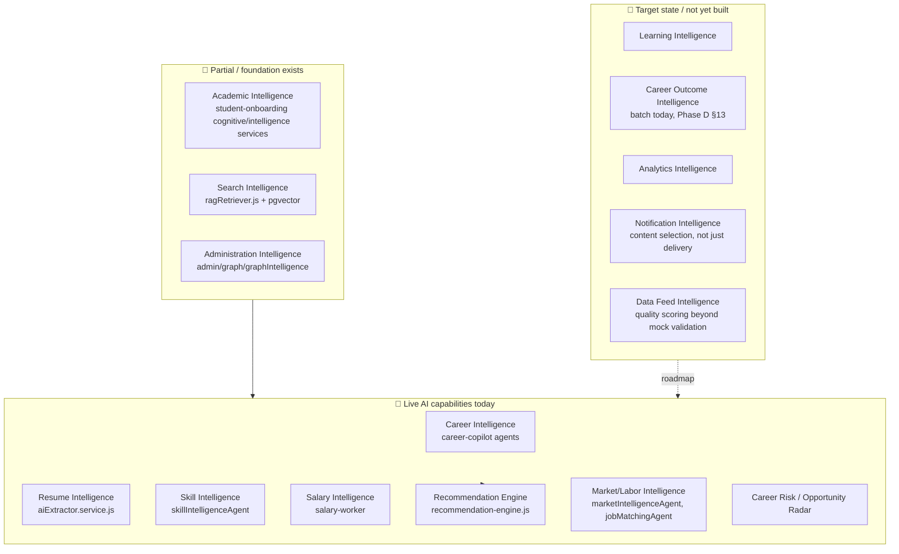
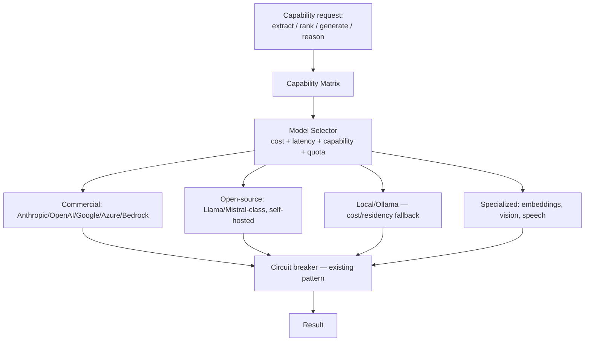
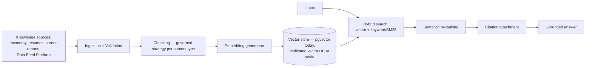
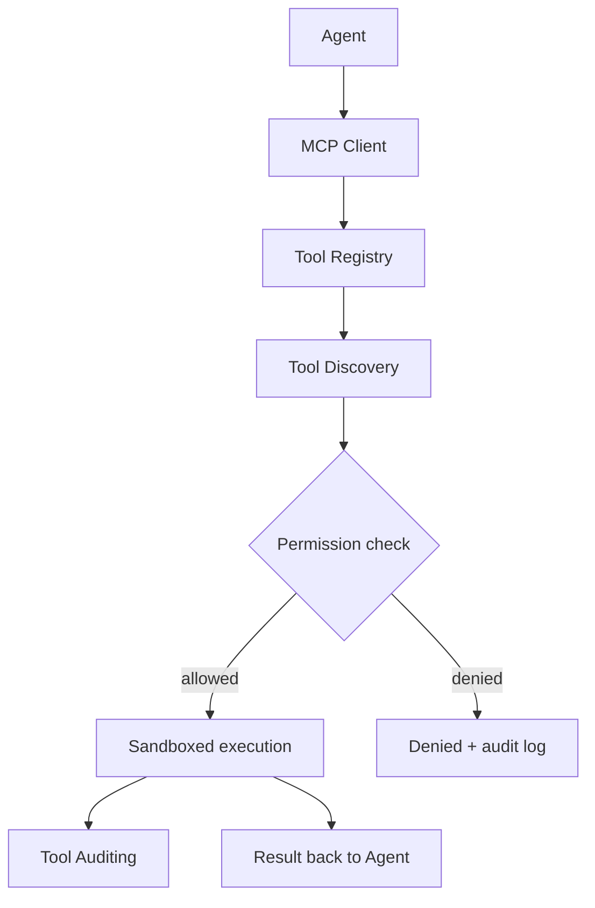
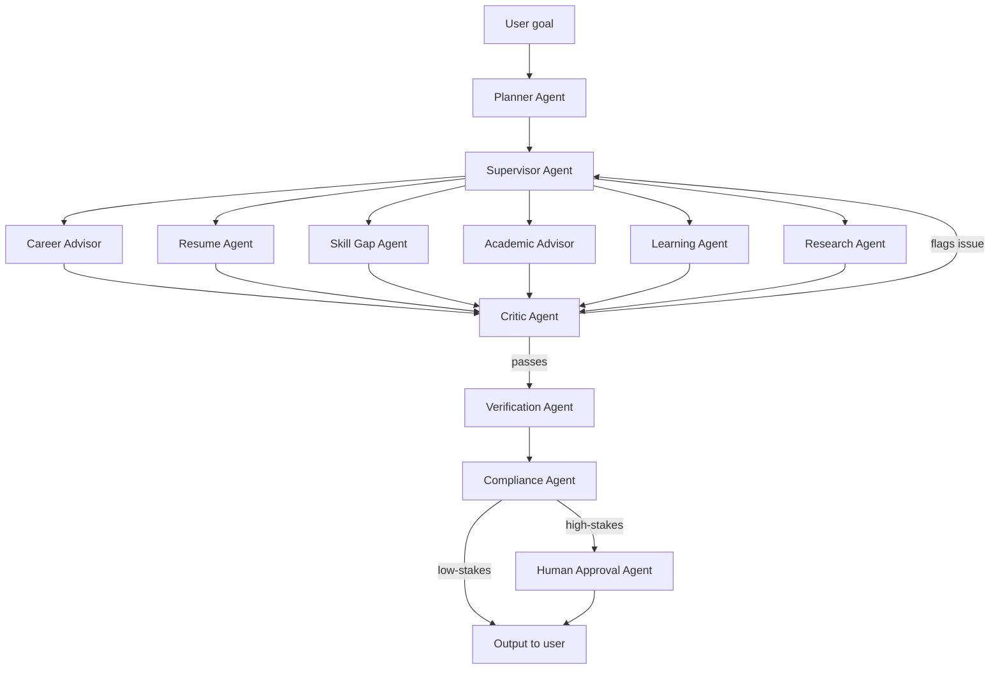

# EEP-01 — Phase F
## Enterprise AI & Intelligent Automation Architecture
### HireRise Career Intelligence Platform

**Role:** Chief AI Architect / Enterprise Architect / LLM Systems Architect / Multi-Agent Systems Architect / AI Platform Architect / ML Architect / Prompt Engineering Architect / RAG Architect / Knowledge Engineering Architect / MLOps Architect / DevSecOps Architect / Enterprise Governance Architect / Responsible AI Specialist — combined deliverable.

**Inputs treated as authoritative, not redesigned:** EEP-01 Phases A–E. Phase E's provider abstraction, circuit breaker, and ACL-per-provider pattern (`aiProviderManager.js`, `model-registry.js`) are not redesigned here — Phase F extends them upward into prompts, RAG, agents, evaluation, and governance. Where a topic is really "how does this call get routed/retried" that's Phase E's job and this document points there.

**Convention (inherited from Phases D/E):** 🔧 **CURRENT STATE** (buildable today, on the existing codebase) / 🎯 **TARGET STATE** (adopted only when a Part 0 trigger fires). This document was written after inspecting the actual AI-related code in `hirerise/core` — the codebase is materially more mature here than the earlier phases might suggest, and this document says so rather than treating everything as greenfield.

---

# PART 0 — AI Reality Check

| Capability transition | Current-state ceiling | Trigger to move to target state |
|---|---|---|
| Single-model → Multi-model | **Already crossed.** `aiProviderManager.js` runs a 5-provider fallback chain today (gemini → grok → mistral → openai → anthropic) | N/A — already target-state on this axis; the remaining work is quota-aware routing (Phase E §8.1), not multi-model adoption itself |
| Rule-based AI → Agentic AI | **Partially crossed.** `career-copilot` has 6 real agent classes (`BaseAgent` subclasses) with a coordinator | Full crossing = agents that plan their own tool sequence, not just execute a fixed `run()` — see Part 8 |
| Single-agent → Multi-agent | **Already crossed** in a narrow sense — `careerAgentCoordinator.js` already runs `CareerRiskAgent` and `OpportunityRadarAgent` in parallel | Formal multi-agent orchestration (shared memory, agent-to-agent handoff, a Supervisor role) — Part 8's trigger table |
| Basic Prompting → Workflow Orchestration | Current: prompts are embedded per-agent/per-service | Dedicated workflow orchestration layer once > ~10 distinct multi-step AI workflows exist and duplication across them becomes costly |
| Simple Retrieval → Enterprise RAG | **Foundation exists.** `001_semantic_ai_upgrade.sql` adds pgvector; `ragRetriever.js` implements retrieval | Enterprise RAG (Part 6) = chunking governance, freshness SLAs, citation generation, hybrid search — adopted incrementally as knowledge sources multiply, not a single cutover |
| AI Provider Abstraction | **Already done** (Phase E) | N/A |
| Model Registry | **Foundation exists** — `model-registry.js`'s `MODEL_CATALOG` is a real (if code-based, not service-based) registry | Standalone Model Registry service once model count/team count makes a code-based catalog hard to keep current |
| AI Evaluation Platform | **Does not exist.** `sla-evaluation.worker.js` checks operational SLA breaches, not output quality | First recorded incident of a bad AI output reaching a user undetected, or first time two people disagree about whether a model regressed — either is a concrete enough signal to build a minimal eval harness |
| Enterprise Knowledge Graph | Does not exist; `admin/graph/graphIntelligence` exists but is narrower in scope | A genuine cross-domain reasoning need that a relational/vector store can't satisfy well |
| MCP Integration | **Does not exist at all** — no MCP code found anywhere in the repository | First concrete tool-use case where a standard protocol beats a bespoke function-calling integration (Part 7) |
| AI Marketplace | Does not exist; not applicable pre-B2B (Phase E Part 20) | B2B/enterprise model launch |

**Note this table is unusual relative to Phases D/E:** several rows are already crossed. This document does not manufacture a "current state" for something that's already ahead of the minimum — it says so and moves the target-state discussion to what's genuinely still ahead.

---

# PART 1 — Enterprise AI Vision

## 1.1 Philosophy

AI at HireRise is a **decision-support platform capability**, not a replacement for the human decisions that carry real consequences for a student's career. Every AI capability in Part 2 is classified by exactly one of two roles, and this document does not blur the two:

- **Decision support** — AI surfaces information, ranks options, drafts content; a human (the student, an advisor, or an admin) decides. This is the default posture for anything career-consequential.
- **Autonomous action** — AI acts without a human in the loop for that specific action. Reserved for low-stakes, easily-reversible, high-volume tasks (e.g. auto-tagging a resume's extracted skills) where Phase B's risk classification says human review isn't warranted.

## 1.2 AI boundaries and responsibility model

Inherits Phase B's high-stakes decision classification directly: **any output that materially affects a student's career decision (job match ranking, career-path recommendation, skill-gap assessment framed as authoritative) defaults to decision-support with a visible confidence signal, never autonomous action**, until a specific, documented risk assessment says otherwise. Responsibility for an AI-assisted decision's real-world outcome sits with the human who acted on it and the platform that presented it clearly — not with "the model," which is a design principle this document enforces through explainability (Part 10) rather than a legal position this document is qualified to state.

## 1.3 Relationship to Phase C/D/E

Phase C/D own how an AI job's start/completion is represented as an event and transported; Phase E owns how a specific model provider is called, routed, and failed-over. Phase F owns everything *inside* that call and around it: what prompt is sent, what's retrieved to ground it, which agent decided to make the call, how the result is evaluated, and what governance gates it before a user sees it.

---

# PART 2 — Enterprise AI Landscape

This map, unlike a from-scratch capability inventory, distinguishes what's *actually running* (top box) from what merely has scaffolding (middle box) from what's aspirational (bottom box) — a distinction worth preserving in every future update to this document, since "AI landscape" documents drift toward listing capabilities as if they all exist equally.

---

# PART 3 — AI Capability Architecture

| Capability | Where it belongs | Current example | Track |
|---|---|---|---|
| Extraction | Structured pull from unstructured input | `aiExtractor.service.js` (resume parsing) | 🔧 |
| Classification | Labeling/categorization | Skill extraction, `cvClassifier.service.js` | 🔧 |
| Ranking | Ordering candidates/options | `jobMatchingAgent` | 🔧 |
| Recommendation | Suggesting a next action | `recommendation-engine.js` | 🔧 |
| Retrieval | Grounding a response in stored knowledge | `ragRetriever.js` | 🔧 (foundation) |
| Summarization | Condensing long content | Career report generation (`onboarding.careerReport.service.js`) | 🔧 |
| Generation | Producing new text | Cover letter engine | 🔧 |
| Reasoning (multi-step) | Chaining extraction/retrieval/ranking into a conclusion | `careerHealthIndex.service.js`, `ai.engine.js` (career-readiness) | 🔧, informally — not yet a named "reasoning" layer |
| Conversation | Multi-turn dialogue | `careerCopilot.service.js` / `advisor.service.js` | 🔧 |
| Planning | Deciding a sequence of steps/tools to reach a goal | Does not exist yet — today's agents run a fixed `run()`, they don't plan a variable step sequence | 🎯 (Part 8's Planner Agent) |
| Validation | Checking an AI output against rules before it's used | Partial — schema/shape validation exists (`validation.schemas`); *semantic* validation (is this recommendation actually sound) does not | 🎯 (Part 10, Part 12) |
| Decision Support / Human Review | Presenting AI output for a human to act on | The default posture per Part 1.2 | 🔧 |
| Automation | Acting without a human in the loop | Reserved for low-stakes tasks only (Part 1.2) | 🔧, narrowly scoped |

---

# PART 4 — Model Architecture

## 4.1 🔧 CURRENT STATE — already a real provider abstraction

Phase E documented this in depth; restated here only as the foundation Part 4's target state extends: `PROVIDER_REGISTRY` in `aiProviderManager.js` (gemini, grok, mistral, openai, anthropic), `MODEL_CATALOG` in `model-registry.js` with `contextWindow`, `tier`, and per-1k-token cost fields already present for models like `claude-opus-4-6`, `claude-sonnet-4-6`, `claude-haiku-4-5`. **Note:** the model-string values in that catalog should be reconciled against Anthropic's actual current model lineup periodically — a hardcoded catalog is exactly the kind of thing that silently drifts, which is itself an argument for Part 4.2's registry service eventually, and a cheap CI check (validate catalog entries against a known-good list) now.

## 4.2 🎯 TARGET STATE — Enterprise Model Platform

**Capability matrix** (target-state artifact): a table mapping each Part 3 capability to which model tier is *sufficient* for it — most extraction/classification tasks don't need a flagship-tier model, and routing them to a cheaper tier by default (with escalation only on low-confidence results) is both a cost lever (Part 15) and a latency lever, adoptable incrementally starting with the existing catalog's tier field rather than waiting for a full platform.

**Vision/speech/multimodal:** 🎯, added to the same provider-abstraction pattern as new capability types the moment a real product need appears (e.g. parsing a scanned/handwritten resume image) — no new architectural pattern required, just new entries in the existing registry.

---

# PART 5 — Prompt Architecture

## 5.1 🔧 CURRENT STATE

Prompts currently live embedded in each service/agent (`core/src/prompts`, and inline within agents like `careerAdvisorAgent.js`). The single highest-value, zero-new-infrastructure change here: **extract prompts into a versioned registry directory** (`core/src/prompts/<capability>/v<n>.js` or similar, several of which already exist under `core/src/prompts`) with a lightweight convention — every prompt file exports a version, a short description, and the prompt template — and a CI check that a prompt change bumps the version. This gets most of the governance value of a "prompt registry" without building a service.

## 5.2 🎯 TARGET STATE

| Concern | Target-state addition |
|---|---|
| Prompt testing | Golden-output regression tests per prompt version (feeds Part 12) |
| Prompt approval | Required sign-off for prompts touching high-stakes capabilities (Part 1.2/Part 10), tracked the same way Phase D Part 18 tracks event schema approval |
| Prompt security | Explicit defenses against injection via retrieved/user content (Part 11.1) — checked at the point a prompt is assembled, not just at the model boundary |
| Prompt observability | Per-prompt-version latency/cost/quality metrics (Part 13) |
| Prompt experimentation | A/B testing across prompt versions for the same capability, gated by the eval harness (Part 12) so a "better" prompt is measured, not asserted |

---

# PART 6 — Enterprise RAG Architecture

## 6.1 🔧 CURRENT STATE — real foundation exists

`001_semantic_ai_upgrade.sql` and `002_career_opportunity_radar.sql` add pgvector-backed semantic search to Supabase; `ragRetriever.js` in `career-copilot/retrieval` implements the retrieval call. This is a genuine RAG foundation, not a green field. Current-state completion, no new infrastructure required:

- **Chunking convention:** if not already standardized, define one chunking strategy per content type (resume text vs. career-report text vs. taxonomy definitions) and document it next to the embedding-generation code, since inconsistent chunking is the most common silent quality problem in a RAG system this size.
- **Citation generation:** when `ragRetriever.js`'s results feed a generated answer, carry the source chunk's ID through to the response so the UI can show "based on: X" — cheap to add now, valuable for the explainability requirement (Part 10) and for user trust.
- **Knowledge freshness:** a simple `updated_at`-based staleness check on the embedded source tables, surfaced as a metric (Part 13), before building a formal freshness SLA system.

## 6.2 🎯 TARGET STATE — Enterprise retrieval pipeline

**Relationship to the Data Feed Platform (Phase E Part 9):** once real (non-mock) external sources exist, they become RAG ingestion sources subject to the *same* trust-scoring Phase E Part 9.2 defines — a low-trust source shouldn't be retrieved with the same confidence as a verified one, and the retrieval layer should be able to express that (e.g. down-weighting or flagging low-trust-source citations), not just the ingestion layer.

**Trigger to move from pgvector to a dedicated vector database:** sustained query latency or index-size limits that pgvector genuinely can't meet — not "dedicated vector DBs are more standard," since pgvector inside the existing Supabase instance is operationally simpler while it's sufficient.

---

# PART 7 — MCP Architecture (🎯 entirely target-state)

No MCP code exists anywhere in the repository today, and per Part 0, none should be built until a concrete tool-use case genuinely needs a standard protocol rather than the direct function-calls the existing agents already use.

Every element above — registry, discovery, permissions, sandboxing, auditing — is a generalization of what the current agents already need informally when they call an external service (Phase E's provider ACL pattern, again). **The concrete trigger to build this rather than more bespoke function-calls:** the day a second or third external tool needs agent access with genuinely different permission requirements per tool, at which point a registry with per-tool permissions is cheaper than N more bespoke integrations.

---

# PART 8 — Multi-Agent Architecture

## 8.1 🔧 CURRENT STATE — what exists vs. the requested 15-agent roster

| Requested role | Current-state status |
|---|---|
| Career Advisor Agent | ✅ exists — `careerAdvisorAgent.js` |
| Resume Agent | Partial — resume processing exists (`resume.service.js`, `aiExtractor.service.js`) but not as an `Agent`-pattern class today |
| Skill Gap Agent | ✅ exists — `skillIntelligenceAgent.js` |
| Recruiter/Job Matching Agent | ✅ exists — `jobMatchingAgent.js` |
| Market/Salary Intelligence Agent | ✅ exists — `marketIntelligenceAgent.js` |
| Career Risk / Opportunity Radar | ✅ exists — `riskAndRadarAgents.js` (`CareerRiskAgent`, `OpportunityRadarAgent`) |
| Planner Agent | 🎯 does not exist — no agent today plans a variable tool/step sequence |
| Academic Advisor Agent | 🎯 does not exist as a distinct agent (academic logic lives in `student-onboarding` services, not agent-pattern) |
| Learning Agent | 🎯 does not exist (no LMS integration yet — Phase E Part 7) |
| Outcome Intelligence Agent | 🎯 does not exist (Career Outcome Intelligence is batch, Phase D §13) |
| Research Agent | 🎯 does not exist |
| Verification Agent | 🎯 does not exist |
| Compliance Agent | 🎯 does not exist |
| Critic Agent | 🎯 does not exist |
| Supervisor Agent | 🎯 does not exist — `careerAgentCoordinator.js` does *coordination* (parallel execution, caching, staleness) but not *supervision* (evaluating/correcting agent outputs) |
| Human Approval Agent | 🎯 does not exist as an agent — human approval is a Phase D event pair (`ai.approval.requested/completed`), not yet wired to a dedicated agent role |

**Six of fifteen requested agent roles already exist in production code.** This document treats that as the honest current state rather than describing all fifteen as if they're equally real.

## 8.2 🔧 CURRENT STATE — agent collaboration, as it actually works today

`careerAgentCoordinator.js` already demonstrates the right *shape* of collaboration for the current scale: parallel execution of independent agents, shared Redis caching (`BaseAgent`'s cache client), staleness/prewarm logic, and graceful degradation if one agent fails. This is choreographed collaboration (Phase D Part 6's term) — each agent runs independently and the coordinator merges results — which is the correct pattern for the current agent count and is **not** yet a orchestration/Supervisor pattern, and doesn't need to be.

## 8.3 🎯 TARGET STATE — full multi-agent orchestration

**Agent memory:** target-state agents need shared, structured memory beyond per-agent Redis caching (today's pattern) — a session-scoped context object passed through the Planner/Supervisor, not a shared global store, to avoid one agent's cached assumption silently leaking into another's reasoning.

**Trigger to build the Planner/Supervisor/Critic layer:** the first real workflow where a *fixed* sequence of the existing six agents genuinely isn't enough — i.e., the user's goal requires a variable set of agents decided at runtime, not a hardcoded pipeline. Building Planner/Supervisor ahead of that need would be solving a problem the current coordinator pattern doesn't yet have.

---

# PART 9 — Intelligent Automation

| Workflow | 🔧 Current state | 🎯 Target state |
|---|---|---|
| Resume processing | Automated end-to-end (upload → extract → classify), human sees the result, doesn't approve each step | Add Verification Agent pass before high-confidence auto-population of a profile field |
| Career analysis | Automated generation, human-facing as decision support (Part 1.2) | Critic Agent pass before surfacing a career-path recommendation |
| Employer/job matching | `jobMatchingAgent`, automated ranking | Recruiter Agent negotiating/filtering on employer-specific criteria once employer integrations exist (Phase E Part 7) |
| Knowledge updates | Manual/scheduled | Automated freshness-triggered re-embedding (Part 6.1) |
| Data Feed ingestion | Mock, scheduled (Phase E §9.1) | Real-source automation once agreements exist |
| AI quality evaluation | Manual/ad hoc | Continuous evaluation pipeline (Part 12) gating deploys |
| Administrative workflows | Existing admin routes, manual trigger | Automation only for low-stakes, reversible admin actions — never for actions Phase B classifies as requiring human authorization |

---

# PART 10 — AI Governance

## 10.1 🔧 CURRENT STATE

Apply Phase B's existing risk classification to every AI capability in Part 3 explicitly — this is a documentation/labeling exercise now, not new infrastructure: tag each capability as decision-support or automation-eligible (Part 1.2), and for decision-support outputs, surface a confidence/explainability signal in the response payload (many extraction/classification services likely already compute a confidence score internally; the current-state action is making sure it reaches the API response, not computing something new).

## 10.2 🎯 TARGET STATE

| Concern | Target-state mechanism |
|---|---|
| Bias/fairness | Periodic fairness audits on ranking/recommendation outputs across demographic slices where legally and ethically appropriate to measure, with findings feeding Part 12's eval suite |
| Transparency/explainability | Citation generation (Part 6.1) + a standard "why this recommendation" trace attached to every decision-support output |
| Policy management | A versioned policy store (which capabilities require approval, at what confidence threshold) rather than logic embedded per-service |
| AI audit | Every AI decision that reached a user is reconstructable — inputs, model/version, prompt version, retrieved context, and any human approval — feeding Phase B's audit domain directly |
| Risk classification | Same table as Part 1.2/10.1, formalized as a required field on every new AI capability at design time, not retrofitted |

---

# PART 11 — AI Security

| Threat | 🔧 Current-state mitigation | 🎯 Target-state mitigation |
|---|---|---|
| Prompt injection (via user input or retrieved content) | Basic input sanitization exists at the API layer (Phase E Part 11); **gap:** no explicit check that retrieved RAG content can't override system instructions — worth adding a simple "treat retrieved content as data, never as instructions" convention in every prompt template now | Structured prompt formats that make injection harder by construction; automated injection-attempt detection |
| Data poisoning (bad data entering RAG/training) | Data Feed Platform's mock-only status (Phase E §9) means this risk is currently low by construction — worth re-assessing the moment real external sources are ingested | Source trust scoring (Phase E §9.2) feeding retrieval confidence |
| Model abuse / tool abuse | N/A yet (no MCP/tool-use exists) | Part 7's sandboxing + permission model |
| Hallucination | Citation generation (Part 6.1) lets a human check groundedness | Automated groundedness scoring as part of the eval harness (Part 12) |
| Secret protection | **Flagged repeatedly in this review series — `.env`/API-key handling is still a live risk** | Vault/KMS-backed secrets, as stated in Phase D/E |
| Context isolation | Each request's context is scoped per-user already (standard multi-tenant-user isolation) | Explicit agent-memory isolation once shared agent memory (Part 8.3) exists |
| Output validation | Schema/shape validation exists; semantic validation does not | Critic/Verification agent passes (Part 8.3) |

---

# PART 12 — AI Evaluation

**Honest current state: this does not exist yet, beyond `sla-evaluation.worker.js`'s operational-breach checks.** This is the single largest genuine gap this document identifies, and it's worth building before most of the 🎯 content elsewhere in this document, because every other target-state improvement (better prompts, more agents, RAG tuning) is unmeasurable without it.

## 12.1 🔧 CURRENT STATE — a minimal harness, buildable now

- A small, hand-curated set of representative inputs per capability (e.g. 20–30 real-ish resumes for extraction, 20–30 career scenarios for advisor output) checked into the repo.
- A script that runs the current prompt/model against that set and diffs against a last-known-good output, run in CI on any prompt or model-catalog change.
- This alone catches the two most damaging failure modes — a prompt edit that silently breaks a capability, and a provider-catalog change (Part 4.1's drift risk) that silently degrades quality.

## 12.2 🎯 TARGET STATE

Full benchmark suites per capability, model-comparison dashboards, cost/latency/quality three-way tradeoff tracking, business-KPI-linked evaluation (does a "better" recommendation actually correlate with better outcomes — feeding back from Career Outcome Intelligence, Phase D §13), and continuous evaluation gating every deploy, not just prompt/catalog changes.

---

# PART 13 — AI Observability

🔧 **Current state:** extend Phase D Part 15's four core signals (latency, error rate, retry depth, cost) with AI-specific dimensions that are cheap to add now: token usage per call, per-provider cost (using the existing `MODEL_CATALOG` cost fields — this data already exists, it just needs to be logged per call), and human-intervention rate (how often a decision-support output gets overridden or ignored, a genuinely useful signal that current-state instrumentation can start collecting immediately).

🎯 **Target state:** full OpenTelemetry tracing through an entire agent chain (Planner → Supervisor → specialist agents → Critic), prompt-version-level analytics, and business-impact dashboards tying AI usage to downstream outcomes.

---

# PART 14 — AI Runtime

Mirrors Phase D Part 10/11 (event/messaging runtime) applied to AI specifically — this document does not re-derive worker orchestration, retry, or rate limiting, since Phase D/E already own those patterns and `ai-event-bus`/`baseWorker.js` already implement them for AI jobs. The one AI-specific runtime addition worth calling out: **caching.** `BaseAgent`'s Redis caching (10-minute TTL) is already a real, working pattern — the target-state extension is embedding-level caching (avoid re-embedding identical or near-identical content, a meaningful cost lever per Part 15) and prompt-result caching keyed by a semantic hash rather than an exact-match key, so a rephrased-but-equivalent query doesn't miss the cache.

---

# PART 15 — AI Cost Optimization

🔧 **Current state, buildable now:** since `MODEL_CATALOG` already has per-1k-token cost data, the fastest win is routing low-stakes capabilities (Part 3's classification/extraction tasks) to the cheapest sufficient tier by default, reserving flagship-tier calls for genuinely high-stakes reasoning — this is a routing-policy change, not new infrastructure. Embedding reuse (Part 14) and the existing Redis caching are the next two cheapest levers.

🎯 **Target state:** context compression (trimming retrieved context to what's actually relevant before it hits the model, reducing token cost on every RAG-grounded call), batch inference for non-latency-sensitive workloads (e.g. nightly re-scoring), and formal per-capability budget controls/quotas once AI spend is large enough that a budget overrun is a real operational concern rather than a rounding error.

---

# PART 16 — AI Governance & Lifecycle

| Artifact | Lifecycle stage this document defines now (🔧) | Target-state addition (🎯) |
|---|---|---|
| Models | Catalog entry, manually reconciled | Registry-service-managed, automatically reconciled against provider APIs |
| Prompts | Versioned files + CI version-bump check (Part 5.1) | Full registry with approval workflow (Part 5.2) |
| Agents | Code review, same as any service | Formal agent registry with capability declarations |
| Knowledge (RAG sources) | `updated_at`-based freshness check | Full freshness SLA + governance (Part 6) |
| Evaluations | N/A yet (Part 12.1 is the starting point) | Continuous eval as a gate, versioned eval sets |
| Policies | Embedded in code/docs (this document) | Versioned policy store (Part 10.2) |
| Deprecation/retirement | Ad hoc | A defined sunset process for a model, prompt version, or agent — mirroring Phase D Part 18's topic-deprecation window concept |

---

# PART 17 — AI Reference Architectures

Each reference below composes patterns already defined above; none introduces a new pattern.

## 17.1 Resume Analysis (🔧)
Upload (Phase E §18.2) → `aiExtractor.service.js` (Part 3: extraction, via provider fallback chain, Part 4.1) → classification (`cvClassifier.service.js`) → decision-support output, no autonomous profile mutation without a confidence threshold (Part 1.2).

## 17.2 Career Intelligence / Career Path Generation (🔧)
`careerAdvisorAgent` + `careerHealthIndex.service.js`, choreographed via `careerAgentCoordinator.js` (Part 8.2), grounded optionally via `ragRetriever.js` (Part 6.1).

## 17.3 Skill Gap Analysis (🔧)
`skillIntelligenceAgent.js`, same coordination pattern.

## 17.4 Learning Recommendations (🎯 — pending LMS integration, Phase E §7)

## 17.5 Salary Intelligence (🔧 — `marketIntelligenceAgent` + `salary-worker`)

## 17.6 Career Outcome Intelligence (🔧 batch / 🎯 event-driven — Phase D §13, unchanged)

## 17.7 Enterprise Search (🔧 foundation / 🎯 hybrid+reranked — Part 6)

## 17.8 Knowledge Ingestion (🔧 mock sources / 🎯 real sources with trust scoring — Part 6.2, Phase E §9)

## 17.9 AI Evaluation (🎯 — Part 12, the priority gap)

## 17.10 Human Approval Workflow (🔧 event pair exists / 🎯 dedicated agent — Part 8.1, Phase D §11)

---

# PART 18 — Architecture Decision Records

### ADR-F1: Prompts and models are versioned artifacts subject to CI regression checks before any further prompt-engineering work proceeds

- **Context:** Part 12 identifies AI evaluation as the platform's largest current gap.
- **Problem:** without any regression check, every prompt or model-catalog edit is a silent risk to output quality that nothing today would catch.
- **Options:** (a) continue without a harness, relying on manual review; (b) build the minimal harness in Part 12.1 now, before expanding Part 5's prompt registry or Part 8's agent roster further.
- **Decision:** (b) — sequence this ahead of most other Phase F target-state work, not after it.
- **Consequences:** a small amount of near-term setup work; every subsequent AI change becomes measurable rather than asserted.
- **Trigger to adopt:** immediate — this is the one Part with no "wait for a trigger" framing in this document, because the cost of building it now is low and the cost of not having it compounds with every future prompt/model change.

### ADR-F2: Choreography-based agent coordination remains the default; Planner/Supervisor is added only for a workflow the current pattern can't express

- **Context:** the current `careerAgentCoordinator.js` pattern (parallel choreographed agents, no central planner) works and is simple.
- **Problem:** the requested 15-agent roster implies a full orchestration layer (Planner, Supervisor, Critic) that doesn't correspond to any workflow HireRise runs today.
- **Options:** (a) build the full orchestration layer now, ahead of need; (b) keep choreography as default, add orchestration only when a specific workflow genuinely requires runtime-variable agent sequencing.
- **Decision:** (b), consistent with ADR-D4's "orchestration only for a named exception" precedent from Phase D.
- **Consequences:** the six agents that exist stay in their current, working pattern; new agent roles get added to the coordinator's pattern by default, not to a new orchestration layer, unless Part 8.3's trigger fires.
- **Trigger to adopt:** the first workflow requiring a variable, runtime-decided agent sequence (Part 8.3).

### ADR-F3: No MCP adoption until a concrete multi-tool use case exists

- **Context:** Part 7 is entirely target-state; no MCP code exists.
- **Problem:** MCP adds a protocol layer (client, registry, discovery, sandboxing) that's pure overhead for the single/few-tool integrations the current agents actually need.
- **Options:** (a) adopt MCP now, ahead of need, for future-proofing; (b) defer until a concrete trigger.
- **Decision:** (b), consistent with this entire document's Part 0 discipline.
- **Consequences:** current agents continue using direct function calls / provider SDKs; MCP is adopted only when a second/third tool with distinct permission needs appears (Part 7's trigger), at which point the registry pattern pays for itself immediately rather than speculatively.
- **Trigger to adopt:** stated in Part 7.

### ADR-F4: Decision-support is the default posture for every new AI capability; autonomous action requires an explicit, documented exception

- **Context:** Part 1.2 sets this rule; this ADR makes it a governance gate, not just a stated principle.
- **Problem:** without a gate, a new AI feature could ship as autonomous by default (the easier implementation path) rather than by deliberate choice.
- **Options:** (a) leave the decision-support/autonomous choice to each feature's implementer; (b) require an explicit sign-off (per Phase B's risk classification) before any new capability ships as autonomous.
- **Decision:** (b).
- **Consequences:** slightly more process for autonomous features; protects against the default drift toward autonomy that's common when "just ship it" pressure exists.
- **Trigger to adopt:** immediate — this is a governance rule, not a scale-triggered migration.

---

# PART 19 — AI Maturity Model

| Level | Name | What it requires | HireRise's position today |
|---|---|---|---|
| 1 | Assisted AI | Single-model calls, human does all synthesis | Exceeded |
| 2 | Intelligent Automation | Multi-step automated pipelines (extract → classify → recommend), human reviews the output | **Current position** — resume/career/skill pipelines match this exactly |
| 3 | AI Copilot | Conversational, context-aware assistance across a session (`careerCopilot.service.js`) with retrieval grounding | **Partially reached** — the copilot exists; full groundedness/citation (Part 6.1) is the remaining gap |
| 4 | Multi-Agent Collaboration | Multiple specialist agents coordinating (today: choreographed) or orchestrating (target: Planner/Supervisor) toward one goal | **Partially reached** on choreography; orchestration is Part 8.3's target state |
| 5 | Autonomous Enterprise Intelligence | Agents plan, act, and self-correct across the platform with minimal human gating, reserved for genuinely low-stakes/reversible domains only | Not reached, and per Part 1.2, most of HireRise's core domain (career decisions) should **never** fully reach Level 5 regardless of platform maturity — this is a deliberate boundary, not a temporary limitation |

**Honest read of this table:** HireRise sits solidly at Level 2, reaching into Level 3/4 in specific places (the copilot, the agent coordinator). The gap to Level 4 is Part 8.3's orchestration layer, gated by a real workflow need (ADR-F2). The gap to Level 5, for the platform's core career-decision domain, is intentional and permanent, not a maturity gap to be closed.

---

# PART 20 — Future Evolution

Roadmap only — 🎯 by definition, none of it sized or committed, in the same spirit as Phase E Part 20.

- **Enterprise AI Platform:** the point at which Parts 4–6's foundations (model registry, prompt registry, RAG pipeline) graduate from code-based conventions into dedicated internal services — justified by team/model/prompt count, not by ambition.
- **AI Marketplace:** depends entirely on the B2B/enterprise business decision named in Phase E Part 20; not a technical milestone on its own.
- **Multi-Agent Ecosystem / MCP Ecosystem:** Part 7/8.3's triggers, generalized platform-wide once (and if) they fire for the core product agents.
- **Autonomous Career Intelligence:** deliberately **not** a target for HireRise's core decision-support domain per Part 1.2/Part 19 — namable as a roadmap item only for narrowly-scoped, low-stakes sub-tasks, never for the career-decision surface itself.
- **Digital Career Twin:** an aggregation of existing capabilities (academic + skill + market intelligence) into one longitudinal model per student — a data-modeling and RAG-grounding challenge more than a new AI capability; builds on Part 6, not a new pattern.
- **Enterprise Knowledge Graph:** only if/when a concrete cross-domain reasoning need appears that pgvector + relational modeling genuinely can't satisfy (Part 0).
- **Federated AI:** relevant primarily if HireRise ever needs to train or fine-tune on partner data without centralizing it (e.g. a university partner unwilling to share raw data) — a partnership-shape question (Phase E Part 7) before it's a technical one.
- **Continuous Learning Systems:** depends on Part 12's evaluation platform existing first — there's no responsible way to let a system continuously adapt without the measurement infrastructure to know whether it's adapting for the better.
- **AI-driven Product Innovation:** the payoff of everything else in this document working well, not a separate architecture item.

---

## Closing note on scope discipline (restated, still true here)

This document found more real, working AI infrastructure in the codebase than either of the two prior Phase reviews — a genuine multi-agent coordinator, a real RAG foundation with pgvector, a provider-abstraction layer mature enough that most of Phase E's "target state" for it was already built. The one area where the codebase's ambition has clearly outrun its own scaffolding is evaluation (Part 12): six-plus AI capabilities in production with no systematic way to tell if a change made them better or worse. If this EEP series has one recommendation to prioritize above the rest of its target-state content, it's ADR-F1 — build the eval harness before adding the next agent, prompt, or provider.
