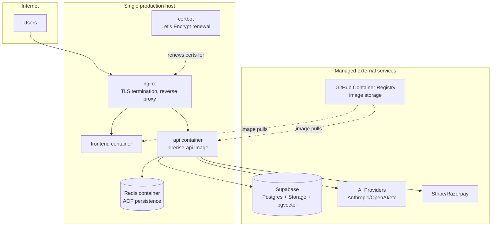
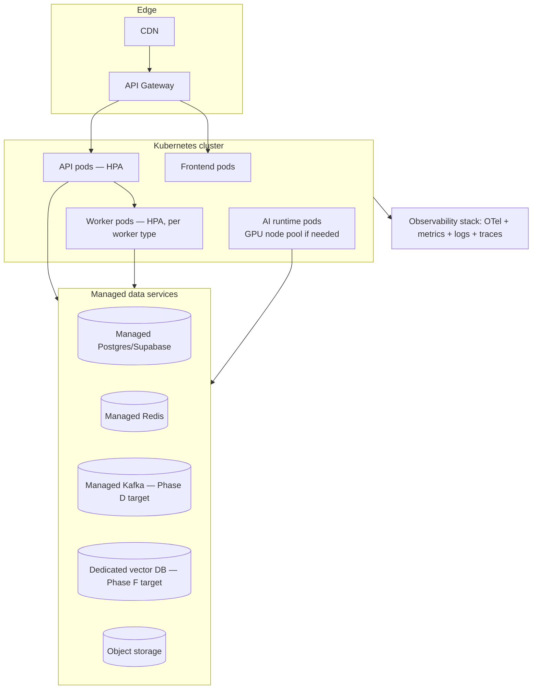

# EEP-01 — Phase G
## Enterprise Platform & Runtime Architecture
### HireRise Career Intelligence Platform

**Role:** Chief Enterprise Architect / Platform Architect / Cloud Architect / Kubernetes Architect / SRE / DevOps Architect / Infrastructure Architect / Runtime Systems Architect / Security Architect / Observability Architect / Enterprise Governance Architect — combined deliverable.

**Inputs treated as authoritative, not redesigned:** EEP-01 Phases A–F. Phase G owns *where and how the bits run* — compute, storage, networking, CI/CD, reliability, DR — not what they mean (Phase A), how they're secured logically (Phase B), how events are shaped (Phase C) or transported (Phase D), how services integrate (Phase E), or how AI is governed (Phase F). Where this document touches security or AI, it defers to those phases and adds only the runtime-specific layer.

**Convention (inherited from Phases D–F):** 🔧 **CURRENT STATE** / 🎯 **TARGET STATE**, every target-state item mapped to a Part 0 trigger. This document was written after inspecting the actual deployment configuration in the repository — the brief's assumption that current-state compute is "current Node.js runtime" (Part 4) turned out to be behind what's actually there, and this document corrects that rather than repeating the assumption.

---

# PART 0 — Platform Reality Check

**Correction before the table:** HireRise is **already containerized** — `core/Dockerfile`, `core/api-service/Dockerfile`, `front/Dockerfile`, and `docker-compose.prod.yml` (redis, api, frontend, nginx, certbot) are real and appear production-oriented (health checks, restart policies, log rotation). This is not a "bare Node process" platform. The trigger table below reflects that.

| Capability | Current-state ceiling | Trigger to move to target state |
|---|---|---|
| Containers | **Already adopted.** Docker images for api, frontend; Compose orchestrates them | N/A |
| Container orchestration (Kubernetes) | **Not adopted** — single-host Docker Compose | > ~8–10 containers needing independent scaling/scheduling, or a real multi-host HA requirement Compose can't express, or the ops burden of manual host management exceeds the cost of running a managed K8s control plane |
| Service Mesh | Not needed — nginx handles the only current routing concern | Same trigger as Phase D/E: > ~15–20 independently deployed services, or a concrete mTLS/east-west observability need |
| Multi-region | Single host/region | Real user base or compliance requirement in a second region (consistent with Phase D/E Part 0) |
| Auto Scaling | Manual (fixed container count in Compose) | Sustained load variability that manual capacity planning can't track economically, or the Kubernetes trigger above (HPA comes with it) |
| API Gateway | nginx as reverse proxy/TLS terminator today — a real gateway function, just not a dedicated API gateway product (Phase E Part 4 covers this in depth) | Phase E Part 0's API Gateway row |
| CDN | Not present | Public/partner-facing static content volume or global latency requirement (Phase E §17) |
| Object Storage | Supabase Storage (already in use for resume files etc.) | N/A — already adequate at current scale; revisit only if storage egress cost or a multi-provider requirement appears |
| Managed Redis | Self-hosted Redis container (`redis:7.2-alpine` in Compose, with AOF persistence and an LRU eviction policy already configured) | Redis becomes a single point of failure for something business-critical enough to justify managed HA (e.g. ElastiCache/Upstash) — current config (single instance, `maxmemory 512mb`) is a real ceiling worth watching |
| Managed Kafka | N/A — Phase D Part 0's Kafka trigger, not restated here | Phase D Part 0 |
| Dedicated Vector Database | pgvector inside Supabase (Phase F §6.1) | Phase F Part 0's vector-DB row |
| Dedicated AI Runtime | AI calls run inline in existing Node services/workers | Sustained GPU/self-hosted-model workload (e.g. adopting Ollama at real volume, Phase F §4.2) that a general-purpose container can't serve efficiently |
| Platform Engineering Team | N/A — one team owns everything | Team/service count where a dedicated platform team's leverage exceeds its cost — typically well beyond the Kubernetes trigger above, not before it |

**Rule inherited from Phases D–F:** every 🎯 section below maps to a row above.

---

# PART 1 — Enterprise Platform Vision

## 1.1 Runtime philosophy

The platform should run on the least infrastructure that meets today's reliability and security bar — not the least infrastructure that's technically possible, and not the most infrastructure that a 10-year architecture could someday justify. Docker Compose on a well-configured host, with real health checks, log rotation, and CI-gated deploys, **is** a legitimate production architecture at HireRise's current scale — this document does not treat it as a waypoint to apologize for.

## 1.2 Operational principles

Twelve-Factor App principles are already substantially followed (config via environment, stateless processes, containerized builds) and this document extends rather than reintroduces them. GitOps and full Infrastructure-as-Code are 🎯 — the current CI/CD pipeline (Part 10) already encodes deploy logic in version control, which is GitOps' actual point, even without a dedicated GitOps tool.

## 1.3 Relationship to Phase D/E/F

Phase D's messaging runtime (outbox relay, workers) and Phase F's AI runtime both execute *on* the compute/storage/networking this document defines — Phase G doesn't redefine how a worker retries a message (Phase D) or routes an AI call (Phase F/E), it defines what a worker *is* at the infrastructure level (a container, scheduled how, on what host, monitored how).

---

# PART 2 — Runtime Landscape

## 2.1 🔧 CURRENT STATE

**Open question this diagram surfaces, worth resolving rather than glossing over:** `docker-compose.prod.yml` lists `redis`, `api`, `frontend`, `nginx`, `certbot` — it does **not** visibly list the worker services (`career-worker`, `resume-worker`, `salary-worker`, `notification-worker`) that Phases D–F reference extensively as separate processes. Either those run inside the `api` container as in-process workers, in a compose file not included in this review, or as a gap between the documented architecture and the deployed one. This document flags it as ADR-G1 rather than assuming an answer.

## 2.2 🎯 TARGET STATE

---

# PART 3 — Deployment Architecture

## 3.1 🔧 CURRENT STATE

`deploy.yml` already implements a real pipeline: a **Quality Gate** job (lint + typecheck + test, both frontend and backend, with coverage) gating `main`/`staging` pushes and PRs. This is the right shape for the current team size. Current-state environments, inferred from the workflow's branch triggers: local (developer machine, `docker-compose.dev.yml`), CI (GitHub Actions runners), staging (the `staging` branch), production (`main`). **Current-state gap worth closing with no new infrastructure:** confirm a staging *deploy* actually happens on the `staging` branch (not just tests) — a staging branch that only runs tests but never deploys anywhere isn't functioning as a pre-production environment.

## 3.2 Deployment strategy

| Strategy | 🔧 Current state | 🎯 Target state |
|---|---|---|
| Rolling | Achievable manually today (bring up new container, health-check, swap, tear down old) — worth scripting explicitly rather than `docker compose up -d` with brief downtime | Native rolling updates via Kubernetes Deployments |
| Blue/Green | Requires a second full environment — doable on a second host today if a deploy is risky enough to warrant it, but not default | Standard via K8s service-selector swap or a managed platform's native support |
| Canary | Not practical with a single host/instance today | Requires K8s or a load balancer capable of weighted routing |
| Hotfix | Same pipeline, fast-tracked (skip non-essential checks only if the quality gate's essential subset still runs) | Same, with automated rollback-on-failure (Part 10) |
| Disaster Recovery deployment | Manual rebuild from images + Supabase backups (Part 12) | Automated, tested failover (Part 12.2) |

---

# PART 4 — Compute Architecture

## 4.1 🔧 CURRENT STATE — corrected from the brief's assumption

Compute today is **containerized Node.js**, not bare-process Node.js: Docker images built in CI, pushed to GHCR, run via Compose with `restart: always` and health checks. Process model: one container per logical service (api, frontend); worker model: per Part 2.1's open question, needs confirming whether workers are separate containers or in-process. Horizontal scaling today is manual (`docker compose up --scale`, if used, or manually adding containers) — Compose can do this but doesn't automate it. Resource isolation exists at the container level (cgroups) but CPU/memory *limits* should be confirmed as explicitly set in `docker-compose.prod.yml` rather than left unbounded, which is a one-line-per-service change with real reliability value (an unbounded container can starve its neighbors on the same host).

## 4.2 🎯 TARGET STATE

Kubernetes Deployments per service, HPA keyed on CPU/memory and, for workers specifically, on queue/consumer-lag metrics (Phase D Part 15) rather than CPU alone — a worker can be CPU-idle while badly behind on its queue, and scaling on CPU alone would miss that. Affinity/anti-affinity rules to spread replicas across nodes once there's more than one node to spread across. Adopted at the Part 0 Kubernetes trigger, not before.

---

# PART 5 — Storage Architecture

| Store | 🔧 Current state | 🎯 Target state |
|---|---|---|
| PostgreSQL/Supabase | Managed by Supabase already — backups, snapshots are Supabase's responsibility per their plan tier; **action item, not a redesign:** confirm which Supabase backup tier is active and that its RPO/RTO actually matches Part 12's targets, rather than assuming it does | Same provider or a self-managed HA Postgres cluster only if a concrete requirement Supabase can't meet appears |
| Redis | Self-hosted container, AOF persistence enabled, `maxmemory 512mb` with LRU eviction — a reasonable config for a cache/session store; **not currently a source of truth for anything that can't be lost**, which is the correct scope for a self-hosted single instance | Managed Redis (HA, automated failover) once Redis holds something business-critical enough to need it |
| Object Storage | Supabase Storage | Adequate; revisit only per Part 0 |
| Vector storage | pgvector inside Supabase (Phase F §6.1) | Dedicated vector DB per Phase F Part 0 |
| Backups | Supabase-managed for Postgres; **Redis backup is only as good as its AOF file on a single host** — if that host is lost, cache/session state is lost too, which is acceptable *only if* nothing non-reconstructible lives in Redis today (worth explicitly verifying, not assuming) | Cross-region backup replication, tested restores (Part 12) |
| Retention | Inherits Phase B's data retention rules; this document doesn't restate them | Enforced at the storage-tier level (Phase D Part 3.3's tiered storage) |

---

# PART 6 — Configuration & Secrets

## 6.1 🔧 CURRENT STATE

`docker-compose.prod.yml`'s own header comment states secrets are "injected via CI/CD environment, NOT committed to git" — that's the right intent, and `core/.github/workflows/secret-scan.yml` runs Gitleaks on every push/PR to `main`, which is a genuinely good practice already in place. **This makes the plaintext `claudeapi key.txt` and `.env` found in the uploaded zip (flagged repeatedly across this review series) worth a specific, narrow question: were those files ever committed to git, or did they only ever exist locally and get swept into this zip export?** If the former, Gitleaks should have caught them and it's worth checking why it didn't (wrong branch, added after last scan, path excluded); if the latter, the CI hygiene is fine and the issue is purely local file handling. Either way, rotate the exposed credentials regardless of which it was — that guidance from the Phase D review stands.

Configuration hierarchy today: environment variables per environment (dev/staging/prod), consistent with Twelve-Factor. Feature flags: not confirmed present — if absent, a simple environment-variable-driven flag (no new infrastructure) is enough at current scale.

## 6.2 🎯 TARGET STATE

Vault/KMS-backed secret management with automated rotation (restated from Phase D/E, applied here as the runtime mechanism that would host it), a proper feature-flag service once flag count/team count makes environment variables unwieldy, and formal environment-promotion tooling (config diffing between staging/prod) once manual review of that diff becomes error-prone.

---

# PART 7 — Networking Architecture

🔧 **Current state:** nginx as reverse proxy and TLS terminator, certbot for automated Let's Encrypt renewal — both real, working, and appropriate at current scale. Internal networking: Compose's default bridge network (`hirerise_internal`, per the compose file) isolates the Redis/API containers from direct external exposure (Redis is `expose`d, not `port`-published, which is the right pattern). External networking: nginx is the only public entry point, which is a reasonable minimal attack surface.

🎯 **Target state:** CDN in front of nginx/static assets (Part 0 trigger), a dedicated API Gateway (Phase E Part 4.2) replacing nginx's routing role once the gateway trigger fires, private networking (VPC-equivalent) once infrastructure spans more than one host/provider, and edge services only if genuine global-latency requirements appear.

---

# PART 8 — Platform Security

| Concern | 🔧 Current state | 🎯 Target state |
|---|---|---|
| Runtime hardening | Containerized processes already reduce host-level attack surface vs. bare processes | Kubernetes PodSecurity standards, non-root containers enforced by policy rather than convention |
| Container security | Base images should be pinned and periodically scanned — **worth confirming Dockerfiles pin a specific base image tag** (e.g. `node:20-alpine`, not `node:latest`), since an unpinned base image is a common, easy-to-fix drift risk | Automated image scanning (Trivy/Grype) in CI, blocking on high-severity findings |
| Supply chain / SBOM | Not present today — **a real, addable-now gap:** generating an SBOM (e.g. via `syft`) as a CI step is low-cost and directly requested by the brief | SBOM generation + image signing (cosign) as a hard CI/CD gate |
| Secrets protection | Gitleaks in CI (Part 6.1) | Vault/KMS (Part 6.2) |
| Least privilege | Confirm containers don't run as root by default (a one-line Dockerfile `USER` directive if not already present) | Enforced via K8s SecurityContext + PodSecurity policy |
| Network security | Compose's internal network isolation (Part 7) | Network policies (K8s) restricting pod-to-pod traffic explicitly |

---

# PART 9 — Platform Observability

🔧 **Current state:** health-check endpoints already exist (`health.routes.js`, `admin/systemHealth.routes.js`) and Compose's `healthcheck` blocks use them — a real, working foundation. Current-state completion: add OpenTelemetry instrumentation to the api/worker containers now (Phase D/F both already call for this at the application level; Part 9 is where it actually gets wired to an exporter), and stand up a minimal metrics/log aggregation stack sized for a single host — this can be as simple as shipping container logs (already JSON-formatted per the compose `logging` config, with rotation already configured — `max-size: 50m`, `max-file: 5`) to a low-cost managed log service, rather than building a full observability platform prematurely.

🎯 **Target state:** full OTel collector pipeline, dashboards and SLO/error-budget tracking (Part 11 depends on this existing), synthetic monitoring hitting the public endpoints on a schedule, all consolidated once the Kubernetes trigger (Part 0) makes per-host log/metric shipping insufficient.

---

# PART 10 — CI/CD Architecture

## 10.1 🔧 CURRENT STATE — already a real pipeline

`deploy.yml`'s Quality Gate (lint, typecheck, test with coverage, both frontend and backend) plus `secret-scan.yml` (Gitleaks) and `governance.yml` (additional lint/checks on PRs) together form a genuinely solid current-state CI setup — this document extends it rather than replacing it. Current-state additions worth making now, no new platform required: dependency vulnerability scanning (`npm audit` or equivalent as a CI step, if not already present), container image build + push to GHCR as a distinct, cacheable pipeline stage, and an explicit rollback step (redeploy the previous GHCR image tag) documented as a runbook (Part 17) even before it's automated.

## 10.2 🎯 TARGET STATE

Full GitOps (a tool like ArgoCD/Flux reconciling cluster state from the git repo rather than a push-based pipeline), automated canary analysis gating promotion, and SBOM/signing (Part 8) as hard gates rather than optional steps.

---

# PART 11 — Reliability Engineering

Restates Phase D/E's circuit-breaker, retry, and bulkhead patterns (already implemented for AI providers, Phase E Part 6/8) as *platform-wide* runtime concerns rather than re-deriving them: 🔧 **current state** — the existing `restart: always` policy plus Compose health checks already provide basic self-healing (a crashed container restarts automatically); 🎯 **target state** — Kubernetes liveness/readiness probes generalize this with more nuance (readiness gates traffic, liveness triggers restart, and they're allowed to differ), plus chaos testing (deliberately killing a container/pod to verify self-healing actually works) once there's enough redundancy in the target-state topology for chaos testing to be informative rather than just destructive.

---

# PART 12 — Disaster Recovery

## 12.1 🔧 CURRENT STATE

| Metric | Current realistic target | Basis |
|---|---|---|
| RPO (data loss on failure) | Bounded by Supabase's backup frequency for Postgres; **effectively "since last AOF fsync" for Redis, i.e. near-zero for cache data that doesn't matter if lost** | Confirm Supabase's actual backup cadence for the active plan tier — this is a concrete number to look up, not assume |
| RTO (time to recover) | Hours — manual rebuild: pull images from GHCR, `docker compose up` on a replacement host, restore Supabase connection | Realistic for a single-host architecture; worth actually testing once (Part 12.2) rather than estimating |
| Cross-region | None today | Not needed until Part 0's multi-region trigger |
| Failover | Manual | N/A yet |

## 12.2 Recovery testing — the one current-state action item with outsized value

**A DR plan that has never been executed is a hypothesis, not a plan.** The single highest-value current-state action in this Part: actually perform a recovery drill — stand up the production stack on a fresh host from GHCR images and a Supabase restore, time it, and record the real RTO rather than an estimated one. This costs a few hours and turns every number in the table above from a guess into a measurement.

## 12.3 🎯 TARGET STATE

Cross-region standby (active-passive, consistent with Phase D Part 3.4's reasoning against premature active-active), automated failover, and scheduled (not one-time) recovery drills as a standing operational practice (Part 17).

---

# PART 13 — Runtime Governance

| Concern | 🔧 Current state | 🎯 Target state |
|---|---|---|
| Platform/operational ownership | One team, implicit | Formal ownership registry once multiple teams touch infrastructure |
| Runbooks | Should exist now for: deploy, rollback, Redis restart, DR recovery (Part 12.2's drill should produce the first real one) | Expanded runbook library, versioned alongside infrastructure code |
| Upgrade policy | Ad hoc (Node version, base image, dependency updates) | Scheduled patch cadence with a defined testing gate before promotion |
| Capacity planning | Manual observation of the single host's resource usage | Data-driven, based on Part 9's metrics, feeding autoscaling policy (Part 4.2) |
| Incident response | Should be written down now even if informal — who gets paged, how, and what the first three steps are | Formal on-call rotation, paging integration, postmortem process |
| Compliance | Inherits Phase B directly | Same, plus infrastructure-level compliance evidence (SBOM, scan results) once Part 8's target state exists |

---

# PART 14 — Cost Optimization

🔧 **Current state:** a single host running Compose is already close to cost-minimal for the current scale — the main current-state lever is right-sizing that host against actual observed usage (Part 9's metrics make this possible) rather than guessing at instance size. Redis's `maxmemory 512mb` cap is itself a cost/reliability control already in place. AI runtime cost is Phase F Part 15's concern, not duplicated here.

🎯 **Target state:** reserved/committed-use capacity once usage is predictable enough to commit to, autoscaling to avoid paying for peak capacity at all times (Part 4.2), and CDN/caching (Part 7) to reduce origin compute load, all adopted alongside their respective Part 0 triggers rather than ahead of them.

---

# PART 15 — Platform Reference Architectures

## 15.1 Local development (🔧)
`docker-compose.dev.yml` — the correct, already-existing pattern; no target-state change needed here regardless of production's evolution, since local dev environments benefit from staying simple even as production scales up.

## 15.2 CI pipeline (🔧 — Part 10.1, as built)

## 15.3 Production deployment (🔧 — Part 2.1's diagram, as it exists; 🎯 — Part 2.2)

## 15.4 Worker runtime (🔧, pending Part 2.1's open question / ADR-G1)

## 15.5 AI runtime (🔧 — inline in API/worker containers today; 🎯 — Phase F Part 4.2's model platform, on dedicated compute if GPU/self-hosted models are ever adopted)

## 15.6 Supabase runtime (🔧 — managed, as-is; no architecture change needed until a concrete Supabase limitation appears)

## 15.7 Event runtime (🔧/🎯 — Phase D Part 2, unchanged, running on this Part's compute)

## 15.8 Monitoring stack (🔧 — Part 9's minimal stack; 🎯 — full OTel pipeline)

## 15.9 Backup / Recovery architecture (🔧 — Part 12.1; 🎯 — Part 12.3, and Part 12.2's drill should happen regardless of which state is current)

---

# PART 16 — Runtime Maturity Model

| Level | Name | Requires | HireRise's position today |
|---|---|---|---|
| 1 | Local Development | Runs on a laptop | Exceeded |
| 2 | Cloud Hosted | Deployed to a real host, manually or semi-automated | Exceeded |
| 3 | Operational Platform | Containerized, CI-gated deploys, health checks, basic monitoring, secret scanning | **Current position** — this matches `docker-compose.prod.yml` + `deploy.yml` + `secret-scan.yml` closely |
| 4 | Platform Engineering | Kubernetes, autoscaling, self-service infra, formal SLOs/error budgets | Not reached — Part 0's Kubernetes/autoscaling triggers haven't fired |
| 5 | Enterprise Cloud Platform | Multi-region, chaos-tested, full GitOps, dedicated platform team | Not reached, and per Part 0, most rows shouldn't be pursued until their specific trigger fires — this is not a gap to close on a timeline |

**Honest read:** HireRise sits solidly at Level 3, with real practices (secret scanning, health checks, quality-gated CI) that some Level-4 platforms lack. The jump to Level 4 is triggered by scale, not by calendar time, consistent with every other Reality Check table in this EEP series.

---

# PART 17 — Platform Operations

| Concern | 🔧 Current-state action | 🎯 Target-state mechanism |
|---|---|---|
| Runbooks | Write the deploy/rollback/DR-recovery runbooks now (Part 12.2, Part 13) | Versioned, tested runbook library |
| Monitoring | Part 9's minimal stack | Full dashboards + alerting |
| Incident response | Write down the informal process now, even if it's "page the one on-call engineer via phone" | Formal on-call rotation + paging tool |
| Patch management | Manual, tracked in a simple checklist (base image version, dependency versions) | Automated scanning + scheduled patch windows |
| Capacity management | Manual, based on observed host metrics | Data-driven, autoscaling-integrated |
| Release calendar | Informal, tied to `main`/`staging` branch cadence | Formal release windows once multiple teams need coordination |
| Support/on-call model | Whoever built it supports it, informally | Formal rotation once team size justifies it |

---

# PART 18 — Architecture Decision Records

### ADR-G1: Resolve whether worker services run as separate containers before extending the deployment pipeline further

- **Context:** `docker-compose.prod.yml` lists `redis`, `api`, `frontend`, `nginx`, `certbot` — no visible `career-worker`/`resume-worker`/`salary-worker`/`notification-worker` entries, despite these being referenced extensively in Phases D–F as independent processes.
- **Problem:** if workers run in-process inside the `api` container, several of this document's target-state and even current-state recommendations (independent worker scaling, per-worker health checks, per-worker resource limits) don't apply as described; if a separate compose file or deployment step handles workers and simply wasn't in scope for this review, the architecture is fine as documented.
- **Options:** (a) assume workers are in-process and document accordingly; (b) assume workers are separately deployed and document accordingly; (c) flag the ambiguity explicitly rather than guessing either way.
- **Decision:** (c) — this document does not assume an answer it can't verify from what was reviewed.
- **Consequences:** Part 4/15's worker-runtime sections are written conditionally rather than definitively; this should be resolved and this document updated with the actual answer.
- **Trigger to resolve:** immediate — this affects the accuracy of the rest of the document, not a future migration decision.

### ADR-G2: Single-host Docker Compose remains the production architecture until a Part 0 trigger fires — not replaced preemptively

- **Context:** the brief's Part 4 assumes today's compute is bare Node.js needing containerization; it's actually already containerized, running well below Kubernetes-justifying scale.
- **Problem:** "enterprise architecture" documents have a structural bias toward recommending more sophisticated infrastructure than current scale requires, and this EEP series has repeatedly had to correct that bias in earlier phases.
- **Options:** (a) recommend Kubernetes adoption now, matching the sophistication level of the rest of this document series; (b) recognize the current architecture as sufficient and correct, deferring Kubernetes to its trigger.
- **Decision:** (b), consistent with every prior phase's Part 0 discipline.
- **Consequences:** this document will look "less impressive" than a from-scratch enterprise infrastructure proposal — that is the intended outcome, not a shortcoming.
- **Trigger to adopt Kubernetes:** Part 0's row, restated: container count, host-management burden, or a real multi-host HA need.

### ADR-G3: Recovery drill (Part 12.2) is scheduled before any further DR architecture is designed

- **Context:** current DR posture is based on estimated RTO/RPO, never measured.
- **Problem:** designing target-state DR (cross-region, automated failover) on top of unmeasured current-state numbers risks solving the wrong problem, or over-building for a recovery time that turns out to already be acceptable.
- **Options:** (a) design target-state DR now based on assumed current numbers; (b) run the drill first, then design target-state DR against measured numbers.
- **Decision:** (b).
- **Consequences:** a small amount of near-term operational effort (a few hours, per Part 12.2); every future DR decision in this series becomes evidence-based.
- **Trigger to adopt:** immediate, same framing as ADR-F1 in Phase F.

---

# PART 19 — Future Platform Evolution

Roadmap only, 🎯 by definition, mapped to Part 0 triggers or explicit business decisions — consistent with Phase E/F Part 20's discipline.

- **Kubernetes adoption:** Part 0's row.
- **Platform Engineering (team + internal developer platform):** well beyond the Kubernetes trigger — justified by team count and service count, not by ambition.
- **Multi-region:** Part 0's row, shared with Phase D/E.
- **Edge computing:** only if a genuine global-latency requirement appears; not adopted for its own sake.
- **AI infrastructure / GPU workloads:** Phase F Part 4.2's trigger — a real self-hosted-model volume need, not a default assumption that self-hosting is "more enterprise."
- **Enterprise runtime / SaaS platform:** depends on the same B2B business decision named in Phase E/F Part 20 — most of this document's target-state complexity exists to serve that decision, and this document says so rather than treating 10-year scale as inevitable.
- **Self-service infrastructure:** the last thing to build, not the first — valuable only once enough teams need to provision infrastructure independently that a shared platform team becomes a bottleneck without it.

---

# PART 20 — Enterprise Platform Roadmap

| Phase | Focus | Depends on | Measurable success criteria |
|---|---|---|---|
| **1 — Current Platform Stabilization** | Resolve ADR-G1 (worker deployment clarity); run the DR drill (ADR-G3); add SBOM generation, dependency scanning, and confirmed base-image pinning to CI; confirm resource limits are set on all containers | Nothing — all buildable immediately on current infrastructure | Documented, measured RTO/RPO; a passing SBOM/scan CI step; a written incident-response runbook |
| **2 — Operational Excellence** | Full OTel instrumentation + minimal metrics/log stack (Part 9); formal runbooks (Part 17); staging environment confirmed to actually deploy, not just test | Phase 1's clarity on what's actually deployed | Dashboards showing the four Phase D-style core signals for the platform itself (uptime, deploy frequency, MTTR, error rate) |
| **3 — Cloud Native Platform** | Kubernetes adoption, once Part 0's trigger fires; CDN; managed Redis if the trigger fires | Phase 2's observability (needed to operate K8s responsibly); a measured, not assumed, need | Autoscaling functioning against real load; zero-downtime rolling deploys demonstrated in practice |
| **4 — Platform Engineering** | Internal developer platform, self-service provisioning, formal SLOs/error budgets | Team/service count trigger (Part 0); Phase 3's Kubernetes foundation | Developers can provision a new service's infrastructure without platform-team involvement, measured by actual time-to-provision |
| **5 — Enterprise Runtime** | Multi-region, GitOps, chaos-tested resilience, dedicated platform team | A real second-region business/compliance need; B2B model decision (Phase E/F Part 20) | Demonstrated regional failover within target RTO; chaos drills passing on a schedule, not just once |

**Migration dependency note:** Phases 3–5 are explicitly gated on triggers firing, not on calendar time elapsing since Phase 1–2 completion — a platform can and should stay at Phase 2 indefinitely if its trigger conditions never fire, and that would be the roadmap working correctly, not stalling.

---

## Closing note on scope discipline (restated, still true here)

This document found HireRise's runtime platform in better shape than the brief's own Part 4 assumed — already containerized, already CI-gated, already scanning for secrets. The genuine gaps aren't "insufficiently enterprise" infrastructure; they're three concrete, cheap, current-state actions: resolve where workers actually run (ADR-G1), run one real disaster-recovery drill (ADR-G3), and add SBOM/dependency scanning to a CI pipeline that's already otherwise solid. Do those three things before any of this document's Kubernetes-era target state, regardless of how far out this EEP series' 10-year horizon reaches.
