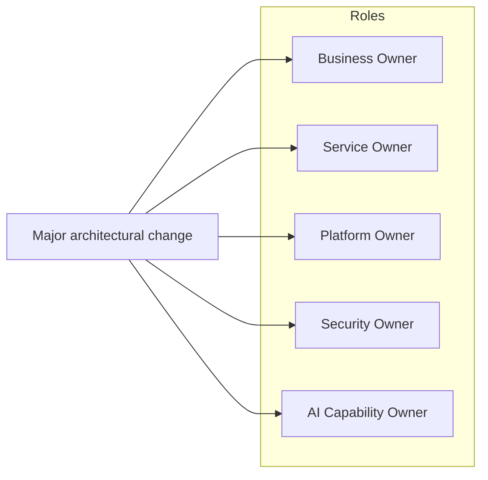
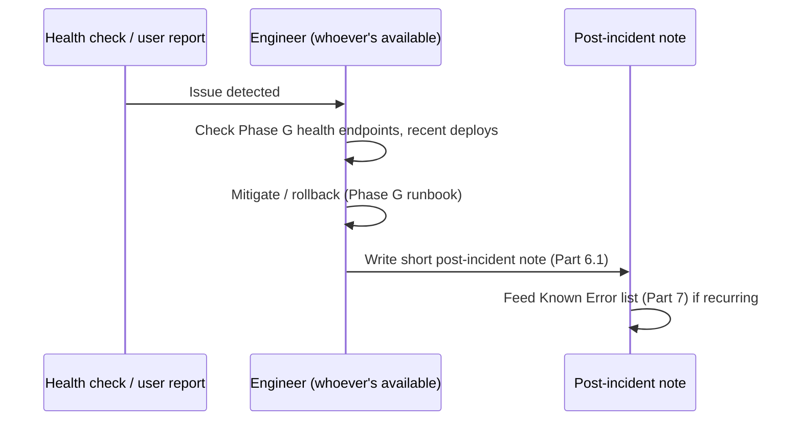
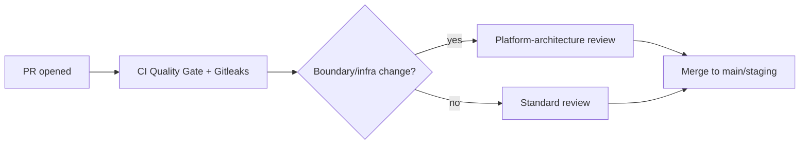

# EEP-01 — Phase H
## Enterprise Operations, Governance & Service Management Architecture
### HireRise Career Intelligence Platform

**Role:** Chief Enterprise Architect / Enterprise Operations Architect / ITSM Architect / Platform Operations Architect / SRE Lead / DevOps Architect / Governance Architect / Enterprise Risk Architect / Compliance Architect / Quality Management Architect / Enterprise PMO Advisor — combined deliverable.

**Inputs treated as authoritative, not redesigned:** EEP-01 Phases A–G. Phase H owns *who decides, who's accountable, and how work gets governed* — not the technical designs those decisions apply to. Where this document references an SLA, it's Phase D/E/G's SLA table, not a new one; where it references risk, it's Phase B's classification, not a new one.

**Convention (inherited from Phases D–G):** 🔧 **CURRENT STATE** / 🎯 **TARGET STATE**, every target-state item mapped to a Part 0 trigger.

**A note this document owes you before anything else:** of the eight EEP phases so far, this is the one where the gap between "consulting-grade enterprise governance" and HireRise's actual size is most likely to produce nonsense if I don't name it directly. ITIL 4, COBIT, a Change Advisory Board, a 24×7 support model, and an Enterprise PMO are designed for organizations with dozens to hundreds of people in operations roles. I don't know HireRise's actual headcount — the repository doesn't tell me that — but the engineering evidence throughout this series (one team implementing all six agents, one CI pipeline, one production host) suggests a small team, plausibly a single founder-engineer. **If that's accurate, the correct reading of most of this document is "here is what this looks like eventually, and here is the specific, measurable reason you're not doing it yet."** I've written it that way throughout, and Part 0 is more load-bearing in this document than in any prior phase — read it first.

---

# PART 0 — Operations Reality Check

| Capability | Current-state ceiling | Trigger to adopt target state |
|---|---|---|
| Dedicated Operations Team | Engineers operate what they build (Part 1) | Enough concurrent services/incidents that context-switching between building and operating measurably slows both — typically double-digit engineering headcount, not before |
| Platform Team | Same engineers own platform concerns (Phase G) | Phase G Part 0's Kubernetes/service-count trigger, since a platform team's job is largely to run that layer |
| SRE Team | N/A — reliability is everyone's job at this size, correctly | Service count or on-call burden high enough that a dedicated reliability function outperforms distributed ownership — usually correlates with the Platform Team trigger |
| 24×7 Support | Best-effort, business-hours-plus-reasonable-availability | A contractual/business commitment to 24×7 uptime that justifies the cost of staffing it (follow-the-sun or on-call rotation with enough people to be sustainable — a rotation of one person is not 24×7 support, it's one person's sleep debt) |
| ITSM Platform (ServiceNow-class) | A shared doc/board (Part 8) is sufficient | Enough concurrent tickets/services that a spreadsheet-equivalent genuinely can't track relationships — a real, checkable ticket-volume threshold, not a maturity aspiration |
| Enterprise CMDB | A generated inventory (Part 8.1) | Enough independently-changing services that a static/generated list goes stale faster than it's useful |
| Change Advisory Board (CAB) | PR review is the change board (Part 4) | Enough concurrent change volume or enough people proposing changes that a single reviewer/small team can't safely evaluate risk per change — **not** adopted just because "enterprise architecture has a CAB" |
| Service Desk | Direct communication (email/chat) with users | User volume high enough that ticket triage/routing needs a dedicated function |
| Architecture Review Board | The PR template's existing `@platform-architecture` review gate *is* this, informally, today | Enough architects/teams proposing conflicting designs that informal review can't arbitrate fairly |
| Compliance Office | Phase B's security/compliance rules, applied by whoever's building the feature | A regulatory requirement or enterprise customer contract that specifically requires a named compliance function |
| Enterprise PMO | Founder/lead engineer prioritizes (Part 1) | Multiple concurrent workstreams with competing resourcing needs across more people than one prioritizer can track in their head |

**This table is the spine of the whole document.** Every 🎯 section below maps to a row here, and — per the note above — most rows are unlikely to have fired yet.

---

# PART 1 — Enterprise Operating Model

## 1.1 Operational philosophy

**"You build it, you run it," applied honestly rather than aspirationally.** At current scale this isn't a DevOps slogan, it's simply what's happening — the same people who wrote `careerAgentCoordinator.js` are the ones who'd get paged if it broke. This document's job is to make that arrangement *deliberate and documented* rather than to replace it with a role structure the team doesn't have people for.

## 1.2 Ownership, today

🔧 One accountable party (a person, or a very small team) owns product decisions, platform decisions, and operational response, with the PR template's `@platform-architecture` review gate (Part 3, Part 9) as the one already-real point of formalized governance in the current process. That gate is worth taking seriously as a foundation — it's evidence the team already understands the value of a review checkpoint for boundary-crossing changes, which is exactly the instinct enterprise governance formalizes at scale.

## 1.3 AI-assisted operations

🔧 Given Phase F's real AI capability (the provider-abstraction layer, the agent coordinator), it's worth using that same infrastructure for operations tooling now — e.g. an AI-assisted first pass at incident triage or runbook lookup — rather than treating "AI-assisted ops" as a separate future platform (🎯) to build. This is a good example of a target-state-sounding capability that's actually cheap to get a version of today because the underlying AI plumbing already exists.

## 1.4 Relationship to Phase B/D/G

Phase B's classification determines *what* requires review before it ships (Part 4/9); Phase D's SLA table and Phase G's platform SLIs feed Part 11's service-level management directly rather than being re-derived; Phase G's runbook stubs (deploy, rollback, DR) are the seed of Part 10's operational documentation, not a separate effort.

---

# PART 2 — Enterprise Service Catalog

## 2.1 🔧 CURRENT STATE — a minimal, real catalog

| Service | Business capability | Technical owner (today) | SLA basis | Key dependencies | Criticality |
|---|---|---|---|---|---|
| api-service | All synchronous product functionality | Engineering (single team) | Phase G Part 14/16 targets | Supabase, Redis, AI providers | Critical |
| Frontend | User-facing product | Engineering | N/A (client-side) | api-service | Critical |
| career-worker | Career analysis pipeline | Engineering | Phase D Part 16 | Outbox/inbox tables, AI providers | High |
| resume-worker | Resume parsing/extraction | Engineering | Phase D Part 16 | Same | High |
| salary-worker | Salary/market intelligence | Engineering | Phase D Part 16 | Same | Medium |
| notification-worker | Outbound notifications | Engineering | Phase D Part 16 | Email/SMS providers (Phase E) | Medium |
| AI Services (provider chain) | All AI capability (Phase F) | Engineering | Phase F Part 13 | External AI providers | Critical |
| Data Feed Platform | Labor-market data ingestion | Engineering | Phase E Part 9 (mock today) | External sources (🎯) | Low today (mock), rising with real sources |
| Authentication | Identity/session | Engineering | Phase E Part 10 | Supabase Auth (assumed) | Critical |
| Analytics | Internal/product analytics | Engineering | N/A | Data stores | Low-Medium |
| Monitoring | Observability (Phase G Part 9) | Engineering | N/A | Log/metric sink | Supporting |
| Developer Services (CI/CD) | Build/deploy pipeline | Engineering | N/A | GitHub Actions, GHCR | Supporting, high leverage |

**Lifecycle:** every service above is "actively developed" today; none are deprecated. This table should be updated whenever a service's status changes — that update *is* the current-state configuration management practice (Part 8.1), no separate CMDB required yet.

## 2.2 🎯 TARGET STATE

The same table, machine-generated from actual deployment manifests (Phase G's target-state Kubernetes definitions) rather than hand-maintained, with per-service SLA dashboards (Part 11) linked directly from the catalog entry — adopted at Part 0's ITSM/CMDB triggers.

---

# PART 3 — Service Ownership Model

## 3.1 🔧 CURRENT STATE

At current team size, most of the roles below collapse onto the same one or few people — that's fine, and this document names them separately anyway because **naming the role clarifies the responsibility even when one person holds several roles**, and it's the thing that scales cleanly later without a redesign.

| Role | Responsibility | Current holder |
|---|---|---|
| Business Owner | Decides what HireRise should do | Founder/product lead |
| Technical Owner | Decides how a service is built | Engineering |
| Service Owner | Accountable for a specific service's health | Engineering (per Part 2's table) |
| Platform Owner | Accountable for Phase G's runtime | Engineering |
| Data Owner | Accountable for Phase A's data domains | Engineering (until a dedicated data role exists) |
| AI Capability Owner | Accountable for Phase F's capabilities, including ADR-F1's eval gap | Engineering |
| Security Owner | Accountable for Phase B's posture | Engineering (until a dedicated security role exists) |
| Support Owner | Accountable for user-facing issue response | Founder/engineering, informally |

**Escalation path, today:** there's only one level to escalate to — whoever holds the relevant role above. This is a real, valid escalation path at this size; it becomes a problem only when the same person is the escalation path for everything and becomes a bottleneck, which is worth watching for as a soft signal even before it trips a hard Part 0 trigger.

## 3.2 🎯 TARGET STATE — RACI, once roles genuinely separate

A formal RACI matrix per decision type (feature launch, infra change, AI capability change, security exception) is worth building once at least two of the roles above are held by *different* people whose priorities can genuinely conflict — before that, a RACI matrix documents disagreements that can't yet happen.

---

# PART 4 — Change Management

## 4.1 🔧 CURRENT STATE — already real, extend it

Phase G Part 3/10 already documented this: PR review + CI quality gate + Gitleaks + governance checks *is* the current change management process, and the PR template's boundary/infrastructure-change checkbox (requiring `@platform-architecture` review) already implements **risk-based change classification** — a real, working, lightweight version of what a CAB does at scale. Current-state completion: make the existing three-tier distinction explicit as policy, not just as a PR template checkbox —

- **Standard change:** normal PR review, no special approval (most work).
- **Major/boundary change:** the PR template's existing flagged categories — requires the named review.
- **Emergency change (hotfix):** Phase G Part 3.2's fast-tracked path — document that the *quality gate's essential subset* (not all of it) still must pass even on a hotfix, so "emergency" never quietly means "unreviewed."

## 4.2 🎯 TARGET STATE

Formal risk scoring per change (beyond a checkbox), automated deployment governance (a change can't merge without its required approval type satisfied, enforced by branch protection rules rather than convention), and a CAB only at Part 0's trigger — a CAB convened for a single-team codebase would just be the same people meeting with themselves under a different name.

---

# PART 5 — Release Management

🔧 **Current state:** `main`/`staging` branch strategy (Phase G Part 3.1) already implies a release model — merges to `main` are releases. Worth making explicit: a lightweight version governance scheme (even just a date-based or incrementing tag on each `main` deploy, tied to the GHCR image tag Phase G already uses) costs nothing and makes rollback (Phase G Part 10.1) unambiguous — "redeploy image tag X" only works if tags are meaningful. Release calendar: not needed as a formal artifact yet — deploys happen when work is ready, which is appropriate at this size and shouldn't be replaced with an artificial cadence just to look more enterprise.

🎯 **Target state:** a real release calendar once multiple teams need deploy-window coordination, formal release notes/communication once there's a user base large enough that unannounced changes cause support burden, and a defined hotfix-vs-standard-release approval split at scale (Part 4.2).

---

# PART 6 — Incident Management

## 6.1 🔧 CURRENT STATE — write this down now, costs nothing

| Severity | Definition | Current-state response |
|---|---|---|
| Sev 1 (critical) | Platform down or a critical service (Part 2's table) unavailable | Whoever's available responds immediately; no formal war room yet — a shared chat thread serves that function at this size |
| Sev 2 (high) | A high-criticality service degraded, workaround exists | Response within the same working day |
| Sev 3 (medium/low) | Non-critical service or cosmetic issue | Normal backlog |

**The single highest-value current-state action in this Part:** write a one-page incident checklist now — what to check first (health endpoints, Phase G Part 9), who to notify, where to log what happened — so the first real Sev 1 doesn't have to invent process while it's also being fought. This is the incident-management equivalent of Phase G's DR-drill recommendation (ADR-G3): cheap now, expensive to improvise under pressure.

**Post-incident review:** do this for every Sev 1/Sev 2 regardless of team size — a short written "what happened, why, what changes" is valuable at any scale and is the seed of Part 7's Known Error Database.

**AI-assisted incident response:** 🔧 worth trying now given Phase F's existing AI infrastructure — e.g. feeding recent logs/metrics to a model for a first-pass "what changed recently" summary during an incident — genuinely useful even at small scale and not gated on any target-state platform.

## 6.2 🎯 TARGET STATE

Formal escalation tiers, a real war-room process (multiple people with defined roles: incident commander, communicator, investigator — meaningless with fewer people than roles), and formal customer communication SLAs, adopted once incident volume/user base justifies the overhead of formal roles over "whoever's on."

---

# PART 7 — Problem Management

🔧 **Current state:** a **Known Error list** — not a database, a document or a labeled set of GitHub issues — recording recurring or known-but-unfixed issues, cross-referenced from incident reviews (Part 6.1). Technical debt tracking: a simple, honestly-maintained backlog label is sufficient; the value of "problem management" at this scale is entirely in the discipline of writing things down consistently, not in the tooling. Trend analysis: even a quarterly fifteen-minute look at "what kept breaking" is a real, valuable practice worth doing now.

🎯 **Target state:** a formal KEDB integrated with the ITSM platform (Part 0 trigger), systematic trend analysis feeding capacity planning (Phase G Part 13) automatically rather than via a manual quarterly look.

---

# PART 8 — Configuration & Asset Management

## 8.1 🔧 CURRENT STATE — a lightweight CMDB is a generated file, not a product

The most honest, lowest-effort current-state CMDB: a script that enumerates Docker images, Compose services, and environment variables actually in use, run periodically and diffed against the last run — this catches drift (a new env var appearing, a service quietly added) without maintaining a separate system of record that inevitably goes stale faster than the infrastructure it describes. Dependency mapping: Phase E's integration landscape diagram and Phase G's runtime diagram already **are** the dependency map — Part 8 doesn't need to redraw them, just keep them updated when the underlying architecture changes.

## 8.2 🎯 TARGET STATE

A real CMDB (or its modern equivalent — a service catalog tool with dependency graphing) once Part 0's trigger fires, feeding automated impact analysis ("if this service goes down, what else is affected") directly from Part 2's catalog data.

---

# PART 9 — Architecture Governance

## 9.1 🔧 CURRENT STATE — already partially real

The PR template's `@platform-architecture` review requirement for boundary/infrastructure changes is a genuine, working Architecture Review Board function, scaled to the team that exists. This EEP-01 series itself — eight phases of documented architecture with ADRs — is the current-state architecture governance artifact; the practice this document recommends *is the practice already being followed* in producing this series. Current-state completion: a short **technology standards** list (approved languages/frameworks/providers, e.g. "AI providers must go through `aiProviderManager`'s abstraction, no direct SDK calls from a new service" — Phase F ADR-F3's spirit generalized) costs little to write and prevents drift.

## 9.2 🎯 TARGET STATE

A formal Architecture Review Board with named members (once more than one architecture-capable person exists), a technical-exception process (a documented, time-boxed waiver when a change must violate a standard, with a required follow-up), and a technology lifecycle policy (when a dependency/framework version is considered end-of-life and must be upgraded).

---

# PART 10 — Operational Governance

🔧 **Current state:** three runbooks were already identified as missing and cheap to write in Phase G (deploy, rollback, DR recovery) — Part 10 adds one more that belongs at this layer specifically: **an incident-response SOP** (Part 6.1's checklist, formalized as a short document). Operational KPIs: Phase G Part 9's four core signals (uptime, deploy frequency, MTTR, error rate) already are the executive dashboard at this size — a fifth service (a dashboard product) isn't needed to display four numbers a founder can glance at directly.

🎯 **Target state:** formal maintenance windows and communicated capacity/risk reviews on a schedule, once there's an audience beyond the people already in every conversation about the platform.

---

# PART 11 — Service Level Management

🔧 **Current state:** inherits Phase D Part 16 and Phase G Part 14/16 directly — this document doesn't redefine SLAs/SLOs/SLIs, it adds the **governance wrapper**: someone (Part 3's Service Owner) is accountable for noticing when an SLO is missed, and a missed SLO triggers a Part 7 problem-management entry, not just a shrug. Error budgets: worth adopting informally now (e.g. "if career-worker's error rate crosses X% this month, that's this month's improvement priority") even without a formal error-budget *policy* document.

🎯 **Target state:** formal customer-facing SLA commitments (meaningful only once there are customers with contracts, not just users), automated error-budget tracking and enforcement (e.g. auto-freezing non-critical releases when a budget is exhausted), consistent with SRE practice at the scale where a release freeze is a meaningful lever rather than pure ceremony.

---

# PART 12 — Compliance & Risk

🔧 **Current state:** inherits Phase B's classification model directly for data/security risk; adds two operational-risk practices worth starting now regardless of scale: a short, living **risk register** (a list: what could go wrong operationally — single-host failure, key-person dependency, a specific vendor outage — and what mitigates it today, per Phase G's DR section) and a **vendor risk note** per critical dependency (Supabase, AI providers, payment processors) — what happens to HireRise if each one has an outage or changes terms, which is a genuinely useful five-minute exercise per vendor rather than a formal vendor-management program.

🎯 **Target state:** formal audit readiness (evidence collection automated from Phase G's SBOM/scan results and this document's own governance artifacts), a dedicated compliance function once a specific regulatory trigger (Part 0) requires one, and formal business-continuity planning beyond Phase G's DR drill once multi-region/24×7 commitments exist.

---

# PART 13 — Documentation Governance

🔧 **Current state:** this EEP-01 series itself is the architecture repository — the current-state action is simply keeping it **honest and current**, which every phase in this series has tried to model by grounding claims in the actual codebase rather than an idealized one. Runbooks/SOPs (Parts 6/10) live alongside it. API documentation: worth generating from the OpenAPI-equivalent contracts Phase E Part 12.1 already calls for, rather than hand-maintaining a separate document that drifts. Review cadence: revisit this series when a phase's "current state" section stops matching reality — which, per Part 0's own logic, is itself a trigger worth tracking (if Phase D's current-state description is stale, that's a signal, not just paperwork).

🎯 **Target state:** a searchable knowledge base once documentation volume exceeds what "read the relevant markdown file" can serve well, and a formal documentation-review SLA once more than one or two people are writing docs that others depend on.

---

# PART 14 — Enterprise Metrics

| Domain | 🔧 Current-state metric (cheap, real, worth tracking now) | 🎯 Target-state addition |
|---|---|---|
| Engineering | Deploy frequency, PR cycle time (already visible in GitHub) | DORA metrics dashboard |
| Operations | MTTR, incident count by severity (Part 6) | Formal ops dashboard |
| Platform | Phase G Part 9's four signals | Full SLO dashboard |
| Reliability | Uptime, error rate | Error budget burn-down |
| AI | Phase F Part 13's token/cost/human-intervention metrics | Full eval-linked quality metrics (Phase F Part 12) |
| Security | Gitleaks findings over time, dependency-scan findings (Phase G Part 8) | Full compliance dashboard |
| Customer experience | Qualitative — direct user feedback at this scale is a real, valid signal | NPS/CSAT once volume supports statistical meaning |
| Business operations | Whatever the founder/lead already tracks for the business | Formal PMO reporting once multiple workstreams compete for resourcing |
| Developer productivity | Felt experience — "does shipping feel slow" is a real, if informal, signal worth checking in on | Formal productivity metrics, used carefully to avoid perverse incentives |
| Service health | Part 2's catalog + Phase G health checks | Automated health scoring per service |

---

# PART 15 — Enterprise Operating Model Reference Architectures

## 15.1 Incident response, current state

## 15.2 Change approval, current state

## 15.3 Architecture governance, current state
This EEP-01 series' own production process — draft, ground in the actual repo, document current/target state, record ADRs — **is** the reference architecture for Part 9 today; no separate diagram improves on describing the practice directly.

---

# PART 16 — Operational Maturity Model

| Level | Name | Requires | HireRise's likely position |
|---|---|---|---|
| 1 | Founder Operated | One or few people hold every role informally | Likely **exceeded in tooling, matches in headcount** — the tooling (CI, scanning, health checks) is more mature than "Level 1" typically implies, but the org structure (one accountable party for most roles, Part 3.1) is Level 1's actual definition |
| 2 | Engineering Managed | A dedicated engineering function with defined processes (this document's current-state recommendations, once adopted) | **Target position after this document's near-term actions** |
| 3 | Operational Platform | Formal SRE-lite practices, defined SLOs with accountability, real incident/problem management | Not reached |
| 4 | Enterprise Operations | Dedicated ops/platform/SRE functions, CAB, formal ITSM | Not reached, and per Part 0, shouldn't be pursued ahead of its triggers |
| 5 | Continuous Governance | Enterprise Governance Board, AIOps, FinOps, self-improving operating model | Not reached |

**The honest and slightly unusual finding here:** HireRise's *engineering tooling* (Phase G's CI/CD, scanning, health checks) is more mature than its *organizational* maturity level would predict — a team this small doesn't usually have Gitleaks + a quality gate + boundary-review PR templates already in place. The org-structure side of maturity (dedicated roles, formal processes) is the part actually at Level 1, and that's fine — it's the correct level for the headcount, and this document's near-term recommendations close the *documentation and discipline* gap to Level 2 without requiring the *headcount* growth that Levels 3+ assume.

---

# PART 17 — Continuous Improvement

🔧 **Current state:** a short retrospective after each Sev 1/2 incident (Part 6.1) and a lightweight quarterly review (Part 7's trend analysis) are enough continuous-improvement process for this scale — formal ceremonies beyond that would be process for its own sake. An improvement backlog is just Part 7's Known Error list plus normal engineering backlog items tagged as improvements; it doesn't need a separate system.

🎯 **Target state:** formal Service Improvement Plans tied to Part 11's error budgets, an innovation process with dedicated time/resourcing once team size allows for it without trading off delivery, and lessons-learned repositories integrated with Part 13's documentation once volume justifies a dedicated index rather than "read the relevant retro note."

---

# PART 18 — Architecture Decision Records

### ADR-H1: Do not adopt named ITSM/CAB/ITIL roles or tooling ahead of their Part 0 triggers, even though this document is required to describe them

- **Context:** the brief requires ITIL 4/COBIT-aligned deliverables (CAB, service desk, formal ITSM platform, PMO).
- **Problem:** adopting these structures at current headcount would mean the same one or few people role-playing multiple committee seats — pure overhead with no risk-reduction benefit, since the "conflict of interest" a CAB resolves at scale doesn't exist when there's no one to conflict with.
- **Options:** (a) recommend adopting lightweight versions of all requested structures now, for completeness; (b) describe each structure's target-state form (as required) but explicitly recommend against adoption until its Part 0 trigger fires.
- **Decision:** (b).
- **Consequences:** this document satisfies the brief's requirement to *design* these structures while not creating false pressure to *implement* them prematurely — a distinction every EEP phase in this series has maintained and this one states most explicitly, because governance frameworks carry unusually strong "this is what mature companies do" social pressure independent of actual fit.
- **Trigger to adopt each structure:** Part 0's corresponding row.

### ADR-H2: The existing PR-template governance gate is the Architecture Review Board and the Change Advisory Board simultaneously, at current scale — not two functions to build separately

- **Context:** Part 4 and Part 9 both point to the same `@platform-architecture` review requirement.
- **Problem:** treating ARB and CAB as separate future functions to design independently would produce two governance documents describing the same one review gate.
- **Options:** (a) design ARB and CAB as fully separate target-state functions; (b) recognize them as the same current-state mechanism serving both purposes, splitting them only when their concerns genuinely diverge (an architecture-quality question vs. a deployment-risk question stop being answerable by the same reviewer).
- **Decision:** (b).
- **Consequences:** simpler current-state documentation; a clear, single signal for when to split them (the reviewer starts being asked architecture and deployment-risk questions that pull in different directions, or there's more review volume than one reviewer can sustain).
- **Trigger to split:** review volume or role conflict, not a fixed team size.

### ADR-H3: Write the incident checklist and risk register now; everything else in this document's current-state column is secondary to those two

- **Context:** Parts 6.1 and 12 each identify a cheap, high-value, currently-missing artifact.
- **Problem:** across this entire EEP series, the pattern has been that cheap, high-value current-state actions (Phase F's eval harness, Phase G's DR drill) are easy to defer in favor of more interesting target-state design work.
- **Options:** (a) treat all of this document's current-state recommendations as equally next; (b) name the two highest-value ones explicitly as the priority.
- **Decision:** (b) — the incident checklist (Part 6.1) and risk register (Part 12), in that order, because an unplanned incident is the likeliest near-term event this document can actually reduce the cost of.
- **Consequences:** everything else in this document (RACI matrices, service catalogs, metrics tables) is genuinely useful documentation but is not urgent in the way these two are.
- **Trigger to adopt:** immediate, same framing as ADR-F1 and ADR-G3.

---

# PART 19 — Future Operating Model

Roadmap only, 🎯 by definition, mapped to Part 0 triggers — consistent with every prior phase's Part 20/19.

- **Dedicated Platform Team / SRE Organization:** Phase G Part 0's service-count/Kubernetes trigger, generalized to the org chart.
- **Enterprise Support / Service Desk:** user-volume trigger (Part 0).
- **Architecture Office:** once the informal ARB (ADR-H2) genuinely can't keep up with review volume.
- **AIOps:** an extension of Part 6.1's current-state AI-assisted triage, formalized once incident volume makes a bespoke tool worth building rather than an ad hoc prompt.
- **FinOps:** relevant once cloud/AI spend (Phase F Part 15, Phase G Part 14) is large enough that a dedicated cost-governance function outperforms the current lightweight practices.
- **DataOps / MLOps:** extensions of Phase A's data governance and Phase F's AI lifecycle (Part 16) respectively, formalized at their own scale triggers, not this document's.
- **Enterprise Governance Board:** the eventual home for what this entire EEP-01 series currently does informally — worth convening only once more than a handful of people need to be in the room for an architecture decision to be legitimate.
- **Global Operations:** Phase D/E/G's multi-region trigger, generalized to staffing (follow-the-sun) rather than just infrastructure.

---

# PART 20 — Enterprise Operations Roadmap

| Phase | Objectives | Prerequisites | Dependencies | Success criteria | Adoption trigger |
|---|---|---|---|---|---|
| **1 — Operational Foundations** | Write the incident checklist (ADR-H3) and risk register (Part 12); make the change-classification tiers explicit (Part 4.1); generate the lightweight CMDB script (Part 8.1) | None — buildable immediately | Phase G's existing health checks/runbook stubs | All four artifacts exist and are referenced at least once in a real incident or PR | None — this phase has no trigger, it's the baseline |
| **2 — Standardized Operations** | Formal service catalog (Part 2) kept current; error-budget-style informal tracking (Part 11); quarterly problem-management review (Part 7) | Phase 1 complete | Phase G Part 9's metrics | A missed SLO produces a tracked follow-up, not just a shrug, at least once, demonstrating the loop works | Growing incident/change volume that Phase 1's informal tracking starts to strain |
| **3 — Managed Services** | Formal RACI once roles genuinely separate (Part 3.2); real CAB/ARB split if warranted (ADR-H2's trigger); ITSM tooling (Part 0) | Phase 2 complete; role separation has actually occurred | Team growth | A change or incident correctly routes through a defined role structure without the founder being the default escalation for everything | Part 0's role-separation and headcount triggers |
| **4 — Enterprise Governance** | Architecture Office, Compliance Office, formal PMO | Phase 3 complete; a specific regulatory/enterprise-customer trigger | Business model decisions (B2B, per Phase E/F/G Part 20) | Passing a real external audit or enterprise-customer security review using this series' documentation as evidence | Regulatory requirement or enterprise contract |
| **5 — Autonomous/Continuous Operations** | AIOps, FinOps, DataOps/MLOps as named functions, continuous governance board | Phase 4 complete | Phase F's eval platform (ADR-F1) must exist first — you cannot responsibly automate operations decisions with AI before you can measure whether AI decisions are good ones | Demonstrated AI-assisted operations decisions with measured, tracked accuracy, not just deployed and assumed to help | Sustained scale where manual governance genuinely can't keep pace |

**Dependency note, restated from Phase G:** these phases are trigger-gated, not time-gated. A platform can correctly stay at Phase 1 or 2 for years if headcount and incident volume never justify more — and per this document's opening note, that's the most likely near-term reality for HireRise, not a shortcoming to plan around.

---

## Closing note on scope discipline (restated across all eight phases, most relevant here)

This is the phase most likely to be misread as "HireRise needs a CAB, an ITSM platform, and a PMO." It doesn't, not yet, and ADR-H1 says so plainly rather than hedging. What HireRise's actual operating model needs from this document is two cheap artifacts (the incident checklist and risk register, ADR-H3) written this week, and a Part 0 trigger table to check back against before adopting anything heavier — the same discipline every phase from D onward has tried to hold, applied here to organizational structure instead of technical infrastructure.
